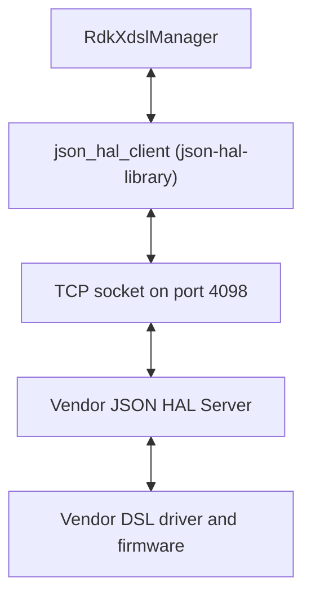
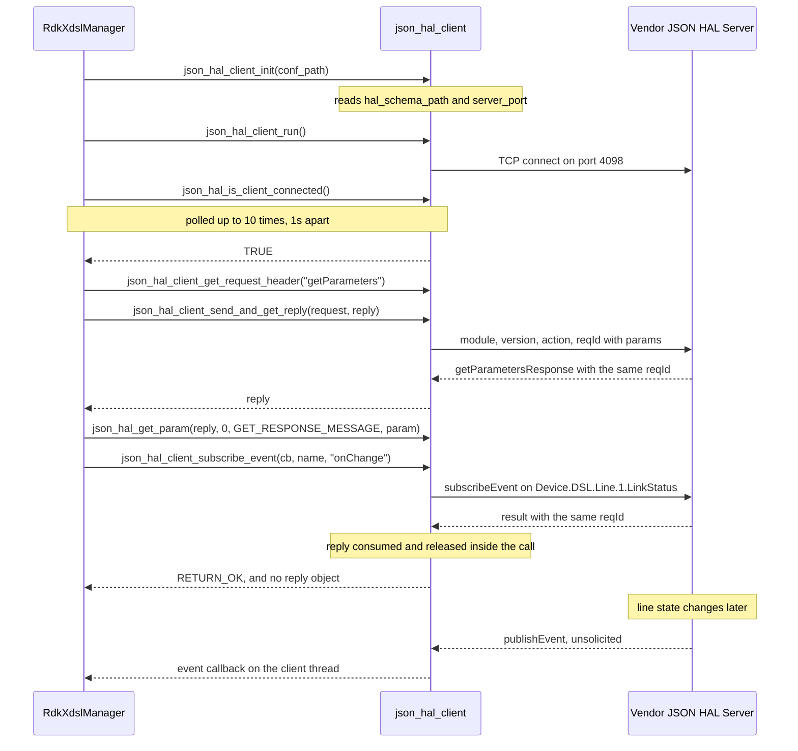
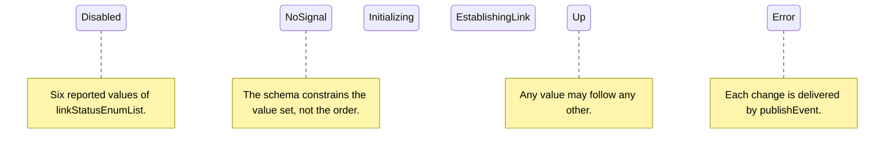

# xDSL HAL Documentation

## Version History

| Date | Comment | Version |
| --- | --- | --- |
| 2026-08-24 | Initial release of this specification | 1.0.0 |

## Acronyms

- `HAL` \- Hardware Abstraction Layer
- `RDK-B` \- Reference Design Kit for Broadband Devices
- `xDSL` \- the family of Digital Subscriber Line technologies, ADSL through VDSL2
- `ADSL` \- Asymmetric Digital Subscriber Line
- `VDSL` \- Very high speed Digital Subscriber Line
- `FAST` \- ITU-T G.9700/G.9701, marketed as G.fast
- `ATM` \- Asynchronous Transfer Mode
- `PTM` \- Packet Transfer Mode
- `TR-181` \- the Broadband Forum `Device:` data model; the model this documentation cites is `Device:2.13`, published as release `tr-181-2-13-0` and identified in [halSpecDetailed.md](halSpecDetailed.md), which records the comparison against versions 2.11, 2.12, 2.13, 2.15 and 2.21 that selected it
- `DML` \- Data Model Layer, the RDK-B code that backs TR-181 parameters
- `JSON` \- JavaScript Object Notation
- `TCP` \- Transmission Control Protocol
- `SELT` \- Single-Ended Line Test
- `UER` \- Uncalibrated Echo Response, a SELT result
- `OEM` \- Original Equipment Manufacturer

## Repositories

xDSL Manager - https://github.com/rdkcentral/xdsl-manager

JSON HAL Library - https://github.com/rdkcentral/json-hal-library

## Description

The xDSL HAL is the contract between the RDK-B middleware stack and a vendor's DSL implementation.
It differs from most RDK-B HALs in one structural respect that shapes everything else in this
document: **the contract is a JSON schema carried over a TCP socket, not a C header linked into the
caller.** The interface definition is
[`hal_schema/xdsl_hal_schema.json`](../../hal_schema/xdsl_hal_schema.json).

`RdkXdslManager` is the owning middleware service for this interface, so a caller integrating
against the xDSL HAL is normally working inside that manager rather than calling the socket
directly. The manager exposes the vendor's DSL state upwards as TR-181 parameters and translates
each read and write into a JSON message exchange with the vendor's server.

Because the interface is a schema rather than a header, there is no inline Doxygen to carry
per-parameter detail. That detail lives in a companion document,
[halSpecDetailed.md](halSpecDetailed.md), which is to this schema what inline Doxygen is to a C
header: one entry per parameter, with its type, constraint, access and description.

**The schema exposes four TR-181 families, not one.** A reader who has seen this HAL described
elsewhere as a `Device.DSL` interface should treat that as incomplete: the shipped schema defines
parameters under all four of the trees below, and the ATM and PTM trees are how the DSL line is
carried into the WAN data path.

| TR-181 family | Parameter definitions | What it covers |
| --- | --- | --- |
| `Device.DSL` | 241 | Lines, channels, bonding groups and line diagnostics |
| `Device.FAST` | 61 | G.fast lines and their statistics |
| `Device.ATM` | 45 | ATM links, QoS and link statistics |
| `Device.PTM` | 22 | PTM links and link statistics |

Those 369 parameter definitions cover **512 logical TR-181 paths**, because 20 of them use regular
expression alternation and so match more than one path each. The expansion is enumerated per
definition in [halSpecDetailed.md](halSpecDetailed.md).

The manager reads `/etc/rdk/conf/xdsl_manager_conf.json`, and that file
names the deployed schema path `/etc/rdk/schemas/xdsl_hal_schema.json` in `hal_schema_path` and the
server port `4098` in `server_port` [`hal_schema/xdsl_manager_conf.json`]. The schema that travels with
this repository is [`hal_schema/xdsl_hal_schema.json`](https://github.com/rdkcentral/rdkb-halif-xdsl/hal_schema/xdsl_hal_schema.json); the
`/etc/rdk/schemas` path is where a deployment is expected to install it, and it is the path a
`getSchemaResponse` is expected to return.

Three genuinely optional surfaces do exist.

- **ATM and PTM status subscription.** `xdsl_hal_init()` subscribes only the DSL line link status.
  The ATM and PTM equivalents, `atm_hal_subscribeStatusEvent()` and `ptm_hal_subscribeStatusEvent()`
  (declared at `xdsl_hal.h` ), are invoked
  separately by the middle layer when those link types are in use.
- **Optional versus mandatory parameters.** The schema states its own optional/mandatory split
  through four lists. `getParameterSupportedList` admits 348 entries and
  `getParameterOptionalList` a further 45; `setParameterSupportedList` admits 18 and
  `setParameterOptionalList` a further 6. Those entries are not all parameters: the read and write
  lists also admit object paths, and [halSpecDetailed.md](halSpecDetailed.md) gives the exact split per list. A vendor server is expected to answer the supported set;
  the optional set is the part a platform may decline.
- **Line diagnostics.** The SELT, QLN and UER diagnostic parameters under `Device.DSL` are exercised
  only when a diagnostic is requested, and `dslDiagnosticsStateEnumList` includes a `None` state for
  the case where none ever is.

The schema carries a small number of structural defects that a caller should know about before
relying on a branch of it. They are inventoried, with their consequences, in the `Contract Defects`
section of [halSpecDetailed.md](halSpecDetailed.md) rather than repeated here.

## Component Runtime Execution Requirements

The xDSL HAL is not a library loaded into the caller's address space. It is a vendor process reached
over a TCP socket, and the requirements below follow from that. Failure to meet them will result in
undefined behaviour on the manager side, because the manager has no way to distinguish a vendor
server that is slow from one that is absent beyond the checks this section describes.

### Initialization and Startup

The client half of the interface must be brought up in a fixed order before any parameter is read or
written. `xdsl_hal_init()`, at `https://github.com/rdkcentral/xdsl-manager/source/TR-181/integration_src.shared/xdsl_hal.c`, establishes
that order and a caller must not vary it.

- `json_hal_client_init("/etc/rdk/conf/xdsl_manager_conf.json")` — `xdsl_hal.c`, reading the
  configuration path fixed by `XDSL_JSON_CONF_PATH`. This loads the schema path
  `/etc/rdk/schemas/xdsl_hal_schema.json` and the server port `4098` from that file's
  `hal_schema_path` and `server_port` keys [`hal_shema/xdsl_manager_conf.json`]; it does not open the
  socket.
- `json_hal_client_run()` — `xdsl_hal.c:196`. Starts the client socket thread, which is what
  actually connects.
- A connectivity poll on `json_hal_is_client_connected()` — `xdsl_hal.c`, inside the retry loop
  described below. The connection is established asynchronously by the socket thread, so this poll
  is the only correct way to learn that it succeeded.
- `subscribe_dsl_link_event()` — `xdsl_hal.c`, which registers the DSL line link-status
  subscription. Events published before this point are not delivered.

### Threading Model

The transport places a receive loop on its own thread. `json_hal_client_run()` is documented as
starting the client socket thread (`json_hal_client.h`), and that thread owns the socket for
the lifetime of the client: it accepts responses, matches them to outstanding requests, and
dispatches published events into the registered callback.

Two consequences bear directly on caller code. Event callbacks are invoked **on the transport's
thread, not the caller's**, so a callback body must be safe to run concurrently with the caller's own
work and must not block — it is the same thread that would otherwise be receiving the next response.
And `json_hal_client_send_and_get_reply()` is documented as a blocking call
(`json_hal_client.h`), so the calling thread waits inside it while that separate thread does
the receiving.

Vendors may implement internal threading and event mechanisms in the server to meet their
operational requirements, provided each response carries back the `reqId` of the request it answers,
since that field is the only thing that lets the client match a reply to a caller.

Beyond the blocking guarantee on the synchronous reply path, **this interface does not specify
whether its client entry points may be called concurrently from more than one caller thread.** A
caller must not assume either behaviour; where concurrent use is required, the caller is responsible
for its own serialization.

Derived from `json_hal_client.h` in
[`json-hal-library`](https://github.com/rdkcentral/json-hal-library).

### Process Model

**The manager and the vendor implementation are two processes communicating over a TCP socket.** This
is the single most consequential difference between this HAL and the C HALs in the RDK-B corpus, and
most of the rest of this document follows from it. There is no vendor `.so` in the manager's address
space, no shared memory and no direct function call: a vendor's allocations and pointers cannot
reach the manager's heap, and equally the manager cannot recover a crashed vendor server by any means
other than reconnecting. That is isolation of memory, not isolation from the peer. The peer's data
crosses the boundary and is copied into fixed manager buffers, in places without a bound;
`Contract Defects` in [halSpecDetailed.md](halSpecDetailed.md) records those copies with their locators, so a malformed or
hostile message can corrupt manager memory through the parsing path.

A single client instance per manager process is expected. On the server side the listen backlog is
32 (`tcp_server.c` in `json-hal-library`), so a vendor server accepts connections rather than
serving exactly one, but nothing in this contract assigns meaning to a second concurrent client and a
caller should not rely on one.

Because the two sides are separate processes, they are also separately restartable, and the interface
says nothing about what a vendor server does with subscriptions across its own restart. A caller that
has restarted, or that suspects the server has, should re-establish its subscriptions rather than
assume they survived.

### Memory Model

Every message in both directions is a `json_object` from `json-c`, which is reference counted. The
ownership rule is therefore about reference counts rather than about `malloc` and `free`, and the
repository applies it through one idiom.

`FREE_JSON_OBJECT`, defined at `xdsl_hal.c`, expands to a
guarded `json_object_put(expr)` — a null check followed by a reference release. It is applied to both
the request and the reply on every exchange path in this repository, including the error paths, and
it is the pattern a caller should follow.

#### Caller Responsibilities

- Release the request object obtained from `json_hal_client_get_request_header()` once the exchange
  completes, on both the success and the failure path. A request abandoned after a failed send leaks
  as surely as one abandoned after a successful one.
- Release the reply object returned through the out-parameter of
  `json_hal_client_send_and_get_reply()`. The caller owns that reference.
- Copy any value needed beyond the life of the exchange before releasing the reply. Values read out
  of a reply point into that object.
- Treat an event callback's message buffer as valid only for the duration of the callback. The
  callback receives a `const char *` and its length (`json_hal_client.h`); the caller must copy
  anything it intends to keep.
- Observe the transport's fixed buffer sizes when composing a request, since they bound what can be
  represented rather than merely what is efficient: a parameter name is capped at 256 bytes and a
  parameter value at 2048 bytes (`hal_param_t`, `json_hal_common.h`), and a schema file path
  returned by the server at 2048 bytes (`hal_schema_response_t`, `json_hal_server.h`).

#### Module Responsibilities

- The transport owns the receive buffer and its growth. Reads are made in units of
  `MAX_BUFFER_SIZE`, which is 16384 bytes (`json_rpc_common.h`), and a message larger than one
  read is reassembled by successive reallocation (`tcp_client.c`). A vendor server is
  therefore not required to fit a response into a single 16 KiB read, but it is required to emit
  well-formed JSON, because reassembly is driven by buffer occupancy rather than by JSON structure.
  **Reassembly exists on the reply path only.** The server side receives into one fixed buffer and
  hands exactly what a single `recv` returned to its handler (`tcp_server.c`), so a request
  that does not arrive complete in one read is parsed as a fragment and discarded without a reply. The
  accumulation on the reply path is also unbounded and grows by repeated reallocation, so neither
  direction offers a framed, bounded whole-message guarantee; `Contract Defects` in
  [halSpecDetailed.md](halSpecDetailed.md) states both limits.
- The transport owns the request-tracking list that correlates replies with waiting callers, and
  releases it on `json_hal_client_terminate()` (`json_hal_client.h`).
- Vendor servers must release whatever they allocate per request. Nothing in this contract gives the
  manager visibility of server-side allocation, so a leak there is invisible to the caller until the
  server fails.
- All strings crossing this interface are JSON strings and must be valid UTF-8 and zero-terminated
  once decoded.

### Power Management Requirements

**This interface places no power-management obligation on the HAL, and none is specified for it.**
The schema defines no parameter through which a caller could request a host power transition, and
`xdsl_hal.c` participates in no suspend or resume path. A vendor implementation is not expected to
register for power events on the manager's behalf.

One parameter invites confusion and is worth separating explicitly. `Device.DSL.Line.{i}.PowerManagementState`
reports the DSL line's own power state, drawn from `powerManagementStateEnumList` with the values
`L0`, `L1`, `L2`, `L3` and `L4`. These are ITU-T DSL link power states — the state of the copper
line — and are **read-only status reported by the interface**, not a control surface for the power
state of the gateway. It is not a member of either set-parameter list.

### Asynchronous Notification Model

Notification is a two-step exchange followed by unsolicited messages. The caller sends
`subscribeEvent` and the server answers with a `result`; thereafter the vendor server sends
`publishEvent` messages whenever the subscribed parameter changes, with no request to correlate them
to. **That `result` does not reach the caller when the subscription is made through
`json_hal_client_subscribe_event()`:** the client library consumes and releases it, and returns
`RETURN_OK` or `RETURN_ERR` without parsing its status. `Sequence Diagram` sets out what that return
value does and does not prove, and what a caller must do instead if it needs the status itself.

**The set of subscribable events is closed and has exactly two members.**
`subscribeEventSupportedList` admits only `dslLineLinkStatus` and `fastLineLinkStatus` — that is,
`Device.DSL.Line.{i}.LinkStatus` and `Device.FAST.Line.{i}.LinkStatus`. No other parameter in the
schema may be subscribed, and these two are also the only definitions that carry a
`notificationType` property.

`notificationType` takes `interval` or `onChange` and defaults to `onChange`. This repository always
requests `onChange` explicitly: `subscribe_dsl_link_event()` at `xdsl_hal.c` calls
`json_hal_client_subscribe_event(eventcb, name, "onChange")`.

The callback surface a vendor's events are delivered into is declared in
`source/TR-181/integration_src.shared/xdsl_hal.h`:

- `dsl_link_status_callback` — the DSL line link-status callback type, 
- `xdsl_hal_registerDslLinkStatusCallback()` — installs it,
- `xtm_status_callback` — the ATM/PTM link-status callback type,
- `atm_hal_registerStatusCallback()` and `ptm_hal_registerStatusCallback()` — install it, 

A single event handler receives everything and demultiplexes on the parameter path: the DSL line
branch at `xdsl_hal.c`, the ATM branch and the PTM branch. A caller adding
a subscription must therefore expect its events at the same entry point rather than at a dedicated
one.

**There is no `onChangeSync` or `onChangeSyncTimeout` notification type in this schema.** Those exist
in the transport only behind the `JSON_BLOCKING_SUBSCRIBE_EVENT` compile-time flag
(`json_hal_server.h`) and are used by the telco voice HAL, not by this one. The transport's own
notification enumeration and the schema's do not correspond member for member; the divergence is set
out in the `Event Model` section of [halSpecDetailed.md](halSpecDetailed.md).

### Blocking calls

**The synchronous reply path blocks by design.** This is the opposite of the convention in the C HALs
of this corpus, which require that no call block, and stating it plainly is more useful than
restating a rule this interface does not follow. `json_hal_client_send_and_get_reply()` is a blocking until a response arrives or the wait ends (`json_hal_client.h`), which is
unavoidable for a request/response protocol over a socket.

**Synchronous and Responsive:** every parameter read and write is a round trip to another process.
A caller must treat each one as potentially slow and must not issue one from a context that cannot
tolerate waiting — in particular not from an event callback, which runs on the transport's own
receive thread.

**Timeout Handling: both variants are bounded, and they are bounded by the same mechanism.**
`json_hal_client_send_and_get_reply()` is not an unbounded wait. It passes
`SEND_MSG_TICKER_TIMEOUT`, which is `40` (`json_hal_client.c`), to the internal send-and-wait
routine, and the definition's own comment records the intent as
`Ticker timeout for aprox. 10s (40 x 250ms)`. A caller that supplies no deadline therefore
gets one of approximately ten seconds rather than none.

`json_hal_client_send_and_get_reply_with_timeout()` (`json_hal_client.h`) takes a deadline in
seconds, converts it to ticks as `(timeout * 1000000) / LOOP_TIMEOUT` with `LOOP_TIMEOUT` at
`250000` microseconds (`tcp_client.h`) — four ticks per second — and then **clamps the result at
both ends**, down to `40 (10s)` (`json_hal_client.c`) and up to `480 (120s)`, the upper bound. The deadline is approximate, and it is an upper bound rather than a guaranteed minimum wait.

### Internal Error Handling

**Synchronous Error Handling:** the outcome of a write is carried in a `result` message whose
`Result.Status` field takes one of the four values of
`resultStatusEnumList`. The field is required and `additionalProperties` is false, so a conforming
`result` carries exactly that status and nothing else. The table below is that **vocabulary** — what
each value means and what a caller should do with it. Which of the four a caller can actually be
handed is a separate question, answered by the transport rather than by the schema, and the two
paragraphs after the table answer it.

| `Result.Status` | Meaning | What the caller should do |
| --- | --- | --- |
| `Success` | The request was carried out. This is the schema's default value. | Proceed. |
| `Failed` | The request was understood but could not be carried out. | Treat as a runtime failure; retrying may succeed if the cause was transient. |
| `Invalid Argument` | The vocabulary's value for a request that was malformed or carried a value outside its constraint. **No code path in the pinned transport constructs it**, so it reaches a caller only where a vendor's own action handler writes the literal string into `Result` itself. | Do not retry unchanged — correct the request. Check the value against the parameter's constraint in [halSpecDetailed.md](halSpecDetailed.md). |
| `Not Supported` | The server does not implement this parameter or action. | Do not retry. Treat the parameter as absent on this platform; this is the expected answer for a member of an optional list. |

**The schema states what a well-formed message looks like; the pinned transport does not check
inbound messages against it.** This is the single most consequential difference between the contract
and its carrier, because a caller — or a test — that expects malformed input to come back as a clean
rejection is expecting something no code here performs. The server's internal request dispatcher
(`json_hal_server.c`) behaves as follows on a request:

| Inbound request | What the pinned server does | What the caller sees |
| --- | --- | --- |
| Not parseable as JSON | Logs the parse offset and returns from the dispatcher | **No reply at all** — the caller waits out the ticker deadline |
| Valid JSON with no `reqId` | Logs and discards the object  | **No reply at all** |
| Valid JSON with no `action` | Logs and discards the object  | **No reply at all** |
| Wrong `module` or wrong `version` | Neither field is ever read; the message is dispatched on its `action` alone | The handler's own answer, as though the envelope were correct |
| An `action` with no registered handler | Builds a generic `result`  | `Not Supported` |
| A handler that returns non-`RETURN_OK` | Builds a generic `result` | `Failed` |
| A parameter value outside its schema constraint, or a `params` entry missing a required property | Nothing inspects either; `params` is only counted, and the count is taken as an array length without checking that `params` is an array  | Whatever the vendor's handler decides |

**Internal Error Reporting:** a vendor server should report its own internal failures through
`Result.Status` rather than by closing the connection or omitting a reply, and should answer a
malformed or out-of-range request with a status rather than silently dropping it. Both are
obligations on the implementation, not services the transport provides: as the table above shows, the
dropped-input paths are exactly what the pinned dispatcher does by default. A missing reply is
indistinguishable to the caller from a hung server, and costs the caller the full blocking wait.

**Validation is the sender's job on both sides.** Because nothing validates a message on the way in,
a caller that wants a malformed request caught at all must validate its own outbound messages against
[`hal_schema/xdsl_hal_schema.json`](../../hal_schema/xdsl_hal_schema.json) before sending them, and a
vendor server must apply the parameter constraints in [halSpecDetailed.md](halSpecDetailed.md) in its handler. Neither
side is protected by the other.

**Focus on Logging for Errors:** for failures that cannot be expressed in a status value — a
malformed message, a connection lost mid-exchange — both sides should log with enough context to
identify the exchange, which in practice means the `reqId`.

### Persistence Model

**This contract asks the HAL server to persist nothing.** No action in the schema commits or reloads
configuration, and there is no parameter through which a caller could request that a value survive a
restart. A `setParameters` exchange states the intended value of a TR-181 parameter and is answered
with a status; what the vendor does to make that value durable, if anything, is outside this
interface.

Persistence of the TR-181 data model is the manager's responsibility and that of the CCSP framework
around it, not the HAL's. The parameter definitions this repository backs are declared in
[`config/RdkXdslManager.xml`](https://github.com/rdkcentral/xdsl-manager/config/RdkXdslManager.xml), and it is that layer which decides
what is restored at startup.

## Non functional requirements

The following non-functional requirements apply to a vendor implementation of the xDSL JSON HAL
server and to the manager that calls it.

### Logging and debugging requirements

Both sides of this interface should record errors and significant state changes so a failure can be
triaged from the logs alone. Logging should use `syslog`, which is suited to system-level software;
`printf` is discouraged unless `syslog` is unavailable.

Logs should be categorised by the following levels, as defined by the standard Linux logging system
and listed in descending order of severity:

- **FATAL:** critical conditions, typically a crash or a failure requiring immediate attention.
- **ERROR:** non-fatal conditions that nonetheless prevent normal operation.
- **WARNING:** potentially harmful situations that are not yet errors.
- **NOTICE:** significant but non-error events.
- **INFO:** general informational messages describing normal operation.
- **DEBUG:** detail useful only when diagnosing a problem.
- **TRACE:** fine-grained tracing of internal flow.

Each entry should carry a timestamp, the level and a message describing the event, so that logs from
different vendors and components can be parsed and correlated uniformly. For this interface
specifically, an entry describing a message exchange should include the `reqId`, since that is the
only field that ties a reply back to its request.

**Handling of sensitive values in log and debug output.** No credential crosses this interface. The
schema declares no password, key, token or shared secret, and a rule written as though it did would
misdescribe the contract. What does cross it is **persistent equipment identity and one device-local
file path**, and the requirements below are normative for those. They bind the vendor server and the
manager equally, and they are stated here because the interface provides no redaction helper, no
sensitivity marking on a parameter and no way for one side to ask the other to suppress logging — so
nothing enforces them mechanically.

### Memory and performance requirements

**No memory footprint limit is specified for this interface**, by this repository or by its schema.
Rather than leave that as an open question, the concrete bounds the contract does impose are set out
below; they constrain what can be represented and how much work an exchange costs, and are the
figures a caller should size against.

| Bound | Value | Locator |
| --- | --- | --- |
| Socket read unit | 16384 bytes; reassembled across reads on the reply path only, and a request must arrive in one read | `json_rpc_common.h` |
| Parameter value ceiling | 2048 bytes | `json_hal_common.h` |
| Parameter name ceiling | 256 bytes | `json_hal_common.h` |
| Server listen backlog | 32 | `tcp_server.c` |

Two performance characteristics follow from the process model and matter more than footprint.

- **Every read and write is an inter-process round trip.** A caller that needs many parameters should
  request them in one `getParameters` message rather than issue one exchange per parameter; the
  schema permits an array of parameter entries precisely so that it can.
- **Polling loops in this repository are deliberately paced.** Where the manager waits on a vendor
  state change it does so at a 250 millisecond interval — `usleep(250000)` at
  `https://github.com/rdkcentral/xdsl-manager/source/TR-181/integration_src.shared/xdsl_hal.c` — which bounds how quickly a change is
  observed by a polling caller, as distinct from a subscribed one. A caller needing lower latency
  should subscribe to the link-status event rather than shorten a poll.

During idle and standby the interface is quiescent: the client thread is blocked on the socket and no
exchange occurs until a caller initiates one or the server publishes a subscribed event.

### Quality Control

To ensure quality and reliability, third-party analysis tools such as `Coverity`, `Black Duck` and
`Valgrind` should be used to examine both a vendor's server implementation and the manager, so that
memory leaks, corruption and licence-compliance defects are found before deployment. A zero-warning
policy should apply to compilation, with all warnings enabled by default in the build files.

Because the two sides of this interface are separate processes, a vendor server should additionally
be exercised against malformed and unexpected input. Answering such a request with a status rather
than dropping it is an obligation on the handler and not something the transport does for it — as
`Internal Error Handling` records, the pinned dispatcher discards a request with a missing or
unparseable envelope without replying at all — so it is behaviour that has to be implemented
deliberately and is only demonstrable by testing it. A test written against this interface should
assert the transport's actual behaviour on malformed input, not a rejection status the transport
never constructs.

### Licensing

Licensed under the Apache License, Version 2.0 (the "License"). You may not use the files of this
repository except in compliance with the License. See [`LICENSE`](https://github.com/rdkcentral/xdsl-manager/LICENSE). A vendor implementation of this interface is expected to be released under
compatible terms.

### Build Requirements

The xDSL HAL Schema does not have its own build system. However, this JSON-based HAL contract is used by both the xDSL Manager and the vendor HAL server implementation.

### Variability Management

Each interface is versioned using [Semantic Versioning 2.0.0](https://semver.org/spec/v2.0.0.html), and a vendor
implementation complies with a specific version of it. Adjusting the interface is an architecture
decision; vendors align their implementation with a designated version and move to a newer one as
demand requires.

**The version that governs a message on the wire is the HAL schema version, `1.0.0`**, carried by the
`schemaVersion` definition and required in the `version` field of every message. The schema states
its own rule for it:

> DO NOT modify the value of the version string. HAL operation cannot be performed without correct
> supported version.

A client and a vendor server that disagree on this value cannot interoperate, because `version` is
one of the four required envelope fields and is a `const` in the schema — a mismatch makes the
message invalid rather than merely unrecognised. This is the identity a caller negotiates against,
and it advances independently of the repository's release tag.
This HAL contract has no compile-time variability flag.

### Platform or Product Customization

The vendor supplies the JSON HAL **server**, and the contract it must satisfy is the schema. So
customization for this HAL is not a matter of compile-time flags but of **which parameters and
objects a platform actually implements** — and the schema expresses that directly through its own
optional/mandatory split.

| List | Members | What a caller may conclude |
| --- | --- | --- |
| `getParameterSupportedList` | 348 | A conforming server is expected to answer these reads. |
| `getParameterOptionalList` | 45 | A platform may decline these; expect `Not Supported`. |
| `setParameterSupportedList` | 18 | The writable surface a conforming server accepts. |
| `setParameterOptionalList` | 6 | Writable only where the platform implements it. |

The writable surface is deliberately narrow. The two set-parameter lists hold 24 entries between
them, and only 22 of those are parameter definitions — the other two are the `Device.ATM.Link.{i}.`
and `Device.PTM.Link.{i}.` object paths — so 22 of 369 parameter definitions are writable. A caller
should treat this interface as predominantly read-only and check [halSpecDetailed.md](halSpecDetailed.md) before
assuming a parameter can be written.

## Interface API Documentation

The interface is defined by
[`hal_schema/xdsl_hal_schema.json`](../../hal_schema/xdsl_hal_schema.json), a JSON Schema draft-07
document. That file is the single authority for what may cross this interface; this section describes
its shape, and [halSpecDetailed.md](halSpecDetailed.md) documents every parameter it defines.

To use the xDSL HAL from an RDK-B component:

1. **Configure:** ensure the vendor server's port and the schema path in
   [`config/xdsl_manager_conf.json`](../../hal_schema/xdsl_manager_conf.json) match the deployment.
2. **Link:** establish a link dependency on `json_hal_client` from `json-hal-library`.
3. **Initialize:** follow the ordering in
   **Initialization and Startup** exactly.

### Theory of operation and key concepts

Every interaction is a single JSON object sent over the socket. Four fields are required on every
message — `module`, `version`, `action` and `reqId` — and the `action` field determines which payload,
if any, the message must also carry. A caller composes a request, sends it, and receives either a
response action or a generic `result`.

The interface is a **projection of the TR-181 data model onto that message exchange.** There are no
functions to call and no handles to hold: a parameter is addressed by its TR-181 path as a string, and
the operations are read, write, delete, subscribe and describe.

#### Object Lifecycles

There are no objects to create over this interface. TR-181 instances are addressed by path — for
example `Device.DSL.Line.{i}.` for a line, where `{i}` is the instance number — and a caller reads or
writes a parameter within an instance by naming its full path.

#### Method Sequencing

- **Initialization precedes everything.** The ordering in
  **Initialization and Startup** is mandatory; a request issued before the
  connectivity poll succeeds has no established behaviour.
- <b>`getSchema` before assuming a schema path, and the answer is untrusted input.</b> The path in the
  client configuration is what the client reads locally; `getSchema` asks the server where *its*
  schema is and is answered with `getSchemaResponse` carrying `SchemaInfo.FilePath`. A caller that
  needs to confirm both sides agree should ask rather than assume, and the shipped example response
  in this repository returns a path that does not match the configured one — a discrepancy recorded
  in [halSpecDetailed.md](halSpecDetailed.md). **The returned string is data supplied by another
  process and must be treated as such**: its only use is to be compared, as a whole string, against
  the `hal_schema_path` the manager already holds from
  [`hal_schema/xdsl_manager_conf.json`](../../hal_schema/xdsl_manager_conf.json). A caller must not open,
  `stat`, read, execute, log or interpolate it, must not use it to locate the schema it validates
  against, and must treat any value other than an exact match as a configuration fault to report
  rather than a path to follow. **Data Structures and Defines** sets out what the schema's constraint
  on that field does and does not exclude.
- <b>`subscribeEvent` before expecting `publishEvent`.</b> Events are not delivered to a caller that has
  not subscribed, and only two parameters may be subscribed at all.
- **Correlation is by `reqId`.** A response carries the `reqId` of the request it answers, and that is
  the only field tying the two together. A caller issuing concurrent requests must use distinct values
  and must not assume replies arrive in the order the requests were sent.

#### State-Dependent Behavior

The values a read returns depend on the line's current link state, and a caller must not treat a
successful exchange as an indication that the line is up. Statistics and test parameters under
`Device.DSL.Line.{i}.` are meaningful only once the line has trained; while
`Device.DSL.Line.{i}.LinkStatus` reports `Initializing` or `EstablishingLink`, counters may be zero or
stale rather than wrong.

Diagnostics are the clearest case of state dependence: a SELT or QLN result is defined only after a
diagnostic has completed, which `dslDiagnosticsStateEnumList` reports through its `Complete` value as
distinct from `Requested`, `Canceled` and its error states.

The status values themselves, and the important distinction between the two different status
enumerations this interface exposes, are set out in **State Diagram**.

### Data Structures and Defines

A JSON HAL has no header, so the analogue of a header's public types is the set of schema definitions
a caller must construct or interpret. The envelope is the part every message shares.

| Field | Schema definition | Constraint |
| --- | --- | --- |
| `module` | `moduleName` | `const` `xdslhal` |
| `version` | `schemaVersion` | `const` `1.0.0` |
| `action` | `action` | one of eleven enumerated values |
| `reqId` | inline | `type` `string`, `pattern` `^[0-9]+$` |

<b>`reqId` is a numeric string, not an integer.</b> A caller emitting `"reqId": 100001` rather than
`"reqId": "100001"` produces a message that fails validation, and this is the most easily made mistake
in the envelope.

Three payload carriers exist, each bound to particular actions:

- <b>`params`</b> — an array of parameter entries. Carried by `getParameters`, `getParametersResponse`,
  `setParameters`, `subscribeEvent`, `publishEvent` and `deleteObject`.
- <b>`Result`</b> — an object whose only property is `Status`, drawn from `resultStatusEnumList`.
  Carried by `result`.
- <b>`SchemaInfo`</b> — an object whose only property is `FilePath`, a string matching
  `^(.+)/([^/]+)$`. Carried by `getSchemaResponse`. **That pattern is close to no constraint at
  all.** It requires one `/` with at least one character before it and at least one non-`/`
  character after it, and it sets no length bound, no leading-`/` requirement and no character
  restriction.

A parameter entry has up to four properties, and which are required depends on the action:

| Property | Purpose | Required by |
| --- | --- | --- |
| `name` | the TR-181 path, a `const` or a `pattern` | every action carrying `params` |
| `type` | the TR-181 datatype label | `setParameters`, `getParametersResponse` |
| `value` | the value, constrained per parameter | `setParameters`, `getParametersResponse`, `publishEvent` |
| `notificationType` | `interval` or `onChange`, default `onChange` | `subscribeEvent` |

`notificationType` is defined on only two parameters in the whole schema — `dslLineLinkStatus` and
`fastLineLinkStatus` — which is the same closed set that may be subscribed.

The `type` label takes one of seven values, each stated in the schema itself as a `const` on the
definition's `type` property rather than as a definition of its own. The transport has its own
parallel enumeration,
`eParamType` (`json_hal_common.h`), which carries **eight** members: it includes a `long` that
this schema never uses, so a caller mapping between the two should not expect a bijection.

| `type` label | Count | Transport counterpart |
| --- | --- | --- |
| `unsignedInt` | 173 | `PARAM_UNSIGNED_INTEGER` |
| `string` | 85 | `PARAM_STRING` |
| `unsignedLong` | 40 | `PARAM_UNSIGNED_LONG` |
| `int` | 30 | `PARAM_INTEGER` |
| `boolean` | 18 | `PARAM_BOOLEAN` |
| `hexBinary` | 12 | `PARAM_HEXBINARY` |
| `base64` | 8 | `PARAM_BASE64` |

Those seven account for 366 of the 369 parameter definitions. The remaining three — all bonding-group
parameters — constrain their `type` with an inline enumeration instead of a `const`, so a caller
reading the datatype label programmatically must handle both forms.

A `hexBinary` value is further constrained by `typeHex`, whose pattern `^([a-fA-F0-9]{2})+$` requires
an even number of hexadecimal digits.

On the client side the configuration a caller supplies is `hal_config_t`
(`json_hal_common.h`), holding the module name, module version, schema path, server port and
request timeout period; the file it is loaded from uses the keys `hal_schema_path` and `server_port`
(`json_hal_common.h`). A parameter in transit is `hal_param_t`, whose fixed
`name[256]` and `value[2048]` bounds are noted under
**Memory and performance requirements**.

The schema defines eleven enumerated value lists. Rather than repeat them here, they are catalogued
with their members in the `Enumeration Appendix` of
[halSpecDetailed.md](halSpecDetailed.md); the two that describe line and link state are set out in
**State Diagram** because they are the pair most often confused.

### API Surface

This topic is the boundary of the document. Everything above it answers "what is this and how do I
bring it up"; everything from here on answers "what exactly goes on the wire". A reader who came for
the overview can stop here.

**The complete action vocabulary is eleven members**, and this is the whole of the interface's verb
surface — there is nothing else a caller may put in the `action` field.

| Action | Direction | Payload bound by `allOf` |
| --- | --- | --- |
| `getSchema` | client to server | none — bare envelope |
| `getSchemaResponse` | server to client | `SchemaInfo` |
| `getParameters` | client to server | `params` |
| `getParametersResponse` | server to client | `params` |
| `setParameters` | client to server | `params` |
| `deleteObject` | client to server | `params` |
| `subscribeEvent` | client to server | `params` |
| `publishEvent` | server to client, unsolicited | `params` |
| `getActiveSubscriptions` | client to server | none — bare envelope |
| `getActiveSubscriptionsResponse` | server to client | none — bare envelope |
| `result` | server to client | `Result` |

Eight of the eleven have a conditional payload binding; the three that do not —
`getSchema`, `getActiveSubscriptions` and `getActiveSubscriptionsResponse` — travel as the bare
envelope, and adding a `params` array to one of them is not a schema error but is not meaningful
either.

Three facts about this vocabulary are easy to get wrong and each is worth stating outright.

- **There is no `setParametersResponse`.** A write is acknowledged by the generic `result` action,
  carrying `Result.Status`. A caller waiting for a symmetrically named response waits out the
  transport's ticker deadline and is then handed a failure it will read as an unresponsive server —
  see `Blocking calls` for that deadline. `result` is consequently the reply in more than one
  workflow.
- <b>`deleteObject` is instantiable in this schema</b>, which distinguishes it from the GPON and telco
  voice JSON HALs, whose `deleteObject` carries an empty `anyOf` and so admits no message at all. Here
  it does admit one — but for DSL line instances only, per
  **Object Lifecycles**.
- <b>`getActiveSubscriptionsResponse` has no payload binding</b>, so the schema does not state how the
  subscription list is carried back. A caller should not infer a `params` array from the response name.

The **data surface** is the four TR-181 family trees below. Each is exposed in full by the schema; the
counts are parameter definitions, not logical paths.

| Family tree | Parameter definitions | Principal objects |
| --- | --- | --- |
| `Device.DSL` | 241 | `Line`, `Channel`, `BondingGroup`, `Diagnostics` |
| `Device.FAST` | 61 | `Line` and its statistics |
| `Device.ATM` | 45 | `Link`, its QoS and statistics |
| `Device.PTM` | 22 | `Link` and its statistics |

Those 369 definitions cover **512 logical TR-181 paths**, because 20 use regular-expression
alternation and match more than one path each. Twenty-five object definitions and eleven enumerated
lists sit alongside them, for 422 definitions in total.

**Per-parameter detail is not repeated here.** Every one of the 369 parameter definitions, with its
expansion where it alternates, its type, its constraint, its access and its description, is documented
in [halSpecDetailed.md](halSpecDetailed.md), together with the object index, the enumeration
appendix, worked message examples for each workflow, and the schema's known contract defects.

### Sequence Diagram

The exchange below is the normal path: bring the client up, confirm the connection, read a parameter,
then subscribe and receive an event. Every identifier named is one the transport actually declares in
`json_hal_client.h`.

Four details in that diagram are contractual rather than illustrative. The reply carries **the same
`reqId`** as the request, which is the only correlation mechanism. And
`json_hal_client_subscribe_event()` takes **three** arguments — the callback, the event name and the
notification type — as declared at `json_hal_client.h` and called at
`source/TR-181/integration_src.shared/xdsl_hal.c`. A two-argument form appears in the
`json-hal-library` README; the header is authoritative and the two-argument form will not compile.

The third is **which helper reads which reply**, and using the wrong one is silent rather than noisy.
`json_hal_get_result_status()` (`json_hal_client.h`) reads `Result.Status` and nothing else
(`json_hal_client.c`), so it belongs to a `result` message that the caller actually holds —
the reply `json_hal_client_send_and_get_reply()` hands back from a `setParameters` or a
`deleteObject`. It does **not** belong after a subscription, for the reason the fourth detail gives.
A `getParametersResponse` carries **no `Result` object at all**: its
payload is a `params` array, and each entry is read with
`json_hal_get_param(reply, index, GET_RESPONSE_MESSAGE, &param)` (`json_hal_common.h`), which
fills a `hal_param_t` from that entry's `name`, `type` and `value`. That is what this manager's own
getters do — fifteen call sites in `source/TR-181/integration_src.shared/xdsl_hal.c` while `json_hal_get_result_status()` appears there only on write and result
paths. Calling the status helper on a
`getParametersResponse` is worse than merely useless: finding no `Result` field it logs and returns
`RETURN_ERR` **without writing the output `status` at all** (`json_hal_client.c`), so a
caller that checks only `status` and not the return code reads an uninitialised value and may take
either branch. A caller must switch on the reply's `action` and choose the helper from it.

The fourth is **what a successful subscription proves, and how little of the reply a caller ever
sees.** `json_hal_client_subscribe_event()` sends the `subscribeEvent` message through the same
synchronous path, and then keeps the reply to itself: it tests only whether the send failed
(`rc < 0`), releases the reply object it received (`json_hal_client.c`), logs the subscription,
records the callback in its own tracking list and returns `RETURN_OK`. **It never parses
`Result` or `Result.Status`.** So the whole of the verdict a caller gets is `RETURN_OK` or
`RETURN_ERR`, and `RETURN_OK` proves only that the request was written to the socket, that a reply
came back, and that the callback is now registered locally — **not** that the vendor accepted the
subscription. A server that answers `Failed`, or `Not Supported` because it registered no handler for
`subscribeEvent`, still produces `RETURN_OK` at the caller. This manager reads it exactly that way:
`subscribe_dsl_link_event()` checks the return code and nothing else
(`xdsl_hal.c`).

Two rules follow. **Do not call `json_hal_get_result_status()` after subscribing.** The subscribe
call handed the caller no reply, so the only handle still in scope is an earlier one — in the
exchange above the `getParametersResponse` from the read — and the helper then either returns
`RETURN_ERR` without writing `status`, as described above, or reports the status of a different
exchange as though it were the subscription's. That second outcome is the dangerous one, because it
looks authoritative. **And a caller that genuinely needs the subscription's `Result.Status` has to
bypass the convenience function**: build the message itself with
`json_hal_client_get_request_header("subscribeEvent")` and a `params` entry carrying `name` and
`notificationType`, send it with `json_hal_client_send_and_get_reply()`, which does hand back the
reply, and read the status from that. The cost is that the callback registration lives inside the
function being bypassed — the client dispatches a `publishEvent` by matching its parameter name
against the list only `json_hal_client_subscribe_event()` appends to (`json_hal_client.c`), and no public entry point registers a callback on its own. A caller that
wants delivery *and* the status must therefore issue the convenience call for delivery and, if it
must observe the status, a second hand-built `subscribeEvent`, which the server records as a further
subscription.

### State Diagram

This interface exposes **two different status enumerations**, and confusing them is the single easiest
error to make when reasoning about DSL state. They are bound to different parameters and describe
different things.

| Enumeration | Bound to | Describes |
| --- | --- | --- |
| `linkStatusEnumList` | `Device.DSL.Line.{i}.LinkStatus`, `Device.FAST.Line.{i}.LinkStatus` | the DSL link's training progression |
| `lineStatusEnumList` | `Device.DSL.Line.{i}.Status` | the TR-181 generic interface status |

**The training progression is `linkStatusEnumList`**, and it is the one a caller monitoring a line
should watch: it is also the only DSL parameter in `subscribeEventSupportedList`, so it is the only
DSL state a caller can be notified about rather than having to poll. Its six values are below.

**No edge is drawn between these states, and that is deliberate.** The schema constrains the *set* of
values `Device.DSL.Line.{i}.LinkStatus` may report; it does not constrain which value may follow which,
and neither does any other artefact in this repository. The names suggest a progression from
`Initializing` through `EstablishingLink` to `Up`, and a real line usually does behave that way — but
"usually" is not a contract, and drawing those arrows would assert an ordering a vendor is not bound
to and a test could not fairly hold them to. **A caller must therefore treat any reported value as
possible at any time**, and must not, for instance, wait for `EstablishingLink` as a precondition for
`Up`.

What the interface does establish is delivery: with `notificationType` of `onChange`, a change in the
reported value produces a `publishEvent` carrying the new value, so a caller learns the current state
without inferring the path taken to it.

The interface-status enumeration bound to `Device.DSL.Line.{i}.Status` carries the seven standard
TR-181 values — `Up`, `Down`, `Unknown`, `Dormant`, `NotPresent`, `LowerLayerDown` and `Error`. It
reports whether the interface object is usable, not how far the line has got through training, and its
transitions are likewise not specified by this interface. A caller should read it for interface
reachability and read `LinkStatus` for line progress.
