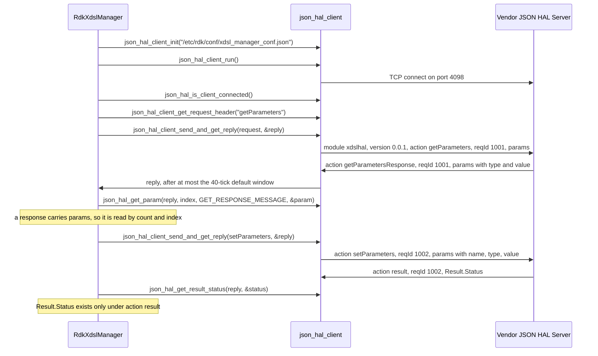
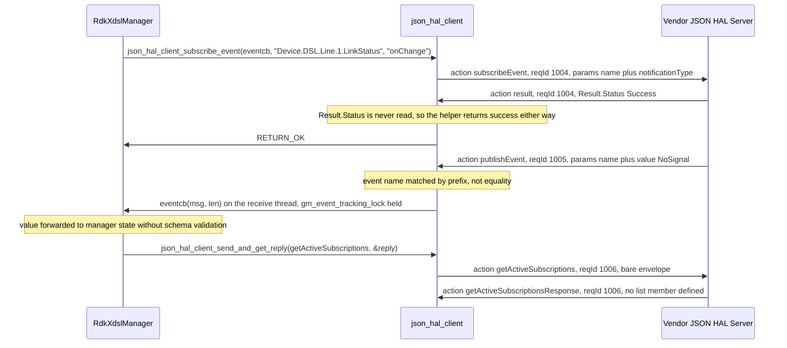

# xDSL HAL Detailed API Reference

This document is the per-parameter reference for the xDSL `JSON` HAL. It stands to
`hal_schema/xdsl_hal_schema.json` as inline Doxygen stands to a C header: one row per parameter
definition, giving the `TR-181` path the definition binds, the datatype and constraint the schema
enforces, whether the parameter may be written, and what the parameter means.
[halSpec.md](halSpec.md) carries the contract narrative — architecture, lifecycle, threading,
blocking behaviour, error handling and the protocol summary — and points here for the parameter
surface itself.

## Purpose and how to read it

The schema is the authority for everything structural in this document. It is a draft-07 document
carrying 422 definitions, which divide into four classes.

| Definition class | Count | What it contributes |
| --- | --- | --- |
| Parameter definitions | 369 | A leaf `TR-181` parameter: a `name` (a `const` path or a `pattern`), a `type` and a `value` constraint. Every row of the Parameter Reference is one of these. |
| Object definitions | 25 | An instance path ending in `.`, declaring `name` only. These name a table row rather than a value, and they are indexed separately in Object Index. |
| Enumerations | 11 | A named `enum` list referenced by `$ref` from parameters, from `notificationType` or from `Result.Status`. Enumeration Appendix lists them. |
| Envelope and protocol definitions | 17 | `moduleName`, `schemaVersion`, `action`, the eight per-action payload definitions, the get, set and subscribe reference lists, `result` and `getSchemaResponse`. Transport and Protocol describes them. |

**Whether the file loads at all depends on the parser, and this document reads it permissively.** The
root object declares `description` twice, at lines 5 and 7949, so a parser that refuses a repeated
member name does not load the contract at all while a permissive one keeps one of the two values
without saying so. Every count, constraint, access marking and validation verdict in this document was
taken from a permissive last-member-wins load. None of them depends on which value survives, because
the repeated member is an annotation and constrains no message — but a consumer must still choose its
parser policy deliberately rather than inherit one. Contract Defects entry 12 states both values, all
three conformant outcomes and the policy this contract requires.

**A definition is not a path, and the two counts differ.** Twenty of the 369 parameter definitions
bind a `pattern` containing an alternation rather than a single path, and those twenty cover 163
paths between them, so the 369 definitions bind **512 name slots**. Those 512 slots resolve to
**511 distinct paths**, because two definitions bind the same path:
`dslADSLLineTestACTATPds` and `dslADSLLineTestACTATPus` both carry the pattern
`^Device\.DSL\.Diagnostics\.ADSLLineTest\.ACTATPds$`. Both figures are stated wherever either is
used, and the duplicate is recorded in Contract Defects. A further five *object* definitions
alternate, expanding the 25 object definitions to 40 instance paths.

**How a row reads.** Each Parameter Reference table has four columns.

| Column | Content |
| --- | --- |
| `TR-181 Parameter` | The path or paths the definition binds, with `{i}` where the schema's `\d+` accepts any instance index, and the schema definition key beneath it. Where a definition alternates, the cell carries either every path it matches or — for the four definitions whose product runs to dozens of paths — the exact pattern with every alternative of every alternation enumerated. |
| `Type and Constraint` | The `type` value the schema fixes for the parameter, then the `value` constraint: the referenced enumeration, the numeric range, the string length, the regular expression, the default, and any `examples` the schema carries. |
| `Access` | `RW` or `RW (optional)` where the definition is referenced by `setParameterSupportedList` or `setParameterOptionalList`; `R` or `R (optional)` where it is referenced only by a get list; `not listed` where no list references it at all. `subscribable` is appended where `subscribeEventSupportedList` references it. |
| `Description` | The parameter's meaning, followed in italics by the source it was derived from. |

**A pipe inside a pattern is written `\|`, and the schema's own pattern carries a bare `|`.** A
Markdown table cell splits on an unescaped pipe, so every alternation in the tables below is escaped
to keep the row intact, and the documentation tool renders that backslash as part of the pattern.
The escape is a property of the table, not of the contract: when copying a pattern out of a cell,
delete the backslash before each `|` — leaving it in place turns an alternation into a literal pipe
character. Every other backslash in a pattern, including each `\.` and each `\d`, belongs to the
regular expression and is reproduced exactly as the schema states it.

**Access rests entirely on list membership, because this schema carries no access markers.** Not one
of the 369 parameter descriptions contains an `(Access = …)` annotation, so the only statement the
contract makes about writability is which reference list a definition appears in. Membership was
measured directly: `setParameterSupportedList` carries 18 references and `setParameterOptionalList`
6, which together resolve to **22 writable leaf parameters and 2 open object-name definitions**;
`getParameterSupportedList` carries 348 references and `getParameterOptionalList` 45. The resulting
spread across the 369 parameter definitions is 305 `R`, 39 `R (optional)`, 16 `RW`, 6
`RW (optional)` and 3 `not listed`, and exactly 2 definitions are subscribable.

**Where descriptions come from.** Only 3 of the 369 parameter definitions carry a `description` in
the schema, so 366 descriptions had to be derived, and every row names its source: a description
taken from the Broadband Forum model is marked `[Device:2.13]`, and one that could not be derived is
marked **underived**.

| Source | Rows | What it establishes, and what it does not |
| --- | --- | --- |
| `hal_schema/xdsl_hal_schema.json` | 3 descriptions, and the path, type, constraint and access of all 369 | Authoritative for everything structural. The three described definitions are `dslSeltuerUER`, `fastLineLinkStatus` and `atmLinkVCSearchList`. |
| Broadband Forum `Device:2.13` | 347 descriptions | Authoritative for the meaning of a path the model defines, including units and the standards clause. It is not authoritative for access here: where its access differs from this schema's list membership, the schema governs and the divergence is tabulated under Parameter Reference. |
| `config/RdkXdslManager.xml` and `source/TR-181/include/xdsl_apis.h` | 19 descriptions | Establishes only that the parameter is declared, with what datatype and under which object. Where these are the only sources, the row states the declaration and marks the meaning **underived**. |

**The model version was identified rather than assumed.** All 511 distinct paths were compared
against the published `Device:2` model reports for versions 2.11, 2.12, 2.13, 2.15 and 2.21.
Versions 2.11 and 2.12 do not define the `Device.DSL.Diagnostics.SELTUER.` and
`Device.DSL.Diagnostics.SELTQLN.` objects this schema exposes and are 46 paths short; 2.13 is the
earliest version that defines every non-vendor path used here and diverges from the schema's
datatypes least; 2.21 is closer on coverage but diverges on many more datatypes. The reference is
therefore <b>`Device:2.13`</b>, published as the
[`Device:2.13` model report](https://cwmp-data-models.broadband-forum.org/tr-181-2-13-0-cwmp.html)
and listed in the
[Broadband Forum CWMP data model index](https://cwmp-data-models.broadband-forum.org/).
Twenty-one of the 511 paths have no counterpart in
any published version through 2.21; nineteen of those are the rows derived from the local
declarations above, and the remaining two are the duplicate-bound and mis-keyed definitions
Contract Defects records.

**Underived is a stated outcome, not an omission.** A row whose meaning no consulted source
establishes says so in the `Description` column and still carries the type, constraint and access
the schema does state. Nineteen rows are in that position. A test author must treat an underived row
as a value of the stated type with no asserted semantics, rather than inferring meaning from the
definition key.

*Derived from `hal_schema/xdsl_hal_schema.json`, `config/RdkXdslManager.xml`,
`source/TR-181/include/xdsl_apis.h`, and the Broadband Forum `Device:2.13` model report.*

## Transport and Protocol

Every message is a single `JSON` object carrying a four-field envelope. The envelope is the same in
both directions and for every action; the root of the schema requires all four fields and constrains
each one.

| Field | Schema definition | Constraint |
| --- | --- | --- |
| `module` | `moduleName` | `const` `xdslhal`. A message naming any other module is invalid. |
| `version` | `schemaVersion` | `const` `0.0.1`. The definition's own description states that the value must not be modified and that HAL operation cannot be performed without the correct supported version. |
| `action` | `action` | One of the eleven members listed below. |
| `reqId` | inline | `type` `string` with `pattern` `^[0-9]+$` — **a decimal string, not a number**. A `JSON` integer in this field is invalid, whichever action carries it. The schema sets **no `maxLength`**, but the server's storage does: see the boundary below. |

**The root does not close unknown members.** It declares `properties` for those four fields only and
sets no `additionalProperties: false`, so any additional top-level member is accepted and left
entirely unvalidated. Nothing in the contract rejects a stray field, and nothing gives one meaning.

<b>`reqId` has a 63-byte usable boundary at the server, which the schema does not express.</b> The
server holds the field in a fixed array — `char req_id[BUF_64]` in the subscription status structure
(`json_hal_server.c:70`) and again as a local in the message handler (`:328`), with `BUF_64` being 64
(`json-rpc-common/json_rpc_common.h:84`) — and fills it with
`strncpy(req_id, json_object_get_string(returnObj), sizeof(req_id))` at `:383`. `strncpy` writes **no
terminating NUL when the source is at least as long as the destination**, so a `reqId` of 64 digits or
more leaves the array unterminated and every later `strlen`, comparison or format on it reads past the
end of the field (CWE-170, improper null termination). The same pattern applies to `action_name` at
`:393`. Because `^[0-9]+$` admits any number of digits, **a message that is fully schema-valid can
cross that boundary**, and neither the schema nor the transport rejects it.

| What | Value | Locator |
| --- | --- | --- |
| Schema constraint on `reqId` | `^[0-9]+$`, no length bound | `hal_schema/xdsl_hal_schema.json`, root `properties.reqId` |
| Server storage | `char req_id[BUF_64]`, `BUF_64` = 64 | `json_hal_server.c:70,328`; `json_rpc_common.h:84` |
| Usable digits | **63** | non-terminating `strncpy(..., sizeof(req_id))`, `json_hal_server.c:383` |

*Required of a caller: keep `reqId` to at most 63 digits and validate its length before the message is
dispatched, rather than relying on schema validation to catch it. A test author should treat a `reqId`
of 64 digits or more as an out-of-contract input that the schema nevertheless admits, and must not
assert vendor behaviour for it.*

**Payloads are bound by action, and eight of the eleven actions bind one.** The schema's `allOf` is
a list of eight `if action == X then …` branches. Each branch names the member the payload travels
in, requires it, and constrains it to an array of `uniqueItems` with `minItems` 1 whose items must
satisfy both an item-level `required` list and an `anyOf` over the reference lists. Two consequences
follow for every bound action: **an empty `params` array is invalid**, and **two identical entries in
one `params` array are invalid**.

| Action | Direction | Bound member | Required members | `anyOf` resolves to |
| --- | --- | --- | --- | --- |
| `getSchema` | manager to vendor | none | — | — |
| `getSchemaResponse` | vendor to manager | `SchemaInfo` (object, `additionalProperties` false) | on the object: `FilePath`, matching `^(.+)/([^/]+)$` | — |
| `getParameters` | manager to vendor | `params` | per item: `name` | `getParameterSupportedList`, `getParameterOptionalList` |
| `getParametersResponse` | vendor to manager | `params` | per item: `name`, `type`, `value` | `getParameterSupportedList`, `getParameterOptionalList` |
| `setParameters` | manager to vendor | `params` | per item: `name`, `type`, `value` | `setParameterSupportedList`, `setParameterOptionalList` |
| `result` | vendor to manager | `Result` (object, `additionalProperties` false) | on the object: `Status`, a `resultStatusEnumList` member | — |
| `subscribeEvent` | manager to vendor | `params` | per item: `name`, `notificationType` | `subscribeEventSupportedList` |
| `publishEvent` | vendor to manager | `params` | per item: `name`, `value` | `subscribeEventSupportedList` |
| `deleteObject` | manager to vendor | `params` | per item: `name` | `dslLineObjectName` |
| `getActiveSubscriptions` | manager to vendor | none | — | — |
| `getActiveSubscriptionsResponse` | vendor to manager | none | — | — |

Two structural facts about the item shape apply to every bound action and are worth stating before
the table is read further. The item-level `required` list is the **only** source of mandatory-field
rules for an entry: of the 371 closed definitions in this file only two — `result` and
`getSchemaResponse` — declare a `required` of their own, and no parameter definition and no object
definition declares one at all. And the `anyOf` is **ordered**, so which alternative an entry matches,
and how far a validator has to walk to find it, both matter — see the fifth property below and the
`Validation boundary` section.

Five properties of that table decide how a caller and a test author must treat the protocol.

- **There is no `setParametersResponse`.** A write is acknowledged by the generic `result` action,
  which is also the acknowledgement for `subscribeEvent` and for `deleteObject`. A reader looking for
  a write-specific response will not find one, and a server that invents one is sending an action the
  enumeration does not contain.
- <b>`publishEvent` binds the same reference list as `subscribeEvent`.</b> The only paths that can be
  published are therefore the only paths that can be subscribed: `Device.DSL.Line.{i}.LinkStatus` and
  `Device.FAST.Line.{i}.LinkStatus`. An `Device.ATM.Link.{i}.Status` or `Device.PTM.Link.{i}.Status`
  event is not expressible, which Contract Defects records against the manager's own subscriptions.
- <b>`deleteObject` is instantiable here.</b> Its `anyOf` resolves to `dslLineObjectName`, so a
  schema-valid delete names a `Device.DSL.Line.{i}.` instance and nothing else. This distinguishes
  xDSL from the GPON and voice HALs, whose `deleteObject` carries an empty `anyOf`.
- **The three unbound actions leave `params` unconstrained rather than forbidden.** `params` is not a
  root property and no branch matches these actions, so a `params` member sent with `getSchema`,
  `getActiveSubscriptions` or `getActiveSubscriptionsResponse` is accepted with any contents. This is
  what makes the transport's request-header helper safe for those actions and unsafe for the bound
  ones. The helper's exclusion is a **prefix test, not an equality test**:
  `strncmp(action_name, JSON_RPC_ACTION_GET_SCHEMA, strlen(JSON_RPC_ACTION_GET_SCHEMA)) != 0`
  (`json_hal_client.c:865`) compares only the first nine characters, so **every** action whose name
  begins with `getSchema` is excluded — `getSchema` itself and `getSchemaResponse` alike — while
  every other action receives an empty `params` array. Two consequences follow. An empty array fails
  `minItems` 1 on all eight bound actions, so a caller must populate `params` before sending. And a
  caller building a `getSchemaResponse` through this helper gets an envelope with no `params` member,
  which is correct for that action here — its payload is `SchemaInfo`, not `params` — but is a
  coincidence of the prefix rather than a decision about it: an action named with a `getSchema` prefix
  that did bind `params` would silently lose the array. `getActiveSubscriptionsResponse` in particular
  has **no schema member in which to return a subscription list**; whatever a server puts there is an
  unknown root member, accepted and unvalidated.
- **The two get actions cannot be validated past the thirty-ninth reference of their list.**
  `getParameters` and `getParametersResponse` resolve an entry through `getParameterSupportedList`,
  whose 348 alternatives include the two dangling references of defect 1 at entries 40 and 41. A
  validator that stops at the first matching alternative returns a verdict only for an entry matching
  one of the first 39; every other entry — a parameter declared later in the list, one of the 45
  drawn from `getParameterOptionalList`, or a malformed entry matching nothing — reaches an
  unresolvable reference and raises instead of reporting valid or invalid. The set, delete, subscribe
  and publish lists carry no dangling reference, so those surfaces return clean verdicts throughout.
  `Validation boundary` records the measurement and what it costs a test author.

**Nothing frames these messages on the wire.** The envelope above is the whole of the protocol: no
length prefix and no delimiter is written or expected in either direction, so a message boundary is
inferred from what a single `recv` happened to return rather than recovered from the stream. The
inference is made differently on the two sides, and both ways of making it are unsound.

| Direction | How a boundary is inferred | What that costs a test author |
| --- | --- | --- |
| Reply, client side | Continue only while the 16384-byte buffer fills; parse on **any** read that does not fill it (`tcp_client.c:188-234`) | `rc` is the return of `recv(sock, buffer, MAX_BUFFER_SIZE, 0)` (`:188`) and so can never exceed 16384, which makes `rc >= MAX_BUFFER_SIZE` (`:191`) a test of buffer occupancy and never of JSON completeness. A reply fragmented by the network reaches the parser truncated **at any size, 16 KiB and below included**, so a parse failure is not evidence that the vendor emitted bad JSON |
| Reply, client side, after a read that filled the buffer | The 16384 bytes are accumulated and the receive step is left **without parsing** (`tcp_client.c:191-202`); the accumulator is drained only by a later read that does not fill the buffer | The call blocks with **no deadline at all** if nothing further arrives, because the tick sweep is the suppressed idle callback (`tcp_client.c:251`, `json_hal_client.c:539-541`) and the caller's wait is untimed (`json_hal_client.c:683`). **Read occupancy is the whole trigger** — a serialized length that is an exact multiple of 16384 bytes is one **sufficient** delivery pattern, not a necessary condition on total length: a short read taken with the accumulator empty is parsed and discarded, so a later buffer-filling read stalls a reply of any total length, and a single read may even carry a reply and an unsolicited `publishEvent` together |
| Request, server side | one `recv` per readable descriptor, processed immediately with no accumulation (`tcp_server.c:219,259-262`) | **A request is truncated at any size** if the read is short; a large batched request has no recovery path |

Accumulation on the reply path copies a fixed `MAX_BUFFER_SIZE` at a `strlen` offset and the parse
call passes `strlen(pBuf)` rather than the received byte count (`tcp_client.c:208-213,234`), so the
accumulated message is NUL-delimited and an embedded NUL truncates it silently. The consequence for
this contract is recorded under Contract Defects and under `Memory Model` in
[halSpec.md](halSpec.md): ten readable parameters admit 61,430-character values, which spans close
to four buffer-loads of reply, so the large diagnostic reads are the ones read over the most `recv`
calls and therefore the ones most exposed to both hazards.

The request/response shape of every bound action is the same: the manager sends an envelope, the
vendor answers with a matching `reqId`, and the manager reads the payload or the status out of the
reply.

**Both diagrams in this reference are authored as fenced `mermaid` blocks.** Such blocks render as
diagrams on GitHub, which is the primary surface for a developer reading this repository. The
documentation generator used here does **not** render them; it displays their source text instead.
That limitation is stated rather than worked around, because the only available workaround would fix
the generated site at the cost of the surface most readers actually use. [halSpec.md](halSpec.md) records the
same limitation for the diagrams it carries.



**Each reply is read by the helper that matches its payload.** `getParametersResponse` binds `params`
and has **no `Result` member**, so it is consumed with `json_hal_get_total_param_count`
(`json_hal_client.h:154`) and `json_hal_get_param` per index (`json_hal_common.h:100`);
`json_hal_get_result_status` (`json_hal_client.h:144`) is meaningful only for `result`, whose payload
is a `Result` object. Applied to a response it finds no `Result`, logs, returns `RETURN_ERR` and
leaves the caller's flag untouched (`json_hal_client.c:934-944`) — so a test that asserts a status
after a read is asserting on an uninitialised value, not on the vendor.

**The transport's symbol table covers the protocol only partly.** Comparing the schema against
[`json-rpc-common/json_rpc_common.h`](https://github.com/rdkcentral/json-hal-library/tree/86a0a300b976f8e3295064af8fb3fd1c793c9e64)
at the pinned revision:

- Five of the eleven actions have a named constant — `JSON_RPC_ACTION_GET_PARAM`,
  `JSON_RPC_ACTION_GET_PARAM_RESPONSE`, `JSON_RPC_ACTION_RESULT`, `JSON_RPC_ACTION_GET_SCHEMA` and
  `JSON_RPC_ACTION_GET_SCHEMA_RESPONSE` at `json_rpc_common.h:77-81`. `setParameters`,
  `subscribeEvent`, `publishEvent`, `deleteObject`, `getActiveSubscriptions` and
  `getActiveSubscriptionsResponse` have none, so callers pass those action names as literals.
- Three of the four `resultStatusEnumList` members have a constant — `JSON_RPC_STATUS_SUCCESS`,
  `JSON_RPC_STATUS_FAILED` and `JSON_RPC_STATUS_NOT_SUPPORTED` at `json_rpc_common.h:72-75`.
  <b>`Invalid Argument` has none</b>, so no transport symbol names it.
- `JSON_RPC_FIELD_CONFIGURE_OBJECT` at `json_rpc_common.h:48` names `configureObject`, which is
  **not a member of this schema's `action` enumeration**. It is the origin of the invalid fixture
  described under Worked Message Examples, and a message using it is rejected.
- `JSON_RPC_FIELD_PARAM_NOTIFICATION_TYPE_ON_CHANGE_SYNC` and its timeout companion at
  `json_rpc_common.h:54-55` name `onChangeSync` and `onChangeSyncTimeout`, which are **not members of
  this schema's `notificationType`**. Only `interval` and `onChange` validate here, so a caller that
  reaches for those two constants produces an invalid `subscribeEvent`.

**Values cross this boundary through signed conversions, and the helper reports nothing about them.**
The two unsigned datatype labels this schema uses most — `unsignedInt` on 173 definitions and
`unsignedLong` on 40 — are carried by paths whose locals and format specifiers do not match the label:

| Label | Extraction, `json_hal_get_param` | Construction, `json_hal_add_param` |
| --- | --- | --- |
| `unsignedInt` | `unsigned int uint_value = json_object_get_int(...)`, printed `"%d"` (`json_hal_common.c:111-112`) | `uint_value = atoll(param->value)`, emitted through json-c's `json_object_new_int` (`:197-198`) |
| `unsignedLong` | `unsigned long ulong_value = json_object_get_int64(...)`, printed `"%ld"` (`:125-126`) | `ulong_value = atoll(param->value)`, emitted through json-c's `json_object_new_int64` (`:207-208`) |

So a value above the signed maximum of the accessor on that path is not representable, the printing
step re-applies a signed conversion, and on a target where `long` is 32 bits the `unsignedLong` path
narrows as well. No range check, `errno` check or full-consumption check is made in either direction:
`atoll` on a non-numeric value yields `0` silently, which is how defect 11 turns a named failure
reason into a decimal zero. Two further outcomes of the same helper are reported as success:

| Input | What the helper does | What the caller sees |
| --- | --- | --- |
| Entry with no `value`, label `boolean`/`int`/`unsignedInt`/`long`/`unsignedLong` | value fetch is conditional; falls through, sets `param->type`, returns `RETURN_OK` (`json_hal_common.c:95-129,141`) | `param->value` is the empty string left by the `memset` at `:38`; `atoi("")` is `0`, so a missing value is **indistinguishable from a genuine zero** once converted |
| Entry with no `value`, label `string`/`hexBinary`/`base64` | returns `RETURN_ERR` (`:72-73,81-82,90-91`) | an error — the asymmetry is the point: the same defect is an error for three labels and a success for five |
| Datatype label matching none of the eight | no arm taken; `param->type` stays `0`, value stays empty, returns `RETURN_OK` (`:129-141`) | success, a type `eParamType` does not define, and no value |
| `eActionType` other than the four handled | `default` arm logs only and returns `RETURN_OK` (`:135-141`) | success and a fully zeroed `hal_param_t` |
| `param->type` of `0` on construction | inner switch has no `default`; `name` is added, `type` and `value` are not (`:165-210`) | `RETURN_OK` and an entry invalid against every `params`-bearing action here |

*Required of a caller and of a test harness: check `param->type` against the expected `eParamType`
member rather than trusting `RETURN_OK`; treat an empty `param->value` as absent rather than
converting it; and read the member directly with `json_object_object_get_ex` and the accessor matching
the schema's declared type for any parameter whose constraint admits a value beyond the signed range
of the path above. `RETURN_OK` from either helper is not evidence that a value was carried.*

*Derived from the root schema and `definitions` of `hal_schema/xdsl_hal_schema.json`, and from
`json-rpc-common/json_rpc_common.h` and `json_hal_common.c` at commit `86a0a300`.*

## Deployment contract

| Element | Value | Established by |
| --- | --- | --- |
| Module name in every message | `xdslhal` | `definitions.moduleName.const` |
| Schema version in every message | `0.0.1` | `definitions.schemaVersion.const` |
| Client configuration file | `/etc/rdk/conf/xdsl_manager_conf.json` | `XDSL_JSON_CONF_PATH` at `source/TR-181/integration_src.shared/xdsl_hal.c:52`, passed to `json_hal_client_init` at `:189` |
| Schema path the configuration names | `/etc/rdk/schemas/xdsl_hal_schema.json` | `hal_schema_path` in `config/xdsl_manager_conf.json` |
| Server port the configuration names | `4098` | `server_port` in `config/xdsl_manager_conf.json` |
| Schema variants | one | This repository ships a single schema file. Unlike the GPON HAL, no build flag selects an alternative, so every deployment of this manager speaks the contract documented here. |

The schema that travels with this repository is `hal_schema/xdsl_hal_schema.json`; the path above is
where a deployment is expected to install it and where a `getSchemaResponse` should point. The
shipped `getSchemaResponse` fixture points somewhere else, which Worked Message Examples corrects.

*Derived from `config/xdsl_manager_conf.json` and
`source/TR-181/integration_src.shared/xdsl_hal.c:52,189`.*

## Object Index

Twenty-five definitions describe an object rather than a value. Each declares a `name` whose pattern
ends in `.`, and declares no other property: an object entry identifies a table row, and carries no
datatype and no value. Five of the twenty-five alternate, so the twenty-five definitions cover forty
instance paths.

**All twenty-five are open, and none of the 369 parameter definitions is.** Every object definition
omits `additionalProperties`, so any further member an entry carries is accepted unchecked; every
parameter definition sets `additionalProperties: false`, so any member beyond `name`, `type` and
`value` is rejected. That difference decides the entry-level verdict for every bound action — see
`Validation boundary`, where it is tabulated per action beside the two closed payload objects and the
reachability limit defect 1 imposes on the read surface — and it is why a `setParameters` naming an
object path validates rather than being refused.

An object definition serves three purposes here. It is the payload of a `deleteObject`, whose `anyOf`
admits `dslLineObjectName` alone. It appears in the get reference lists, where a `getParameters`
naming an object path asks the vendor for the instance rather than for a value. And in two cases it
appears in a **set** list, where the write validates while the contract constrains neither its
datatype nor its value: see Writable surface below and Contract Defects.

| Object definition | Instance paths | List membership | Shape |
| --- | --- | --- | --- |
| `^Device\.ATM\.Diagnostics\.F5Loopback\.$`<br>`atmDiagnosticsF5LoopbackObjectName` | 1 | R (optional) | declares `name` only |
| `^Device\.ATM\.Link\.\d+\.$`<br>`atmLinkObjectName` | 1 | RW | declares `name` only |
| `^Device\.ATM\.Link\.\d+\.QoS\.$`<br>`atmLinkQoSObjectName` | 1 | R | declares `name` only |
| `^Device\.ATM\.Link\.\d+\.Stats\.$`<br>`atmLinkStatsObjectName` | 1 | R | declares `name` only |
| `^Device\.DSL\.BondingGroup\.\d+\.$`<br>`dslBondingGroupObjectName` | 1 | R | declares `name` only |
| `^Device\.DSL\.BondingGroup\.\d+\.BondedChannel\.\d+\.$`<br>`dslBondedChannelObjectName` | 1 | R | declares `name` only |
| `^Device\.DSL\.BondingGroup\.\d+\.Stats\.$`<br>`dslBondingGroupStatsObjectName` | 1 | R | declares `name` only |
| `^Device\.DSL\.BondingGroup\.\d+\.Stats\.(Total\|CurrentDay\|QuarterHour)\.$`<br>`bondingGroupStatsAllObjectName`<br>**3 instance paths** | 3 | R | declares `name` only |
| `^Device\.DSL\.Channel\.\d+\.$`<br>`dslChannelObjectName` | 1 | R | declares `name` only |
| `^Device\.DSL\.Channel\.\d+\.Stats\.(Total\|Showtime\|LastShowtime\|CurrentDay\|QuarterHour)\.$`<br>`channelStatsAllObjectName`<br>**5 instance paths** | 5 | R | declares `name` only |
| `^Device\.DSL\.Diagnostics\.ADSLLineTest\.$`<br>`dslDiagnosticsADSLLineTestObjectName` | 1 | R | declares `name` only |
| `^Device\.DSL\.Diagnostics\.SELTP\.$`<br>`dslDiagnosticsSeltpObjectName` | 1 | R | declares `name` only |
| `^Device\.DSL\.Diagnostics\.SELTQLN\.$`<br>`dslDiagnosticsSeltqlnObjectName` | 1 | R | declares `name` only |
| `^Device\.DSL\.Diagnostics\.SELTUER\.$`<br>`dslDiagnosticsSeltuerObjectName` | 1 | R | declares `name` only |
| `^Device\.DSL\.Line\.\d+\.$`<br>`dslLineObjectName` | 1 | R | declares `name` only |
| `^Device\.DSL\.Line\.\d+\.DataGathering\.$`<br>`dslLineDataGatheringObjectName` | 1 | R (optional) | declares `name` only |
| `^Device\.DSL\.(Line\|Channel)\.\d+\.Stats\.$`<br>`dslLineChannelStatsObjectName`<br>**2 instance paths** | 2 | R | declares `name` only |
| `^Device\.DSL\.Line\.\d+\.Stats\.(Total\|Showtime\|LastShowtime\|CurrentDay\|QuarterHour)\.$`<br>`dslLineStatsAllObjectName`<br>**5 instance paths** | 5 | R | declares `name` only |
| `^Device\.DSL\.Line\.\d+\.TestParams\.$`<br>`dslLineTestParamsObjectName` | 1 | R | declares `name` only |
| `^Device\.FAST\.Line\.\d+\.$`<br>`fastLineObjectName` | 1 | R | declares `name` only |
| `^Device\.FAST\.Line\.\d+\.Stats\.$`<br>`fastLineStatsObjectName` | 1 | R | declares `name` only |
| `^Device\.FAST\.Line\.\d+\.Stats\.(Total\|Showtime\|LastShowtime\|CurrentDay\|QuarterHour)\.$`<br>`fastLineStatsAllObjectName`<br>**5 instance paths** | 5 | R | declares `name` only |
| `^Device\.FAST\.Line\.\d+\.TestParams\.$`<br>`fastLineTestParamsObjectName` | 1 | R | declares `name` only |
| `^Device\.PTM\.Link\.\d+\.$`<br>`ptmLinkObjectName` | 1 | RW | declares `name` only |
| `^Device\.PTM\.Link\.\d+\.Stats\.$`<br>`ptmLinkStatsObjectName` | 1 | R | declares `name` only |

*Derived from the object definitions of `hal_schema/xdsl_hal_schema.json` and from the reference
lists that name them.*

## Parameter Reference

The 369 parameter definitions are presented in nine sections, one per object family, following the
four-column convention set out in Purpose and how to read it. Section totals are given as
*definitions* and as *name slots*, because a definition that alternates binds more than one path.

| Section | Definitions | Name slots |
| --- | --- | --- |
| `Device.DSL.Line` | 113 | 136 |
| `Device.DSL.Channel` | 25 | 55 |
| `Device.DSL.BondingGroup` | 40 | 71 |
| `Device.DSL.Diagnostics` | 62 | 62 |
| `Device.DSL.X_RDK_NLNM` | 1 | 1 |
| `Device.FAST.Line` | 61 | 120 |
| `Device.ATM.Link` | 36 | 36 |
| `Device.ATM.Diagnostics` | 9 | 9 |
| `Device.PTM.Link` | 22 | 22 |
| **Total** | **369** | **512** |

Those 512 name slots resolve to **511 distinct paths**, for the duplicate-pattern reason given in
Purpose and how to read it and recorded under Contract Defects.

All four `TR-181` families this HAL exposes are covered: `Device.DSL`, `Device.FAST`, `Device.ATM`
and `Device.PTM`. A definition whose pattern spans two families — the fourteen
`Device.DSL.(Line|Channel).…` definitions — is listed once, in the section of the first path it
binds, with both paths in its cell.

### Writable surface

The set reference lists carry 24 references between them, and they are **not** 24 writable
parameters. They resolve into exactly two populations — 22 writable leaf parameters and 2 open
object-name definitions, `22 + 2 = 24` — and a test author must keep the two apart. **Neither set
list contains a dangling reference**; the schema's two undefined definitions are referenced only by
`getParameterSupportedList` and belong to the read surface, which the note after the two tables states
and Contract Defects measures.

**22 writable leaf parameters.** Sixteen through `setParameterSupportedList` and six through
`setParameterOptionalList`. These are the only values a schema-valid `setParameters` may carry.

| TR-181 path | Definition key | Set list | Type and Constraint |
| --- | --- | --- | --- |
| `Device.ATM.Diagnostics.F5Loopback.DiagnosticsState` | `atmDiagF5LoopbackDiagnosticsState` | `setParameterOptionalList` | `string`; JSON `string`; one of `None`, `Requested`, `Canceled`, `Complete`, `Error`, `Error_Internal`, `Error_Other` |
| `Device.ATM.Diagnostics.F5Loopback.Interface` | `atmDiagF5LoopbackInterface` | `setParameterOptionalList` | `string`; JSON `string`; maxLength `256` |
| `Device.ATM.Diagnostics.F5Loopback.NumberOfRepetitions` | `atmDiagF5LoopbackNumberOfRepetitions` | `setParameterOptionalList` | `unsignedInt`; JSON `integer`; min `0` |
| `Device.ATM.Diagnostics.F5Loopback.Timeout` | `atmDiagF5LoopbackTimeout` | `setParameterOptionalList` | `unsignedInt`; JSON `integer`; min `0` |
| `Device.ATM.Link.{i}.DestinationAddress` | `atmLinkDestinationAddress` | `setParameterSupportedList` | `string`; JSON `string`; maxLength `256`; pattern `^(d+/d+)$`; `examples` "0/35 or 8/23" (**a string, not an array**) |
| `Device.ATM.Link.{i}.Enable` | `atmLinkEnable` | `setParameterSupportedList` | `boolean`; JSON `boolean`, otherwise unconstrained |
| `Device.ATM.Link.{i}.Encapsulation` | `atmLinkEncapsulation` | `setParameterSupportedList` | `string`; JSON `string`; one of `LLC`, `VCMUX` |
| `Device.ATM.Link.{i}.FCSPreserved` | `atmLinkFCSPreserved` | `setParameterSupportedList` | `boolean`; JSON `boolean`, otherwise unconstrained |
| `Device.ATM.Link.{i}.Name` | `atmLinkName` | `setParameterSupportedList` | `string`; JSON `string`; maxLength `64` |
| `Device.ATM.Link.{i}.QoS.MaximumBurstSize` | `atmLinkQoSMaximumBurstSize` | `setParameterSupportedList` | `unsignedInt`; JSON `integer`; min `0` |
| `Device.ATM.Link.{i}.QoS.PeakCellRate` | `atmLinkQoSPeakCellRate` | `setParameterSupportedList` | `unsignedInt`; JSON `integer`; min `0` |
| `Device.ATM.Link.{i}.QoS.QoSClass` | `atmLinkQoSQoSClass` | `setParameterSupportedList` | `string`; JSON `string`; one of `UBR`, `CBR`, `GFR`, `VBR-nrt`, `VBR-rt`, `UBR+`, `ABR` |
| `Device.ATM.Link.{i}.QoS.SustainableCellRate` | `atmLinkQoSSustainableCellRate` | `setParameterSupportedList` | `unsignedInt`; JSON `integer`; min `0` |
| `Device.ATM.Link.{i}.VCSearchList` | `atmLinkVCSearchList` | `setParameterSupportedList` | `string`; JSON `string`; maxLength `256`; `examples` "0/35, 8/35, 1/35" (**a string, not an array**) |
| `Device.DSL.Diagnostics.ADSLLineTest.DiagnosticsState` | `dslADSLLineTestDiagnosticsState` | `setParameterOptionalList` | `string`; `$ref` `dslDiagnosticsStateEnumList` |
| `Device.DSL.Channel.{i}.Enable` | `dslChannelEnable` | `setParameterSupportedList` | `boolean`; JSON `boolean`, otherwise unconstrained |
| `Device.DSL.Line.{i}.AllowedProfiles` | `dslLineAllowedProfiles` | `setParameterSupportedList` | `string`; JSON `string`; pattern `` ^(8a\|8b\|8c\|8d\|12a\|12b\|17a\|17b\|30a\|35b)(,(8a\|8b\|8c\|8d\|12a\|12b\|17a\|17b\|30a\|35b))*$ `` |
| `Device.DSL.Line.{i}.Enable` | `dslLineEnable` | `setParameterSupportedList` | `boolean`; JSON `boolean`, otherwise unconstrained |
| `Device.DSL.Line.{i}.EnableDataGathering` | `dslLineEnableDataGathering` | `setParameterOptionalList` | `boolean`; JSON `boolean`, otherwise unconstrained |
| `Device.DSL.Line.{i}.StandardsSupported` | `dslLineStandardsSupported` | `setParameterSupportedList` | `string`; JSON `string`; no `maxLength`; `pattern` anchored, an alternation over 26 transmission-system labels, comma-separable — every alternative and the exact expression are given under Long value patterns at the end of this section |
| `Device.PTM.Link.{i}.Enable` | `ptmLinkEnable` | `setParameterSupportedList` | `boolean`; JSON `boolean`, otherwise unconstrained |
| `Device.PTM.Link.{i}.Name` | `ptmLinkName` | `setParameterSupportedList` | `string`; JSON `string`; maxLength `64` |

**2 open object-name definitions.** Both appear in `setParameterSupportedList`, and neither describes
a writable leaf value.

| Object path | Definition key | Set list | Shape |
| --- | --- | --- | --- |
| `Device.ATM.Link.{i}.` | `atmLinkObjectName` | `setParameterSupportedList` | declares `name` only, open |
| `Device.PTM.Link.{i}.` | `ptmLinkObjectName` | `setParameterSupportedList` | declares `name` only, open |

An object definition declares `name` and nothing else, and — unlike every one of the 369 parameter
definitions, which all set `additionalProperties: false` — it sets no `additionalProperties`. The
`type` and `value` members that `setParameters` requires therefore pass through it as unconstrained
extras, so **a write naming one of these two object paths is schema-valid and the schema fixes
neither its datatype nor its value domain.** Measured against `hal_schema/xdsl_hal_schema.json` with
a draft-07 validator: `{"name": "Device.ATM.Link.1.", "type": "string", "value": "x"}` under
`setParameters` is valid, the `Device.PTM.Link.{i}.` equivalent is valid, the same entry carrying an
arbitrary further member is valid, and one whose `value` is `null` is valid; only omitting `type` or
`value` is invalid, which is the action's `required` list refusing an incomplete entry and not the
schema refusing an object write. The paired closed-leaf case establishes the contrast:
`{"name": "Device.ATM.Link.1.Name", "type": "string", "value": null}` is invalid, because
`atmLinkName` closes its `value` to a bounded string.

Nothing in the schema, in `config/RdkXdslManager.xml` or in `source/TR-181/` states what writing an
object name would mean. **Both are excluded from positive functional write cases because there is no
specified behaviour to assert — not because the message would be rejected**; a negative test that
expects rejection asserts the opposite of what the schema does. Their presence in a set list is
recorded as a defect under Contract Defects.

**The two dangling references are read-surface defects, not a third write population.**
`#/definitions/dslLineXTURVersion` and `#/definitions/dslLineXTURSerial` are referenced by
`getParameterSupportedList` — at its 1-based entries **40** and **41** — and by neither set list, so
they do not enter the arithmetic above. They are not parameters of this contract and appear in no
table here; the manager nevertheless writes both paths, which Contract Defects records together with
the reachability consequence for reads.

For orientation, the four reference lists measured against the shipped schema are:

| List | References | Note |
| --- | --- | --- |
| `getParameterSupportedList` | 348 | contains the two dangling entries at positions 40 and 41; only the first 39 are reachable |
| `getParameterOptionalList` | 45 | no dangling entry |
| `setParameterSupportedList` | 18 | 16 leaf parameters plus the 2 object-name definitions |
| `setParameterOptionalList` | 6 | 6 leaf parameters |

That is 393 read references and 24 write references in total.

*Derived from `getParameterSupportedList`, `getParameterOptionalList`, `setParameterSupportedList`,
`setParameterOptionalList` and the definitions they reference in `hal_schema/xdsl_hal_schema.json`.*

### Device.DSL.Line

*113 parameter definitions binding 136 name paths.*

| TR-181 Parameter | Type and Constraint | Access | Description |
| --- | --- | --- | --- |
| `Device.DSL.Line.{i}.ACTINPROCds`<br>`dslLineACTINPROCds` | `unsignedInt`; JSON `integer`; min `0` | R (optional) | This parameter reports the actual impulse noise protection (INP) of the robust overhead channel (ROC) in the downstream direction. `[Device:2.13]` |
| `Device.DSL.Line.{i}.ACTINPROCus`<br>`dslLineACTINPROCus` | `unsignedInt`; JSON `integer`; min `0` | R (optional) | This parameter reports the actual impulse noise protection (INP) of the robust overhead channel (ROC) in the upstream direction. `[Device:2.13]` |
| `Device.DSL.Line.{i}.ACTRAMODEds`<br>`dslLineACTRAMODEds` | `unsignedInt`; JSON `integer`; `1`..`4` | R (optional) | This parameter indicates the actual active rate adaptation mode in the downstream direction. If this parameter equals 1, the link is operating in RA-MODE 1 (MANUAL). If this parameter equals 2, the link is operating in RA-MODE 2 (AT_INIT). If this parameter equals 3, the link is operating in RA-MODE 3 (DYNAMIC). If this parameter equals 4, the link is operating in RA-MODE 4 (DYNAMIC with SOS). Defined as ACT-RA-MODEds in Clause 7.5.1.33.1 of ITU-T G.997.1. `[Device:2.13]` |
| `Device.DSL.Line.{i}.ACTRAMODEus`<br>`dslLineACTRAMODEus` | `unsignedInt`; JSON `integer`; `1`..`4` | R (optional) | This parameter indicates the actual active rate adaptation mode in the upstream direction. If this parameter equals 1, the link is operating in RA-MODE 1 (MANUAL). If this parameter equals 2, the link is operating in RA-MODE 2 (AT_INIT). If this parameter equals 3, the link is operating in RA-MODE 3 (DYNAMIC). If this parameter equals 4, the link is operating in RA-MODE 4 (DYNAMIC with SOS). Defined as ACT-RA-MODEus in Clause 7.5.1.33.2 of ITU-T G.997.1. `[Device:2.13]` |
| `Device.DSL.Line.{i}.ACTSNRMODEds`<br>`dslLineACTSNRMODEds` | `unsignedInt`; JSON `integer`; `0`..`2` | R | Reports whether the OPTIONAL virtual noise mechanism is in use in the downstream direction. `[Device:2.13]` |
| `Device.DSL.Line.{i}.ACTSNRMODEus`<br>`dslLineACTSNRMODEus` | `unsignedInt`; JSON `integer`; min `0` | R | Reports whether the OPTIONAL virtual noise mechanism is in use in the upstream direction. A value of 1 indicates the virtual noise mechanism is not in use, and a value of 2 indicates the virtual noise mechanism is in use. `[Device:2.13]` |
| `Device.DSL.Line.{i}.ACTUALCE`<br>`dslLineACTUALCE` | `unsignedInt`; JSON `integer`; min `0` | R (optional) | Reports the actual cyclic extension, as the value of m, in use for the connection. Note: See ITU-T Recommendation G.997.1. `[Device:2.13]` |
| `Device.DSL.Line.{i}.AllowedProfiles`<br>`dslLineAllowedProfiles` | `string`; JSON `string`; pattern `` ^(8a\|8b\|8c\|8d\|12a\|12b\|17a\|17b\|30a\|35b)(,(8a\|8b\|8c\|8d\|12a\|12b\|17a\|17b\|30a\|35b))*$ `` | RW | Comma-separated list. List items indicate which VDSL2 profiles are allowed on the line. Note: In G.997.1, this parameter is called PROFILES. See ITU-T Recommendation G.997.1. `[Device:2.13]` |
| `Device.DSL.Line.{i}.CurrentProfile`<br>`dslLineCurrentProfile` | `string`; `$ref` `allowedProfilesEnumList` | R | Indicates which VDSL2 profile is currently in use on the line. Note: This parameter is OPTIONAL at the G and S/T interfaces in G.997.1 Amendment 1. `[Device:2.13]` |
| `Device.DSL.Line.{i}.DataGathering.ActLoggingDepthReportingR`<br>`lineDataGatheringActLoggingDepthReportingR` | `unsignedInt`; JSON `integer`; min `0` | R (optional) | This parameter is actual logging depth that is used for reporting the VTU-R event trace buffer over the eoc channel, in number of records, where each of the records consists of 6 bytes indicating a data gathering event as defined in G.993.2. Units: records. `[Device:2.13]` |
| `Device.DSL.Line.{i}.DataGathering.EventTraceBufferR`<br>`lineDataGatheringEventTraceBufferR` | `string`; JSON `string`; maxLength `256` | R (optional) | This parameter identifies the log file of the data gathering event trace buffer containing the event records that originated at the VTU-R. The value is the path name of the row of the device's vendor log file table that holds that buffer, and is an empty string once the referenced row is deleted; the buffer itself is retrieved by uploading the identified vendor log file rather than through this HAL. Defined as EVENT_TRACE_BUFFER_R in Clause 7.5.3.6 of ITU-T G.997.1 and Clause 11.5 of ITU-T G.993.2. `[Device:2.13]` |
| `Device.DSL.Line.{i}.DataGathering.LoggingDepthR`<br>`lineDataGatheringLoggingDepthR` | `unsignedInt`; JSON `integer`; min `0` | R (optional) | This parameter is the maximum depth of the entire data gathering event buffer at the VTU-R, in number of records, where each of the records consists of 6 bytes indicating a data gathering event as defined in G.993.2. Units: records. `[Device:2.13]` |
| `Device.DSL.Line.{i}.DownstreamAttenuation`<br>`dslLineDownstreamAttenuation` | `int`; JSON `integer`, otherwise unconstrained | R | The current downstream signal loss (expressed in 0.1dB). Doesn't apply to VDSL2 G.993.2. Otherwise has the same value as the single element of TestParams.SATNds. Units: 0.1dB. `[Device:2.13]` |
| `Device.DSL.Line.{i}.DownstreamMaxBitRate`<br>`dslLineDownstreamMaxBitRate` | `unsignedInt`; JSON `integer`; min `0` | R | The current maximum attainable data rate downstream (expressed in Kbps). Note: This parameter is related to the G.997.1 parameter ATTNDRds, which is measured in bits/s. Units: Kbps. `[Device:2.13]` |
| `Device.DSL.Line.{i}.DownstreamNoiseMargin`<br>`dslLineDownstreamNoiseMargin` | `int`; JSON `integer`; `-64`..`63` | R | The current signal-to-noise ratio margin (expressed in 0.1dB) in the downstream direction. Note: In G.997.1, this parameter is called SNRMds. Units: 0.1dB. `[Device:2.13]` |
| `Device.DSL.Line.{i}.DownstreamPower`<br>`dslLineDownstreamPower` | `int`; JSON `integer`, otherwise unconstrained | R | The current received power at the CPE's DSL line (expressed in 0.1dBmV). Units: 0.1dBmV. `[Device:2.13]` |
| `Device.DSL.Line.{i}.Enable`<br>`dslLineEnable` | `boolean`; JSON `boolean`, otherwise unconstrained | RW | Enables or disables the DSL line. This parameter is based on ifAdminStatus from RFC2863. `[Device:2.13]` |
| `Device.DSL.Line.{i}.EnableDataGathering`<br>`dslLineEnableDataGathering` | `boolean`; JSON `boolean`, otherwise unconstrained | RW (optional) | Enables or disables data gathering on the DSL line. `[Device:2.13]` |
| `Device.DSL.Line.{i}.FirmwareVersion`<br>`dslLineFirmwareVersion` | `string`; JSON `string`; maxLength `64` | R | A string identifying the version of the modem firmware currently installed for this interface. `[Device:2.13]` |
| `Device.DSL.Line.{i}.INMCCds`<br>`dslLineINMCCds` | `unsignedInt`; JSON `integer`; `0`..`64` | R | The Impulse Noise Monitoring (INM) Cluster Continuation value, measured in DMT symbols, that the xTU receiver uses in the cluster indication process. `[Device:2.13]` |
| `Device.DSL.Line.{i}.INMIATOds`<br>`dslLineINMIATOds` | `unsignedInt`; JSON `integer`; `3`..`511` | R | The Impulse Noise Monitoring (INM) Inter Arrival Time (IAT) Offset, measured in DMT symbols, that the xTU receiver uses to determine in which bin of the IAT histogram the IAT is reported. `[Device:2.13]` |
| `Device.DSL.Line.{i}.INMIATSds`<br>`dslLineINMIATSds` | `unsignedInt`; JSON `integer`; `0`..`7` | R | The Impulse Noise Monitoring (INM) Inter Arrival Time (IAT) Step that the xTU receiver uses to determine in which bin of the IAT histogram the IAT is reported. `[Device:2.13]` |
| `Device.DSL.Line.{i}.INMINPEQMODEds`<br>`dslLineINMINPEQMODEds` | `unsignedInt`; JSON `integer`; `0`..`3` | R | The Impulse Noise Monitoring (INM) Equivalent Impulse Noise Protection (INP) Mode that the xTU receiver uses in the computation of the Equivalent INP. Note: In G.997.1, this parameter is called INM_INPEQ_MODE. See ITU-T Recommendation G.997.1. `[Device:2.13]` |
| `Device.DSL.Line.{i}.LIMITMASK`<br>`dslLineLIMITMASK` | `unsignedInt`; JSON `integer`; min `0` | R (optional) | Indicates the enabled VDSL2 Limit PSD mask of the selected PSD mask class. Bit mask as specified in ITU-T Recommendation G.997.1. `[Device:2.13]` |
| `Device.DSL.Line.{i}.LastChange`<br>`dslLineLastChange` | `unsignedInt`; JSON `integer`; min `0` | R | The accumulated time in seconds since the DSL line entered its current operational state. Units: seconds. `[Device:2.13]` |
| `Device.DSL.Line.{i}.LastStateTransmittedDownstream`<br>`dslLineLastStateTransmittedDownstream` | `unsignedInt`; JSON `integer`; min `0` | R (optional) | This parameter represents the last successful transmitted initialization state in the downstream direction in the last full initialization performed on the line. `[Device:2.13]` |
| `Device.DSL.Line.{i}.LastStateTransmittedUpstream`<br>`dslLineLastStateTransmittedUpstream` | `unsignedInt`; JSON `integer`; min `0` | R (optional) | This parameter represents the last successful transmitted initialization state in the upstream direction in the last full initialization performed on the line. `[Device:2.13]` |
| `Device.DSL.Line.{i}.LineEncoding`<br>`dslLineLineEncoding` | `string`; `$ref` `lineEncodingEnumList` | R | The line encoding method used in establishing the Layer 1 DSL connection between the CPE and the DSLAM. Note: Generally speaking, this variable does not change after provisioning. `[Device:2.13]` |
| `Device.DSL.Line.{i}.LineNumber`<br>`dslLineLineNumber` | `int`; JSON `integer`; min `1` | R | Signifies the line pair that the modem is using to connection. this parameter = 1 is the innermost pair. `[Device:2.13]` |
| `Device.DSL.Line.{i}.LinkStatus`<br>`dslLineLinkStatus` | `string`; `$ref` `linkStatusEnumList` | R, subscribable | Status of the DSL physical link. When this parameter is Up, Status is expected to be Up. When this parameter is Initializing or EstablishingLink or NoSignal or Disabled, Status is expected to be Down. `[Device:2.13]` |
| `Device.DSL.Line.{i}.MREFPSDds`<br>`dslLineMREFPSDds` | `base64`; JSON `string`; maxLength `145` | R (optional) | This parameter SHALL contain the set of breakpoints exchanged in the MREFPSDds fields of the O-PRM message of G.993.2. `[Device:2.13]` |
| `Device.DSL.Line.{i}.MREFPSDus`<br>`dslLineMREFPSDus` | `base64`; JSON `string`; maxLength `145` | R (optional) | This parameter SHALL contain the set of breakpoints exchanged in the MREFPSDus fields of the R-PRM message of G.993.2. `[Device:2.13]` |
| `Device.DSL.Line.{i}.Name`<br>`dslLineName` | `string`; JSON `string`; maxLength `64` | R | The textual name of the DSL line as assigned by the CPE. `[Device:2.13]` |
| `Device.DSL.Line.{i}.PowerManagementState`<br>`dslLinePowerManagementState` | `string`; `$ref` `powerManagementStateEnumList` | R | The power management state of the line. Note: See ITU-T Recommendation G.997.1. `[Device:2.13]` |
| `Device.DSL.Line.{i}.RXTHRSHds`<br>`dslLineRXTHRSHds` | `int`; JSON `integer`; `-640`..`0` | R (optional) | UPBO downstream receiver signal level threshold. This parameter reports the downstream received signal level threshold value used in the alternative electrical length estimation method (ELE-M1). Units: 0.1 dB. `[Device:2.13]` |
| `Device.DSL.Line.{i}.SNRMROCds`<br>`dslLineSNRMROCds` | `unsignedInt`; JSON `integer`; min `0` | R (optional) | This parameter reports the actual signal-to-noise margin of the robust overhead channel (ROC) in the downstream direction (expressed in 0.1 dB). Units: 0.1 dB. `[Device:2.13]` |
| `Device.DSL.Line.{i}.SNRMROCus`<br>`dslLineSNRMROCus` | `unsignedInt`; JSON `integer`; min `0` | R (optional) | This parameter reports the actual signal-to-noise margin of the robust overhead channel (ROC) in the upstream direction (expressed in 0.1 dB). Units: 0.1 dB. `[Device:2.13]` |
| `Device.DSL.Line.{i}.SNRMpbds`<br>`dslLineSNRMpbds` | `string`; JSON `string`; maxLength `24` | R | Comma-separated list. Indicates the current signal-to-noise ratio margin of each band. Interpretation of the values is as defined in ITU-T Rec. G.997.1. `[Device:2.13]` |
| `Device.DSL.Line.{i}.SNRMpbus`<br>`dslLineSNRMpbus` | `string`; JSON `string`; maxLength `24` | R | Comma-separated list. Indicates the current signal-to-noise ratio margin of each upstream band. `[Device:2.13]` |
| `Device.DSL.Line.{i}.StandardUsed`<br>`dslLineStandardUsed` | `string`; `$ref` `standardsSupportedEnumList` | R | Indicates the standard that this object instance is using for the connection. Note: In G.997.1, this parameter is called "xDSL Transmission system". `[Device:2.13]` |
| `Device.DSL.Line.{i}.StandardsSupported`<br>`dslLineStandardsSupported` | `string`; JSON `string`; no `maxLength`; `pattern` anchored, an alternation over 26 transmission-system labels, comma-separable — every alternative and the exact expression are given under Long value patterns at the end of this section | RW | Comma-separated list. List items indicate which DSL standards and recommendations are supported by this object instance. `[Device:2.13]` |
| `Device.DSL.Line.{i}.Stats.BytesReceived`<br>`Device.DSL.Channel.{i}.Stats.BytesReceived`<br>`dslLineChannelStatsBytesReceived`<br>**2 paths** | `unsignedLong`; JSON `integer`; min `0` | R | The total number of bytes received on the interface, including framing characters. `[Device:2.13]` |
| `Device.DSL.Line.{i}.Stats.BytesSent`<br>`Device.DSL.Channel.{i}.Stats.BytesSent`<br>`dslLineChannelStatsBytesSent`<br>**2 paths** | `unsignedLong`; JSON `integer`; min `0` | R | The total number of bytes transmitted out of the interface, including framing characters. `[Device:2.13]` |
| `Device.DSL.Line.{i}.Stats.CurrentDay.X_RDK_InitErrors`<br>`dslLineStatsCurrentDayX_RDK_InitErrors` | `unsignedInt`; JSON `integer`; min `0` | R (optional) | RDK vendor extension declared in `config/RdkXdslManager.xml:611` and mirrored by `xdsl_apis.h:138`. Semantics **underived**. <i>[`RdkXdslManager.xml`, `xdsl_apis.h`]</i> |
| `Device.DSL.Line.{i}.Stats.CurrentDay.X_RDK_InitTimeouts`<br>`dslLineStatsCurrentDayX_RDK_InitTimeouts` | `unsignedInt`; JSON `integer`; min `0` | R (optional) | RDK vendor extension declared in `config/RdkXdslManager.xml:616` and mirrored by `xdsl_apis.h:139`. Semantics **underived**. <i>[`RdkXdslManager.xml`, `xdsl_apis.h`]</i> |
| `Device.DSL.Line.{i}.Stats.CurrentDay.X_RDK_LinkRetrain`<br>`Device.DSL.Line.{i}.Stats.QuarterHour.X_RDK_LinkRetrain`<br>`dslLineStatsCurDayQHourX_RDK_LinkRetrain`<br>**2 paths** | `unsignedInt`; JSON `integer`; min `0` | R (optional) | RDK vendor extension declared in `config/RdkXdslManager.xml:606,645` and mirrored by `xdsl_apis.h:128,137`. Device:2.13 defines no `X_RDK_`-prefixed parameter. Semantics **underived**: the schema states only the type and range. <i>[`RdkXdslManager.xml`, `xdsl_apis.h`]</i> |
| `Device.DSL.Line.{i}.Stats.CurrentDay.X_RDK_SuccessfulRetrains`<br>`dslLineStatsCurrentDayX_RDK_SuccessfulRetrains` | `unsignedInt`; JSON `integer`; min `0` | R (optional) | RDK vendor extension declared in `config/RdkXdslManager.xml:621` and mirrored by `xdsl_apis.h:140`. Semantics **underived**. <i>[`RdkXdslManager.xml`, `xdsl_apis.h`]</i> |
| `Device.DSL.Line.{i}.Stats.CurrentDayStart`<br>`Device.DSL.Channel.{i}.Stats.CurrentDayStart`<br>`dslLineChannelStatsCurrentDayStart`<br>**2 paths** | `unsignedInt`; JSON `integer`; min `0` | R | DSL-specific statistic. The Number of seconds since the beginning of the period used for collection of CurrentDay statistics. Units: seconds. `[Device:2.13]` |
| `Device.DSL.Line.{i}.Stats.DiscardPacketsReceived`<br>`Device.DSL.Channel.{i}.Stats.DiscardPacketsReceived`<br>`dslLineChannelStatsDiscardPacketsReceived`<br>**2 paths** | `unsignedInt`; JSON `integer`; min `0` | R | The total number of inbound packets which were chosen to be discarded even though no errors had been detected to prevent their being delivered. `[Device:2.13]` |
| `Device.DSL.Line.{i}.Stats.DiscardPacketsSent`<br>`Device.DSL.Channel.{i}.Stats.DiscardPacketsSent`<br>`dslLineChannelStatsDiscardPacketsSent`<br>**2 paths** | `unsignedInt`; JSON `integer`; min `0` | R | The total number of outbound packets which were chosen to be discarded even though no errors had been detected to prevent their being transmitted. `[Device:2.13]` |
| `Device.DSL.Line.{i}.Stats.ErrorsReceived`<br>`Device.DSL.Channel.{i}.Stats.ErrorsReceived`<br>`dslLineChannelStatsErrorsReceived`<br>**2 paths** | `unsignedInt`; JSON `integer`; min `0` | R | The total number of inbound packets that contained errors preventing them from being delivered to a higher-layer protocol. `[Device:2.13]` |
| `Device.DSL.Line.{i}.Stats.ErrorsSent`<br>`Device.DSL.Channel.{i}.Stats.ErrorsSent`<br>`dslLineChannelStatsErrorsSent`<br>**2 paths** | `unsignedLong`; JSON `integer`; min `0` | R | The total number of outbound packets that could not be transmitted because of errors. `[Device:2.13]` |
| `Device.DSL.Line.{i}.Stats.LastShowtimeStart`<br>`Device.DSL.Channel.{i}.Stats.LastShowtimeStart`<br>`dslLineChannelStatsLastShowtimeStart`<br>**2 paths** | `unsignedInt`; JSON `integer`; min `0` | R | DSL-specific statistic. The Number of seconds since the second most recent DSL Showtime-the beginning of the period used for collection of LastShowtime statistics. Units: seconds. `[Device:2.13]` |
| `Device.DSL.Line.{i}.Stats.PacketsReceived`<br>`Device.DSL.Channel.{i}.Stats.PacketsReceived`<br>`dslLineChannelStatsPacketsReceived`<br>**2 paths** | `unsignedLong`; JSON `integer`; min `0` | R | The total number of packets received on the interface. `[Device:2.13]` |
| `Device.DSL.Line.{i}.Stats.PacketsSent`<br>`Device.DSL.Channel.{i}.Stats.PacketsSent`<br>`dslLineChannelStatsPacketsSent`<br>**2 paths** | `unsignedLong`; JSON `integer`; min `0` | R | The total number of packets transmitted out of the interface. `[Device:2.13]` |
| `Device.DSL.Line.{i}.Stats.QuarterHourStart`<br>`Device.DSL.Channel.{i}.Stats.QuarterHourStart`<br>`dslLineChannelStatsQuarterHourStart`<br>**2 paths** | `unsignedInt`; JSON `integer`; min `0` | R | DSL-specific statistic. The Number of seconds since the beginning of the period used for collection of QuarterHour statistics. Units: seconds. `[Device:2.13]` |
| `Device.DSL.Line.{i}.Stats.ShowtimeStart`<br>`Device.DSL.Channel.{i}.Stats.ShowtimeStart`<br>`dslLineChannelStatsShowtimeStart`<br>**2 paths** | `unsignedInt`; JSON `integer`; min `0` | R | DSL-specific statistic. The Number of seconds since the most recent DSL Showtime - the beginning of the period used for collection of Showtime statistics. Units: seconds. `[Device:2.13]` |
| `^Device\.DSL\.Line\.\d+\.Stats\.(Total\|Showtime\|LastShowtime\|CurrentDay\|QuarterHour)\.(ErroredSecs\|SeverelyErroredSecs)$`<br>`dslLineStatsAllErroredSecs`<br>**10 paths** | `unsignedInt`; JSON `integer`; min `0` | R | Total number of errored seconds (ES-L as defined in ITU-T Rec. G.997.1). Note: This parameter is OPTIONAL at the G and S/T interfaces in G.997.1 Amendment 1. **Expansion — 10 paths:** the five interval segments (`Total`, `Showtime`, `LastShowtime`, `CurrentDay`, `QuarterHour`) × the two counters (`ErroredSecs`, `SeverelyErroredSecs`), which is the alternation the `name` expression in the first column enumerates in full. `[Device:2.13]` |
| `Device.DSL.Line.{i}.Stats.TotalStart`<br>`Device.DSL.Channel.{i}.Stats.TotalStart`<br>`dslLineChannelStatsTotalStart`<br>**2 paths** | `unsignedInt`; JSON `integer`; min `0` | R | DSL-specific statistic. The Number of seconds since the beginning of the period used for collection of Total statistics. Units: seconds. `[Device:2.13]` |
| `Device.DSL.Line.{i}.Status`<br>`dslLineStatus` | `string`; `$ref` `lineStatusEnumList` | R | The current operational state of the DSL line (see TR-181i2). When Enable is false then this parameter SHOULD normally be Down (or NotPresent or Error if there is a fault condition on the interface). `[Device:2.13]` |
| `Device.DSL.Line.{i}.SuccessFailureCause`<br>`dslLineSuccessFailureCause` | `unsignedInt`; JSON `integer`; `0`..`6` | R | The success failure cause of the initialization. An enumeration of the following integer values: \* 0: Successful \* 1: Configuration error. `[Device:2.13]` |
| `Device.DSL.Line.{i}.TRELLISds`<br>`dslLineTRELLISds` | `int`; JSON `integer`, otherwise unconstrained | R | Reports whether trellis coding is enabled in the downstream direction. A value of 1 indicates that trellis coding is in use, and a value of 0 indicates that the trellis is disabled. `[Device:2.13]` |
| `Device.DSL.Line.{i}.TRELLISus`<br>`dslLineTRELLISus` | `int`; JSON `integer`, otherwise unconstrained | R | Reports whether trellis coding is enabled in the upstream direction. A value of 1 indicates that trellis coding is in use, and a value of 0 indicates that the trellis is disabled. `[Device:2.13]` |
| `Device.DSL.Line.{i}.TestParams.HLOGGds`<br>`dslLineTestParamsHLOGGds` | `unsignedInt`; JSON `integer`; min `0` | R | Number of sub-carriers per sub-carrier group in the downstream direction for HLOGpsds. Valid values are 1, 2, 4, 8, and 16. `[Device:2.13]` |
| `Device.DSL.Line.{i}.TestParams.HLOGGus`<br>`dslLineTestParamsHLOGGus` | `unsignedInt`; JSON `integer`; min `0` | R | Number of sub-carriers per sub-carrier group in the upstream direction for HLOGpsus. Valid values are 1, 2, 4, and 8. `[Device:2.13]` |
| `Device.DSL.Line.{i}.TestParams.HLOGMTds`<br>`dslLineTestParamsHLOGMTds` | `unsignedInt`; JSON `integer`; min `0` | R | Indicates the number of symbols over which HLOGpsds was measured. Note: See ITU-T Recommendation G.997.1. `[Device:2.13]` |
| `Device.DSL.Line.{i}.TestParams.HLOGMTus`<br>`dslLineTestParamsHLOGMTus` | `unsignedInt`; JSON `integer`; min `0` | R | Indicates the number of symbols over which HLOGpsus was measured. Note: See ITU-T Recommendation G.997.1. `[Device:2.13]` |
| `Device.DSL.Line.{i}.TestParams.HLOGpsds`<br>`dslLineTestParamsHLOGpsds` | `string`; JSON `string`; maxLength `2559`; **exceeds `hal_param_t.value`** | R | Comma-separated list. Indicates the downstream logarithmic line characteristics per sub-carrier group. `[Device:2.13]` |
| `Device.DSL.Line.{i}.TestParams.HLOGpsus`<br>`dslLineTestParamsHLOGpsus` | `string`; JSON `string`; maxLength `2559`; **exceeds `hal_param_t.value`** | R | Comma-separated list. Indicates the upstream logarithmic line characteristics per sub-carrier group. `[Device:2.13]` |
| `Device.DSL.Line.{i}.TestParams.LATNds`<br>`dslLineTestParamsLATNds` | `string`; JSON `string`; maxLength `35` | R | Comma-separated list. Indicates the downstream line attenuation averaged across all sub-carriers in the frequency band, as computed during initialization. `[Device:2.13]` |
| `Device.DSL.Line.{i}.TestParams.LATNus`<br>`dslLineTestParamsLATNus` | `string`; JSON `string`; maxLength `35` | R | Comma-separated list. Indicates the upstream line attenuation averaged across all sub-carriers in the frequency band, as computed during initialization. `[Device:2.13]` |
| `Device.DSL.Line.{i}.TestParams.QLNGds`<br>`dslLineTestParamsQLNGds` | `unsignedInt`; JSON `integer`; min `0` | R | Number of sub-carriers per sub-carrier group in the downstream direction for QLNpsds. Valid values are 1, 2, 4, 8, and 16. `[Device:2.13]` |
| `Device.DSL.Line.{i}.TestParams.QLNGus`<br>`dslLineTestParamsQLNGus` | `unsignedInt`; JSON `integer`; min `0` | R | Number of sub-carriers per sub-carrier group in the upstream direction for QLNpsus. Valid values are 1, 2, 4, and 8. `[Device:2.13]` |
| `Device.DSL.Line.{i}.TestParams.QLNMTds`<br>`dslLineTestParamsQLNMTds` | `unsignedInt`; JSON `integer`; min `0` | R | Indicates the number of symbols over which QLNpsds was measured. Note: See ITU-T Recommendation G.997.1. `[Device:2.13]` |
| `Device.DSL.Line.{i}.TestParams.QLNMTus`<br>`dslLineTestParamsQLNMTus` | `unsignedInt`; JSON `integer`; min `0` | R | Indicates the number of symbols over which QLNpsus was measured. Note: See ITU-T Recommendation G.997.1. `[Device:2.13]` |
| `Device.DSL.Line.{i}.TestParams.QLNpsds`<br>`dslLineTestParamsQLNpsds` | `string`; JSON `string`; maxLength `2047` | R | Comma-separated list. Indicates the downstream quiet line noise per subcarrier group. The maximum number of elements is 256 for G.992.3 and G.992.5. `[Device:2.13]` |
| `Device.DSL.Line.{i}.TestParams.QLNpsus`<br>`dslLineTestParamsQLNpsus` | `string`; JSON `string`; maxLength `2047` | R | Comma-separated list. Indicates the upstream quiet line noise per subcarrier group. The maximum number of elements is 64 for G.992.3 and G.992.5. `[Device:2.13]` |
| `Device.DSL.Line.{i}.TestParams.SATNds`<br>`dslLineTestParamsSATNds` | `string`; JSON `string`; maxLength `35` | R | Comma-separated list. Indicates the downstream signal attenuation averaged across all active sub-carriers in the frequency band, as computed during the L0 (i.e., Showtime) state. `[Device:2.13]` |
| `Device.DSL.Line.{i}.TestParams.SATNus`<br>`dslLineTestParamsSATNus` | `string`; JSON `string`; maxLength `35` | R | Comma-separated list. Indicates the upstream signal attenuation averaged across all active sub-carriers in the frequency band, as computed during the L0 (i.e., Showtime) state. `[Device:2.13]` |
| `Device.DSL.Line.{i}.TestParams.SNRGds`<br>`dslLineTestParamsSNRGds` | `unsignedInt`; JSON `integer`; min `0` | R | Number of sub-carriers per sub-carrier group in the downstream direction for SNRpsds. Valid values are 1, 2, 4, 8, and 16. `[Device:2.13]` |
| `Device.DSL.Line.{i}.TestParams.SNRGus`<br>`dslLineTestParamsSNRGus` | `unsignedInt`; JSON `integer`; min `0` | R | Number of sub-carriers per sub-carrier group in the upstream direction for SNRpsus. Valid values are 1, 2, 4, and 8. `[Device:2.13]` |
| `Device.DSL.Line.{i}.TestParams.SNRMTds`<br>`dslLineTestParamsSNRMTds` | `unsignedInt`; JSON `integer`; min `0` | R | Indicates the number of symbols over which SNRpsds was measured. Note: See ITU-T Recommendation G.997.1. `[Device:2.13]` |
| `Device.DSL.Line.{i}.TestParams.SNRMTus`<br>`dslLineTestParamsSNRMTus` | `unsignedInt`; JSON `integer`; min `0` | R | Indicates the number of symbols over which SNRpsus was measured. Note: See ITU-T Recommendation G.997.1. `[Device:2.13]` |
| `Device.DSL.Line.{i}.TestParams.SNRpsds`<br>`dslLineTestParamsSNRpsds` | `string`; JSON `string`; maxLength `2047` | R | Comma-separated list. Indicates the downstream SNR per subcarrier group. The maximum number of elements is 256 for G.992.3, and 512 for G.992.5. `[Device:2.13]` |
| `Device.DSL.Line.{i}.TestParams.SNRpsus`<br>`dslLineTestParamsSNRpsus` | `string`; JSON `string`; maxLength `2047` | R | Comma-separated list. Indicates the upstream SNR per subcarrier group. The maximum number of elements is 64 for G.992.3 and G.992.5. `[Device:2.13]` |
| `Device.DSL.Line.{i}.UPBOKLE`<br>`dslLineUPBOKLE` | `unsignedInt`; JSON `integer`; `0`..`1280` | R | This parameter contains the estimated electrical loop length expressed in 0.1dB at 1MHz (see O-UPDATE in section 12.2.4.2.1.2/G.993.2). Units: 0.1dB. `[Device:2.13]` |
| `Device.DSL.Line.{i}.UPBOKLEPb`<br>`dslLineUPBOKLEPb` | `string`; JSON `string`, otherwise unconstrained | R (optional) | VTU-O estimated upstream power back-off electrical length per band. Units: 0.1 dB. `[Device:2.13]` |
| `Device.DSL.Line.{i}.UPBOKLER`<br>`dslLineUPBOKLER` | `unsignedInt`; JSON `integer`; `0`..`1280` | R (optional) | This parameter contains the estimated electrical loop length estimated by the VTU-R expressed in 0.1 dB at 1MHz (see O-UPDATE in section 12.2.4.2.1.2/G.993.2). Units: 0.1 dB. `[Device:2.13]` |
| `Device.DSL.Line.{i}.UPBOKLERPb`<br>`dslLineUPBOKLERPb` | `string`; JSON `string`, otherwise unconstrained | R (optional) | VTU-R estimated upstream power back-off electrical length per band. Units: 0.1 dB. `[Device:2.13]` |
| `Device.DSL.Line.{i}.US0MASK`<br>`dslLineUS0MASK` | `unsignedInt`; JSON `integer`; min `0` | R (optional) | Indicates the allowed VDSL2 US0 PSD masks for Annex A operation. Bit mask as specified in see ITU-T Recommendation G.997.1. `[Device:2.13]` |
| `Device.DSL.Line.{i}.Upstream`<br>`dslLineUpstream` | `boolean`; JSON `boolean`, otherwise unconstrained | R | Indicates whether the interface points towards the Internet (true) or towards End Devices (false). `[Device:2.13]` |
| `Device.DSL.Line.{i}.UpstreamAttenuation`<br>`dslLineUpstreamAttenuation` | `int`; JSON `integer`, otherwise unconstrained | R | The current upstream signal loss (expressed in 0.1dB). Doesn't apply to VDSL2 G.993.2. Otherwise has the same value as the single element of TestParams.SATNus. Units: 0.1dB. `[Device:2.13]` |
| `Device.DSL.Line.{i}.UpstreamMaxBitRate`<br>`dslLineUpstreamMaxBitRate` | `unsignedInt`; JSON `integer`; min `0` | R | The current maximum attainable data rate upstream (expressed in Kbps). Note: This parameter is related to the G.997.1 parameter ATTNDRus, which is measured in bits/s. Units: Kbps. `[Device:2.13]` |
| `Device.DSL.Line.{i}.UpstreamNoiseMargin`<br>`dslLineUpstreamNoiseMargin` | `int`; JSON `integer`; `-64`..`63` | R | The current signal-to-noise ratio margin (expressed in 0.1dB) in the upstream direction. Note: In G.997.1, this parameter is called SNRMus. Units: 0.1dB. `[Device:2.13]` |
| `Device.DSL.Line.{i}.UpstreamPower`<br>`dslLineUpstreamPower` | `int`; JSON `integer`, otherwise unconstrained | R | The current output power at the CPE's DSL line (expressed in 0.1dBmV). Units: 0.1dBmV. `[Device:2.13]` |
| `Device.DSL.Line.{i}.VirtualNoisePSDds`<br>`dslLineVirtualNoisePSDds` | `base64`; JSON `string`; maxLength `97` | R (optional) | Reports the virtual noise PSD for the downstream direction. Base64 encoded of the binary representation defined in G.997.1 by the parameter called TXREFVNds (maximum length is 97 octets, which requires 132 bytes for Base64 encoding). `[Device:2.13]` |
| `Device.DSL.Line.{i}.VirtualNoisePSDus`<br>`dslLineVirtualNoisePSDus` | `base64`; JSON `string`; maxLength `49` | R (optional) | Reports the virtual noise PSD for the upstream direction. Base64 encoded of the binary representation defined in G.997.1by the parameter called TXREFVNus (maximum length is 49 octets, which requires 68 bytes for Base64 encoding). `[Device:2.13]` |
| `Device.DSL.Line.{i}.XTSE`<br>`dslLineXTSE` | `hexBinary`; `$ref` `typeHex`; length `16` | R | This configuration parameter defines the transmission system types to be allowed by the xTU on this this object instance. `[Device:2.13]` |
| `Device.DSL.Line.{i}.XTSUsed`<br>`dslLineXTSUsed` | `hexBinary`; `$ref` `typeHex`; length `16` | R | This parameter indicates which DSL standard and recommendation are currently in use by this object instance. `[Device:2.13]` |
| `Device.DSL.Line.{i}.XTUCANSIRev`<br>`dslLineXTUCANSIRev` | `unsignedInt`; JSON `integer`; min `0` | R | xTU-C Vendor Revision Number as defined in T1.413 Issue 2. When T1.413 modulation is not in use, the parameter value SHOULD be 0. `[Device:2.13]` |
| `Device.DSL.Line.{i}.XTUCANSIStd`<br>`dslLineXTUCANSIStd` | `unsignedInt`; JSON `integer`; min `0` | R | xTU-C T1.413 Revision Number as defined in T1.413 Issue 2. When T1.413 modulation is not in use, the parameter value SHOULD be 0. `[Device:2.13]` |
| `Device.DSL.Line.{i}.XTUCCountry`<br>`dslLineXTUCCountry` | `hexBinary`; `$ref` `typeHex`; length `4` | R | T.35 country code of the xTU-C vendor as defined in G.994.1, where the two-octet value defined in G.994.1 MUST be represented as four hexadecimal digits. `[Device:2.13]` |
| `Device.DSL.Line.{i}.XTUCSerial`<br>`dslLineXTUCSerial` | `hexBinary`; `$ref` `typeHex`; length `32` | R | Declared as `XTUCSerial` in `config/RdkXdslManager.xml:416` and mirrored by `xdsl_apis.h:270` as a 33-byte string. Device:2.13 defines no `XTUCSerial`. Semantics **underived**: the schema constrains only length. <i>[`RdkXdslManager.xml`, `xdsl_apis.h`]</i> |
| `Device.DSL.Line.{i}.XTUCSystemVendorId`<br>`dslLineXTUCSystemVendorId` | `hexBinary`; `$ref` `typeHex`; length `8` | **not listed** | Mirrored by `xdsl_apis.h:271` as a 17-byte string and **not declared in** `config/RdkXdslManager.xml`. Device:2.13 defines no counterpart, and this definition is referenced by no get, set or subscribe list, so it is unreachable (see Contract Defects). Semantics **underived**. <i>[`RdkXdslManager.xml`, `xdsl_apis.h`]</i> |
| `Device.DSL.Line.{i}.XTUCVendor`<br>`dslLineXTUCVendor` | `hexBinary`; `$ref` `typeHex`; length `8` | R | xTU-C vendor identifier as defined in G.994.1 and T1.413. In the case of G.994.1 this corresponds to the four-octet provider code, which MUST be represented as eight hexadecimal digits. `[Device:2.13]` |
| `Device.DSL.Line.{i}.XTUCVendorSpecific`<br>`dslLineXTUCVendorSpecific` | `hexBinary`; `$ref` `typeHex`; length `2` | R | Declared as `XTUCVendorSpecific` in `config/RdkXdslManager.xml:421` and mirrored by `xdsl_apis.h:274` as a 5-byte string. Device:2.13 defines no counterpart. Semantics **underived**. <i>[`RdkXdslManager.xml`, `xdsl_apis.h`]</i> |
| `Device.DSL.Line.{i}.XTUCVersion`<br>`dslLineXTUCVersion` | `hexBinary`; `$ref` `typeHex`; length `16` | R | Declared as `XTUCVersion` in `config/RdkXdslManager.xml:411` and mirrored by `xdsl_apis.h:269`. Device:2.13 defines no `XTUCVersion`. Semantics **underived**. <i>[`RdkXdslManager.xml`, `xdsl_apis.h`]</i> |
| `Device.DSL.Line.{i}.XTURANSIRev`<br>`dslLineXTURANSIRev` | `unsignedInt`; JSON `integer`; min `0` | R | xTU-R Vendor Revision Number as defined in T1.413 Issue 2. When T1.413 modulation is not in use, the parameter value SHOULD be 0. `[Device:2.13]` |
| `Device.DSL.Line.{i}.XTURANSIStd`<br>`dslLineXTURANSIStd` | `unsignedInt`; JSON `integer`; min `0` | R | xTU-R T1.413 Revision Number as defined in T1.413 Issue 2. When T1.413 modulation is not in use, the parameter value SHOULD be 0. `[Device:2.13]` |
| `Device.DSL.Line.{i}.XTURCountry`<br>`dslLineXTURCountry` | `hexBinary`; `$ref` `typeHex`; length `4` | R | T.35 country code of the xTU-R vendor as defined in G.994.1, where the two-octet value defined in G.994.1 MUST be represented as four hexadecimal digits. `[Device:2.13]` |
| `Device.DSL.Line.{i}.XTURSystemVendorId`<br>`dslLineXTURSystemVendorId` | `hexBinary`; `$ref` `typeHex`; length `8` | **not listed** | Declared as `XTURSystemVendorId` in `config/RdkXdslManager.xml:366`. Device:2.13 defines no counterpart, and this definition is referenced by no get, set or subscribe list, so it is unreachable (see Contract Defects). Semantics **underived**. <i>[`RdkXdslManager.xml`, `xdsl_apis.h`]</i> |
| `Device.DSL.Line.{i}.XTURVendor`<br>`dslLineXTURVendor` | `hexBinary`; `$ref` `typeHex`; length `8` | R | xTU-R vendor identifier as defined in G.994.1 and T1.413. In the case of G.994.1 this corresponds to the four-octet provider code, which MUST be represented as eight hexadecimal digits. `[Device:2.13]` |
| `Device.DSL.Line.{i}.XTURVendorSpecific`<br>`dslLineXTURVendorSpecific` | `hexBinary`; `$ref` `typeHex`; length `2` | **not listed** | Declared as `XTURVendorSpecific` in `config/RdkXdslManager.xml:371` and mirrored by `xdsl_apis.h:263`. Referenced by no get, set or subscribe list, so it is unreachable (see Contract Defects). Semantics **underived**. <i>[`RdkXdslManager.xml`, `xdsl_apis.h`]</i> |
### Device.DSL.Channel

*25 parameter definitions binding 55 name paths.*

| TR-181 Parameter | Type and Constraint | Access | Description |
| --- | --- | --- | --- |
| `Device.DSL.Channel.{i}.ACTINP`<br>`dslChannelACTINP` | `int`; JSON `integer`, otherwise unconstrained | R | Reports the actual impulse noise protection (INP) provided by the latency path indicated in LPATH. The value is the actual INP in the L0 (i.e., Showtime) state. `[Device:2.13]` |
| `Device.DSL.Channel.{i}.ACTINPREIN`<br>`dslChannelACTINPREIN` | `unsignedInt`; JSON `integer`; `0`..`255` | R (optional) | Actual impulse noise protection against REIN, expressed in 0.1 DMT symbols. Units: 0.1 DMT symbols. `[Device:2.13]` |
| `Device.DSL.Channel.{i}.ACTNDR`<br>`dslChannelACTNDR` | `unsignedInt`; JSON `integer`; min `0` | R (optional) | Actual net data rate expressed in Kbps. Units: Kbps. `[Device:2.13]` |
| `Device.DSL.Channel.{i}.ActualInterleavingDelay`<br>`dslChannelActualInterleavingDelay` | `unsignedInt`; JSON `integer`; min `0` | R | Reports the actual delay, in milliseconds, of the latency path due to interleaving. Note: In G.997.1, this parameter is called "Actual Interleaving Delay." See ITU-T Recommendation G.997.1. Units: milliseconds. `[Device:2.13]` |
| `Device.DSL.Channel.{i}.DownstreamCurrRate`<br>`dslChannelDownstreamCurrRate` | `unsignedInt`; JSON `integer`; min `0` | R | The current physical layer aggregate data rate (expressed in Kbps) of the downstream DSL connection. Units: Kbps. `[Device:2.13]` |
| `Device.DSL.Channel.{i}.Enable`<br>`dslChannelEnable` | `boolean`; JSON `boolean`, otherwise unconstrained | RW | Enables or disables the channel. This parameter is based on ifAdminStatus from RFC2863. `[Device:2.13]` |
| `Device.DSL.Channel.{i}.INPREPORT`<br>`dslChannelINPREPORT` | `boolean`; JSON `boolean`, otherwise unconstrained | R | Reports whether the value reported in ACTINP was computed assuming the receiver does not use erasure decoding. `[Device:2.13]` |
| `Device.DSL.Channel.{i}.INTLVBLOCK`<br>`dslChannelINTLVBLOCK` | `int`; JSON `integer`, otherwise unconstrained | R | Reports the interleaver block length in use on the latency path indicated in LPATH. Note: See ITU-T Recommendation G.997.1. `[Device:2.13]` |
| `Device.DSL.Channel.{i}.INTLVDEPTH`<br>`dslChannelINTLVDEPTH` | `unsignedInt`; JSON `integer`; min `0` | R | Reports the interleaver depth D for the latency path indicated in LPATH. Note: See ITU-T Recommendation G.997.1. `[Device:2.13]` |
| `Device.DSL.Channel.{i}.LPATH`<br>`dslChannelLPATH` | `unsignedInt`; JSON `integer`; `0`..`3` | R | Reports the index of the latency path supporting the bearer channel. Note: See ITU-T Recommendation G.997.1. `[Device:2.13]` |
| `Device.DSL.Channel.{i}.LSYMB`<br>`dslChannelLSYMB` | `int`; JSON `integer`, otherwise unconstrained | R | Reports the number of bits per symbol assigned to the latency path indicated in LPATH. This value does not include overhead due to trellis coding. `[Device:2.13]` |
| `Device.DSL.Channel.{i}.LastChange`<br>`dslChannelLastChange` | `unsignedInt`; JSON `integer`; min `0` | R | The accumulated time in seconds since the channel entered its current operational state. Units: seconds. `[Device:2.13]` |
| `Device.DSL.Channel.{i}.LinkEncapsulationSupported`<br>`dslChannelLinkEncapsulationSupported` | `string`; JSON `string`; no `maxLength`; `pattern` anchored, a repetition over five encapsulation labels with no separator between them, which admits the empty string and rejects every comma — every label, the exact expression and the measured verdicts are under Long value patterns at the end of this section | R | Comma-separated list. List items indicate which link encapsulation standards and recommendations are supported by this object instance. `[Device:2.13]` |
| `Device.DSL.Channel.{i}.LinkEncapsulationUsed`<br>`dslChannelLinkEncapsulationUsed` | `string`; `$ref` `linkEncapsulationEnumList` | R | Indicates the link encapsulation standard that this object instance is using for the connection. `[Device:2.13]` |
| `Device.DSL.Channel.{i}.NFEC`<br>`dslChannelNFEC` | `int`; JSON `integer`, otherwise unconstrained | R | Reports the size, in octets, of the Reed-Solomon codeword in use on the latency path indicated in LPATH. Note: See ITU-T Recommendation G.997.1. Units: octets. `[Device:2.13]` |
| `Device.DSL.Channel.{i}.Name`<br>`dslChannelName` | `string`; JSON `string`; maxLength `64` | R | The textual name of the channel as assigned by the CPE. `[Device:2.13]` |
| `Device.DSL.Channel.{i}.RFEC`<br>`dslChannelRFEC` | `int`; JSON `integer`, otherwise unconstrained | R | Reports the number of redundancy bytes per Reed-Solomon codeword on the latency path indicated in LPATH. Note: See ITU-T Recommendation G.997.1. `[Device:2.13]` |
| `Device.DSL.Channel.{i}.Stats.CurrentDay.X_RDK_ErroredSecs`<br>`dslChannelStatsCurrentDayX_RDK_ErroredSecs` | `unsignedInt`; JSON `integer`; min `0` | R (optional) | RDK vendor extension declared in `config/RdkXdslManager.xml:1176` and mirrored by `xdsl_apis.h:337`. Device:2.13 defines a non-prefixed `ErroredSecs` under the same interval object; whether the two are the same counter is **not established**. Semantics **underived**. <i>[`RdkXdslManager.xml`, `xdsl_apis.h`]</i> |
| `Device.DSL.Channel.{i}.Stats.CurrentDay.X_RDK_InitErrors`<br>`dslChannelStatsCurrentDayX_RDK_InitErrors` | `unsignedInt`; JSON `integer`; min `0` | R (optional) | RDK vendor extension declared in `config/RdkXdslManager.xml:1161` and mirrored by `xdsl_apis.h:334`. Semantics **underived**. <i>[`RdkXdslManager.xml`, `xdsl_apis.h`]</i> |
| `Device.DSL.Channel.{i}.Stats.CurrentDay.X_RDK_InitTimeouts`<br>`dslChannelStatsCurrentDayX_RDK_InitTimeouts` | `unsignedInt`; JSON `integer`; min `0` | R (optional) | RDK vendor extension declared in `config/RdkXdslManager.xml:1166` and mirrored by `xdsl_apis.h:335`. Semantics **underived**. <i>[`RdkXdslManager.xml`, `xdsl_apis.h`]</i> |
| `Device.DSL.Channel.{i}.Stats.CurrentDay.X_RDK_LinkRetrain`<br>`Device.DSL.Channel.{i}.Stats.QuarterHour.X_RDK_LinkRetrain`<br>`dslChannelStatsCurDayQHourX_RDK_LinkRetrain`<br>**2 paths** | `unsignedInt`; JSON `integer`; min `0` | R (optional) | RDK vendor extension declared in `config/RdkXdslManager.xml:1156,1220` and mirrored by `xdsl_apis.h:320`. Semantics **underived**. <i>[`RdkXdslManager.xml`, `xdsl_apis.h`]</i> |
| `Device.DSL.Channel.{i}.Stats.CurrentDay.X_RDK_SeverelyErroredSecs`<br>`dslChannelStatsCurrentDayX_RDK_SeverelyErroredSecs` | `unsignedInt`; JSON `integer`; min `0` | R (optional) | RDK vendor extension declared in `config/RdkXdslManager.xml:1171` and mirrored by `xdsl_apis.h:336`. Device:2.13 defines a non-prefixed `SeverelyErroredSecs` under the same interval object; whether the two are the same counter is **not established** by any source here. Semantics **underived**. <i>[`RdkXdslManager.xml`, `xdsl_apis.h`]</i> |
| `channelStatsAllErrors`<br>**30 logical paths**, from `Device.DSL.Channel.{i}.Stats.Total.XTURFECErrors` to `Device.DSL.Channel.{i}.Stats.QuarterHour.XTUCCRCErrors`<br>every path and the exact expression are under `channelStatsAllErrors` in Alternating path expansions | `unsignedInt`; JSON `integer`; min `0` | R | Total number of FEC errors detected (FEC-C as defined in ITU-T Rec. G.997.1). Note: If the parameter is implemented but no value is available, its value MUST be 4294967295 (the maximum for its data type). **Expansion — 30 paths:** the five interval segments (`Total`, `Showtime`, `LastShowtime`, `CurrentDay`, `QuarterHour`) × the six error counters (`XTURFECErrors`, `XTUCFECErrors`, `XTURHECErrors`, `XTUCHECErrors`, `XTURCRCErrors`, `XTUCCRCErrors`), which is the alternation the `name` expression in the first column enumerates in full. `[Device:2.13]` |
| `Device.DSL.Channel.{i}.Status`<br>`dslChannelStatus` | `string`; `$ref` `lineStatusEnumList` | R | The current operational state of the channel (see TR-181i2). When Enable is false then this parameter SHOULD normally be Down (or NotPresent or Error if there is a fault condition on the interface). `[Device:2.13]` |
| `Device.DSL.Channel.{i}.UpstreamCurrRate`<br>`dslChannelUpstreamCurrRate` | `unsignedInt`; JSON `integer`; min `0` | R | The current physical layer aggregate data rate (expressed in Kbps) of the upstream DSL connection. Units: Kbps. `[Device:2.13]` |
### Device.DSL.BondingGroup

*40 parameter definitions binding 71 name paths.*

| TR-181 Parameter | Type and Constraint | Access | Description |
| --- | --- | --- | --- |
| `Device.DSL.BondingGroup.{i}.BondScheme`<br>`dslBondingGroupBondScheme` | `type` one of `ATM`/`Ethernet`/`TDIM`; JSON `string`, otherwise unconstrained | R | Currently operating bonding scheme. Corresponds to TR-159 aGroupOperBondScheme. `[Device:2.13]` |
| `Device.DSL.BondingGroup.{i}.BondSchemesSupported`<br>`dslBondingGroupBondSchemesSupported` | `type` one of `ATM`/`Ethernet`/`TDIM`; JSON `string`, otherwise unconstrained | R | Comma-separated list. Supported DSL bonding schemes. Corresponds to TR-159 oBondingGroup.aGroupBondSchemesSupported. `[Device:2.13]` |
| `Device.DSL.BondingGroup.{i}.BondedChannel.{i}.Channel`<br>`dslBondedChannelChannel` | `string`; JSON `string`; maxLength `256` | R | This is the channel that is being bonded. This is read-only because bonding is expected to be configured by the CPE, not by the Controller. `[Device:2.13]` |
| `Device.DSL.BondingGroup.{i}.BondedChannelNumberOfEntries`<br>`dslBondingGroupBondedChannelNumberOfEntries` | `unsignedInt`; JSON `integer`; `1`..`32` | R | The number of entries in the corresponding table. Corresponds to TR-159 oBondingGroup.aGroupNumChannels. `[Device:2.13]` |
| `Device.DSL.BondingGroup.{i}.DownstreamDifferentialDelayTolerance`<br>`dslBondingGroupDownstreamDifferentialDelayTolerance` | `unsignedInt`; JSON `integer`; min `0` | R | The maximum downstream differential delay in milliseconds among member links in a bonding group. Units: milliseconds. `[Device:2.13]` |
| `Device.DSL.BondingGroup.{i}.Enable`<br>`dslBondingGroupEnable` | `boolean`; JSON `boolean`, otherwise unconstrained | R | Enables or disables the bonding group. This parameter is based on ifAdminStatus from RFC2863. `[Device:2.13]` |
| `Device.DSL.BondingGroup.{i}.GroupCapacity`<br>`dslBondingGroupGroupCapacity` | `unsignedInt`; JSON `integer`; `1`..`32` | R | DSL bonding group capacity, i.e. the maximum number of channels that can be bonded in this group. `[Device:2.13]` |
| `Device.DSL.BondingGroup.{i}.GroupID`<br>`dslBondingGroupGroupID` | `unsignedInt`; JSON `integer`; min `0` | R | DSL bonding group ID. Corresponds to TR-159 oBondingGroup.aGroupID. `[Device:2.13]` |
| `Device.DSL.BondingGroup.{i}.GroupStatus`<br>`dslBondingGroupGroupStatus` | `type` one of `NoPeer`/`PeerPowerLoss`/`PeerBondSchemeMismatch`/`LowRate`; JSON `string`, otherwise unconstrained | R | Comma-separated list. Indicates the current fault status of the DSL bonding group. Corresponds to TR-159 oBondingGroup.aGroupStatus. `[Device:2.13]` |
| `Device.DSL.BondingGroup.{i}.LastChange`<br>`dslBondingGroupLastChange` | `unsignedInt`; JSON `integer`; min `0` | R | The accumulated time in seconds since the bonding group entered its current operational state. Units: seconds. `[Device:2.13]` |
| `Device.DSL.BondingGroup.{i}.Name`<br>`dslBondingGroupName` | `string`; JSON `string`; maxLength `64` | R | The textual name of the bonding group as assigned by the CPE. `[Device:2.13]` |
| `Device.DSL.BondingGroup.{i}.RunningTime`<br>`dslBondingGroupRunningTime` | `unsignedInt`; JSON `integer`; min `0` | R | The accumulated time in seconds for which this bonding group has been operationally up. Corresponds to G.998.1 Group Running Time. Units: seconds. `[Device:2.13]` |
| `Device.DSL.BondingGroup.{i}.Stats.BroadcastPacketsReceived`<br>`bondingGroupStatsBroadcastPacketsReceived` | `unsignedLong`; JSON `integer`; min `0` | R | The total number of received packets, delivered by this layer to a higher layer, which were addressed to a broadcast address at this layer. `[Device:2.13]` |
| `Device.DSL.BondingGroup.{i}.Stats.BroadcastPacketsSent`<br>`bondingGroupStatsBroadcastPacketsSent` | `unsignedLong`; JSON `integer`; min `0` | R | The total number of packets that higher-level protocols requested for transmission and which were addressed to a broadcast address at this layer, including those that were discarded or not sent. `[Device:2.13]` |
| `Device.DSL.BondingGroup.{i}.Stats.BytesReceived`<br>`bondingGroupStatsBytesReceived` | `unsignedLong`; JSON `integer`; min `0` | R | The total number of bytes received on the interface, including framing characters. `[Device:2.13]` |
| `Device.DSL.BondingGroup.{i}.Stats.BytesSent`<br>`bondingGroupStatsBytesSent` | `unsignedLong`; JSON `integer`; min `0` | R | The total number of bytes transmitted out of the interface, including framing characters. `[Device:2.13]` |
| `Device.DSL.BondingGroup.{i}.Stats.CurrentDayStart`<br>`bondingGroupStatsCurrentDayStart` | `unsignedInt`; JSON `integer`; min `0` | R | DSL-specific statistic. The Number of seconds since the beginning of the period used for collection of CurrentDay statistics. Units: seconds. `[Device:2.13]` |
| `Device.DSL.BondingGroup.{i}.Stats.DiscardPacketsReceived`<br>`bondingGroupStatsDiscardPacketsReceived` | `unsignedInt`; JSON `integer`; min `0` | R | The total number of inbound packets which were chosen to be discarded even though no errors had been detected to prevent their being delivered. `[Device:2.13]` |
| `Device.DSL.BondingGroup.{i}.Stats.DiscardPacketsSent`<br>`bondingGroupStatsDiscardPacketsSent` | `unsignedInt`; JSON `integer`; min `0` | R | The total number of outbound packets which were chosen to be discarded even though no errors had been detected to prevent their being transmitted. `[Device:2.13]` |
| `Device.DSL.BondingGroup.{i}.Stats.ErrorsReceived`<br>`bondingGroupStatsErrorsReceived` | `unsignedInt`; JSON `integer`; min `0` | R | The total number of inbound packets that contained errors preventing them from being delivered to a higher-layer protocol. `[Device:2.13]` |
| `Device.DSL.BondingGroup.{i}.Stats.ErrorsSent`<br>`bondingGroupStatsErrorsSent` | `unsignedInt`; JSON `integer`; min `0` | R | The total number of outbound packets that could not be transmitted because of errors. `[Device:2.13]` |
| `Device.DSL.BondingGroup.{i}.Stats.LastShowtimeStart`<br>`bondingGroupStatsLastShowtimeStart` | `unsignedInt`; JSON `integer`; min `0` | R | Declared as `LastShowtimeStart` in `config/RdkXdslManager.xml:515`, mirrored by `xdsl_apis.h:157`. Device:2.13 defines no bonding-group-level counterpart. Semantics **underived**. <i>[`RdkXdslManager.xml`, `xdsl_apis.h`]</i> |
| `Device.DSL.BondingGroup.{i}.Stats.MulticastPacketsReceived`<br>`bondingGroupStatsMulticastPacketsReceived` | `unsignedLong`; JSON `integer`; min `0` | R | The total number of received packets, delivered by this layer to a higher layer, which were addressed to a multicast address at this layer. `[Device:2.13]` |
| `Device.DSL.BondingGroup.{i}.Stats.MulticastPacketsSent`<br>`bondingGroupStatsMulticastPacketsSent` | `unsignedLong`; JSON `integer`; min `0` | R | The total number of packets that higher-level protocols requested for transmission and which were addressed to a multicast address at this layer, including those that were discarded or not sent. `[Device:2.13]` |
| `Device.DSL.BondingGroup.{i}.Stats.PacketsReceived`<br>`bondingGroupStatsPacketsReceived` | `unsignedLong`; JSON `integer`; min `0` | R | The total number of packets received on the interface. `[Device:2.13]` |
| `Device.DSL.BondingGroup.{i}.Stats.PacketsSent`<br>`bondingGroupStatsPacketsSent` | `unsignedLong`; JSON `integer`; min `0` | R | The total number of packets transmitted out of the interface. `[Device:2.13]` |
| `Device.DSL.BondingGroup.{i}.Stats.QuarterHourStart`<br>`bondingGroupStatsQuarterHourStart` | `unsignedInt`; JSON `integer`; min `0` | R | DSL-specific statistic. The Number of seconds since the beginning of the period used for collection of QuarterHour statistics. Units: seconds. `[Device:2.13]` |
| `Device.DSL.BondingGroup.{i}.Stats.ShowtimeStart`<br>`bondingGroupStatsShowtimeStart` | `unsignedInt`; JSON `integer`; min `0` | R | Declared as `ShowtimeStart` under the bonding-group statistics object in `config/RdkXdslManager.xml:510` and mirrored by `DML_XDSL_BONDING_GROUP_STATS.ShowtimeStart` in `source/TR-181/include/xdsl_apis.h:156`. Device:2.13 defines no bonding-group-level counterpart. Semantics **underived**: no source in this repository states what instant the counter is measured from. <i>[`RdkXdslManager.xml`, `xdsl_apis.h`]</i> |
| `Device.DSL.BondingGroup.{i}.Stats.Total.FailureReasons`<br>`Device.DSL.BondingGroup.{i}.Stats.CurrentDay.FailureReasons`<br>`Device.DSL.BondingGroup.{i}.Stats.QuarterHour.FailureReasons`<br>`bondingGroupStatsAllErrorsFailureReasons`<br>**3 paths** | `unsignedInt`; JSON `string`; one of `LowRate`, `ExcessiveDelay`, `InsufficientBuffers`, `Other` | R | Comma-separated list. Indicates the failure conditions that have occurred during the accumulation period. `[Device:2.13]` |
| `bondingGroupStatsAllErrors`<br>**30 logical paths**, from `Device.DSL.BondingGroup.{i}.Stats.Total.UpstreamRate` to `Device.DSL.BondingGroup.{i}.Stats.QuarterHour.UnavailableSeconds`<br>every path and the exact expression are under `bondingGroupStatsAllErrors` in Alternating path expansions | `unsignedInt`; JSON `integer`; min `0` | R | The achieved upstream data rate in bits per second (which might change subject to dynamic link usage conditions). Units: bits per second. **Expansion — 30 paths:** the three interval segments (`Total`, `CurrentDay`, `QuarterHour`) × the ten metrics (`UpstreamRate`, `DownstreamRate`, `UpstreamPacketLoss`, `DownstreamPacketLoss`, `UpstreamDifferentialDelay`, `DownstreamDifferentialDelay`, `FailureCount`, `ErroredSeconds`, `SeverelyErroredSeconds`, `UnavailableSeconds`), which is the alternation the `name` expression in the first column enumerates in full. `[Device:2.13]` |
| `Device.DSL.BondingGroup.{i}.Stats.TotalStart`<br>`bondingGroupStatsTotalStart` | `unsignedInt`; JSON `integer`; min `0` | R | DSL-specific statistic. The Number of seconds since the beginning of the period used for collection of Total statistics. Units: seconds. `[Device:2.13]` |
| `Device.DSL.BondingGroup.{i}.Stats.UnicastPacketsReceived`<br>`bondingGroupStatsUnicastPacketsReceived` | `unsignedLong`; JSON `integer`; min `0` | R | The total number of received packets, delivered by this layer to a higher layer, which were not addressed to a multicast or broadcast address at this layer. `[Device:2.13]` |
| `Device.DSL.BondingGroup.{i}.Stats.UnicastPacketsSent`<br>`bondingGroupStatsUnicastPacketsSent` | `unsignedLong`; JSON `integer`; min `0` | R | The total number of packets requested for transmission which were not addressed to a multicast or broadcast address at this layer, including those that were discarded or not sent. `[Device:2.13]` |
| `Device.DSL.BondingGroup.{i}.Stats.UnknownProtoPacketsReceived`<br>`bondingGroupStatsUnknownProtoPacketsReceived` | `unsignedInt`; JSON `integer`; min `0` | R | The total number of packets received via the interface which were discarded because of an unknown or unsupported protocol. `[Device:2.13]` |
| `Device.DSL.BondingGroup.{i}.Status`<br>`dslBondingGroupStatus` | `string`; `$ref` `lineStatusEnumList` | R | The current operational state of the bonding group (see TR-181i2). When Enable is false then this parameter SHOULD normally be Down (or NotPresent or Error if there is a fault condition on the interface). `[Device:2.13]` |
| `Device.DSL.BondingGroup.{i}.TargetDownRate`<br>`dslBondingGroupTargetDownRate` | `unsignedInt`; JSON `integer`; min `0` | R | Desired downstream data rate in bits per second for DSL bonding group (zero indicates best effort). Units: bits per second. `[Device:2.13]` |
| `Device.DSL.BondingGroup.{i}.TargetUpRate`<br>`dslBondingGroupTargetUpRate` | `unsignedInt`; JSON `integer`; min `0` | R | Desired upstream data rate in bits per second for this DSL bonding group (zero indicates best effort). Units: bits per second. `[Device:2.13]` |
| `Device.DSL.BondingGroup.{i}.ThreshLowDownRate`<br>`dslBondingGroupThreshLowDownRate` | `unsignedInt`; JSON `integer`; min `0` | R | Threshold downstream data rate in bits per second for this DSL bonding group. GroupStatus will include LowRate whenever the downstream rate is less than this threshold. Units: bits per second. `[Device:2.13]` |
| `Device.DSL.BondingGroup.{i}.ThreshLowUpRate`<br>`dslBondingGroupThreshLowUpRate` | `unsignedInt`; JSON `integer`; min `0` | R | Threshold upstream data rate in bits per second for this DSL bonding group. GroupStatus will include LowRate whenever the upstream rate is less than this threshold. Units: bits per second. `[Device:2.13]` |
| `Device.DSL.BondingGroup.{i}.UpstreamDifferentialDelayTolerance`<br>`dslBondingGroupUpstreamDifferentialDelayTolerance` | `unsignedInt`; JSON `integer`; min `0` | R | The maximum upstream differential delay in milliseconds among member links in a bonding group. Units: milliseconds. `[Device:2.13]` |
### Device.DSL.Diagnostics

*62 parameter definitions, each binding one path.*

| TR-181 Parameter | Type and Constraint | Access | Description |
| --- | --- | --- | --- |
| `Device.DSL.Diagnostics.ADSLLineTest.ACTATPds`<br>`dslADSLLineTestACTATPds` | `int`; JSON `integer`; min `0` | R | Downstream actual aggregate transmitter power. Interpretation of the value is as defined in ITU-T Rec. G.997.1. This path is bound twice, by this definition and by `dslADSLLineTestACTATPus` (see Contract Defects). `[Device:2.13]` |
| `Device.DSL.Diagnostics.ADSLLineTest.ACTATPds`<br>`dslADSLLineTestACTATPus` | `int`; JSON `integer`; min `0` | R | Downstream actual aggregate transmitter power. Interpretation of the value is as defined in ITU-T Rec. G.997.1. **This definition binds the downstream path**: its `name` pattern is identical to `dslADSLLineTestACTATPds`, so the description above is the one Device:2.13 gives for `ACTATPds`. The upstream parameter this definition was named for, `ACTATPus`, is therefore not expressible in any schema-valid message; `Contract Defects` entry 5 states the absent path in full and the test exclusion it forces. `[Device:2.13]` |
| `Device.DSL.Diagnostics.ADSLLineTest.ACTPSDds`<br>`dslADSLLineTestACTPSDds` | `int`; JSON `integer`; min `0` | R | Downstream actual power spectral density. Interpretation of the value is as defined in ITU-T Rec. G.997.1. `[Device:2.13]` |
| `Device.DSL.Diagnostics.ADSLLineTest.ACTPSDus`<br>`dslADSLLineTestACTPSDus` | `int`; JSON `integer`; min `0` | R | Upstream actual power spectral density. Interpretation of the value is as defined in ITU-T Rec. G.997.1. `[Device:2.13]` |
| `Device.DSL.Diagnostics.ADSLLineTest.BITSpsds`<br>`dslADSLLineTestBITSpsds` | `string`; JSON `string`; maxLength `61430`; **exceeds `hal_param_t.value`** | R | Comma-separated list. List items represent downstream bit allocation per subcarrier group. Maximum number of elements is 256 for G.992.3, 512 for G.992.5. `[Device:2.13]` |
| `Device.DSL.Diagnostics.ADSLLineTest.BITSpsus`<br>`dslADSLLineTestBITSpsus` | `string`; JSON `string`; maxLength `61430`; **exceeds `hal_param_t.value`** | R | Comma-separated list. List items represent upstream bit allocation per subcarrier group. Maximum number of elements is 256 for G.992.3, 512 for G.992.5. `[Device:2.13]` |
| `Device.DSL.Diagnostics.ADSLLineTest.DiagnosticsState`<br>`dslADSLLineTestDiagnosticsState` | `string`; `$ref` `dslDiagnosticsStateEnumList` | RW (optional) | Indicates the availability of the results of the ADSL line test and, when written, requests or cancels a run. Of the seven members of `dslDiagnosticsStateEnumList` only `Requested` and `Canceled` are writable; the implementation sets `None`, `Complete`, `Error`, `Error_Internal` and `Error_Other`. On completion the value becomes `Complete` or one of the `Error` members, and while it is anything other than `Complete` the object's result parameters are indeterminate; setting `Canceled` returns it to `None`. Device:2.13 also makes the test's input parameters writable, but in this contract `DiagnosticsState` is the object's only writable member — its `Interface` is read-only here, so a caller cannot select the line under test. `[Device:2.13]` |
| `Device.DSL.Diagnostics.ADSLLineTest.HLINGds`<br>`dslADSLLineTestHLINGds` | `unsignedInt`; JSON `integer`; min `0` | R | Number of sub-carriers per sub-carrier group in the downstream direction for HLINpsds. Valid values are 1, 2, 4, and 8. `[Device:2.13]` |
| `Device.DSL.Diagnostics.ADSLLineTest.HLINGus`<br>`dslADSLLineTestHLINGus` | `unsignedInt`; JSON `integer`; min `0` | R | Number of sub-carriers per sub-carrier group in the downstream direction for HLINpsus. Valid values are 1, 2, 4, and 8. `[Device:2.13]` |
| `Device.DSL.Diagnostics.ADSLLineTest.HLINSCds`<br>`dslADSLLineTestHLINSCds` | `int`; JSON `integer`; min `0` | R | Downstream linear representation scale. Interpretation of the value is as defined in ITU-T Rec. G.997.1. `[Device:2.13]` |
| `Device.DSL.Diagnostics.ADSLLineTest.HLINSCus`<br>`dslADSLLineTestHLINSCus` | `int`; JSON `integer`; min `0` | R | Scaling used to represent the upstream linear channel characteristics. Interpretation of the value is as defined in ITU-T Rec. G.997.1. `[Device:2.13]` |
| `Device.DSL.Diagnostics.ADSLLineTest.HLINpsds`<br>`dslADSLLineTestHLINpsds` | `string`; JSON `string`; maxLength `61430`; **exceeds `hal_param_t.value`** | R | Comma-separated list. List items represent downstream linear channel characteristics per subcarrier group. `[Device:2.13]` |
| `Device.DSL.Diagnostics.ADSLLineTest.HLINpsus`<br>`dslADSLLineTestHLINpsus` | `string`; JSON `string`; maxLength `61430`; **exceeds `hal_param_t.value`** | R | Comma-separated list. List items represent upstream linear channel characteristics per sub-carrier group. `[Device:2.13]` |
| `Device.DSL.Diagnostics.ADSLLineTest.HLOGGds`<br>`dslADSLLineTestHLOGGds` | `unsignedInt`; JSON `integer`; min `0` | R | Number of sub-carriers per sub-carrier group in the downstream direction for HLOGpsds. Valid values are 1, 2, 4, and 8. `[Device:2.13]` |
| `Device.DSL.Diagnostics.ADSLLineTest.HLOGGus`<br>`dslADSLLineTestHLOGGus` | `unsignedInt`; JSON `integer`; min `0` | R | Number of sub-carriers per sub-carrier group in the upstream direction for HLOGpsus. Valid values are 1, 2, 4, and 8. `[Device:2.13]` |
| `Device.DSL.Diagnostics.ADSLLineTest.HLOGMTds`<br>`dslADSLLineTestHLOGMTds` | `unsignedInt`; JSON `integer`; min `0` | R | Indicates the number of symbols over which HLOGpsds was measured. Note: See ITU-T Recommendation G.997.1. `[Device:2.13]` |
| `Device.DSL.Diagnostics.ADSLLineTest.HLOGMTus`<br>`dslADSLLineTestHLOGMTus` | `unsignedInt`; JSON `integer`; min `0` | R | Indicates the number of symbols over which HLOGpsus was measured. Note: See ITU-T Recommendation G.997.1. `[Device:2.13]` |
| `Device.DSL.Diagnostics.ADSLLineTest.HLOGpsds`<br>`dslADSLLineTestHLOGpsds` | `string`; JSON `string`; maxLength `2559`; **exceeds `hal_param_t.value`** | R | Comma-separated list. List items represent downstream logarithmic channel characteristics per sub-carrier group. `[Device:2.13]` |
| `Device.DSL.Diagnostics.ADSLLineTest.HLOGpsus`<br>`dslADSLLineTestHLOGpsus` | `string`; JSON `string`; maxLength `2559`; **exceeds `hal_param_t.value`** | R | Comma-separated list. List items represent upstream logarithmic channel characteristics per sub-carrier group. `[Device:2.13]` |
| `Device.DSL.Diagnostics.ADSLLineTest.Interface`<br>`dslADSLLineTestInterface` | `string`; JSON `string`; maxLength `256` | R | This is the interface over which the test is to be performed. `[Device:2.13]` |
| `Device.DSL.Diagnostics.ADSLLineTest.LATNpbds`<br>`dslADSLLineTestLATNpbds` | `string`; JSON `string`; maxLength `24` | R | Comma-separated list. List items represent downstream line attenuation per usable band, as computed during initialization. `[Device:2.13]` |
| `Device.DSL.Diagnostics.ADSLLineTest.LATNpbus`<br>`dslADSLLineTestLATNpbus` | `string`; JSON `string`; maxLength `24` | R | Comma-separated list. List items represent upstream line attenuation per usable band, as computed during initialization. `[Device:2.13]` |
| `Device.DSL.Diagnostics.ADSLLineTest.QLNGds`<br>`dslADSLLineTestQLNGds` | `unsignedInt`; JSON `integer`; min `0` | R | Number of sub-carriers per sub-carrier group in the downstream direction for QLNpsds. Valid values are 1, 2, 4, and 8. `[Device:2.13]` |
| `Device.DSL.Diagnostics.ADSLLineTest.QLNGus`<br>`dslADSLLineTestQLNGus` | `unsignedInt`; JSON `integer`; min `0` | R | Number of sub-carriers per sub-carrier group in the upstream direction for QLNpsus. Valid values are 1, 2, 4, and 8. `[Device:2.13]` |
| `Device.DSL.Diagnostics.ADSLLineTest.QLNMTds`<br>`dslADSLLineTestQLNMTds` | `unsignedInt`; JSON `integer`; min `0` | R | Indicates the number of symbols over which QLNpsds was measured. Note: See ITU-T Recommendation G.997.1. `[Device:2.13]` |
| `Device.DSL.Diagnostics.ADSLLineTest.QLNMTus`<br>`dslADSLLineTestQLNMTus` | `unsignedInt`; JSON `integer`; min `0` | R | Indicates the number of symbols over which QLNpsus was measured. Note: See ITU-T Recommendation G.997.1. `[Device:2.13]` |
| `Device.DSL.Diagnostics.ADSLLineTest.QLNpsds`<br>`dslADSLLineTestQLNpsds` | `string`; JSON `string`; maxLength `61430`; **exceeds `hal_param_t.value`** | R | Comma-separated list. List items represent downstream quiet line noise per subcarrier group. `[Device:2.13]` |
| `Device.DSL.Diagnostics.ADSLLineTest.QLNpsus`<br>`dslADSLLineTestQLNpsus` | `string`; JSON `string`; maxLength `61430`; **exceeds `hal_param_t.value`** | R | Comma-separated list. List items represent upstream quiet line noise per subcarrier group. The maximum number of elements is 64 for G.992.3, and G.992.5. `[Device:2.13]` |
| `Device.DSL.Diagnostics.ADSLLineTest.SATNds`<br>`dslADSLLineTestSATNds` | `string`; JSON `string`; maxLength `24` | R | Comma-separated list. List items represent downstream signal attenuation per usable band, as computed during the L0 (i.e., Showtime) state. `[Device:2.13]` |
| `Device.DSL.Diagnostics.ADSLLineTest.SATNus`<br>`dslADSLLineTestSATNus` | `string`; JSON `string`; maxLength `24` | R | Comma-separated list. List items represent upstream signal attenuation per usable band, as computed during the L0 (i.e., Showtime) state. `[Device:2.13]` |
| `Device.DSL.Diagnostics.ADSLLineTest.SNRGds`<br>`dslADSLLineTestSNRGds` | `unsignedInt`; JSON `integer`; min `0` | R | Number of sub-carriers per sub-carrier group in the downstream direction for SNRpsds. Valid values are 1, 2, 4, and 8. `[Device:2.13]` |
| `Device.DSL.Diagnostics.ADSLLineTest.SNRGus`<br>`dslADSLLineTestSNRGus` | `unsignedInt`; JSON `integer`; min `0` | R | Number of sub-carriers per sub-carrier group in the upstream direction for SNRpsus. Valid values are 1, 2, 4, and 8. `[Device:2.13]` |
| `Device.DSL.Diagnostics.ADSLLineTest.SNRMTds`<br>`dslADSLLineTestSNRMTds` | `unsignedInt`; JSON `integer`; min `0` | R | Indicates the number of symbols over which SNRpsds was measured. Note: See ITU-T Recommendation G.997.1. `[Device:2.13]` |
| `Device.DSL.Diagnostics.ADSLLineTest.SNRMTus`<br>`dslADSLLineTestSNRMTus` | `unsignedInt`; JSON `integer`; min `0` | R | Indicates the number of symbols over which SNRpsus was measured. Note: See ITU-T Recommendation G.997.1. `[Device:2.13]` |
| `Device.DSL.Diagnostics.ADSLLineTest.SNRpsds`<br>`dslADSLLineTestSNRpsds` | `string`; JSON `string`; maxLength `61430`; **exceeds `hal_param_t.value`** | R | Comma-separated list. List items represent downstream SNR per subcarrier group. Maximum number of elements is 256 for G.992.3, 512 for G.992.5. `[Device:2.13]` |
| `Device.DSL.Diagnostics.ADSLLineTest.SNRpsus`<br>`dslADSLLineTestSNRpsus` | `string`; JSON `string`; maxLength `61430`; **exceeds `hal_param_t.value`** | R | Comma-separated list. List items represent upstream SNR per subcarrier group. The maximum number of elements is 64 for G.992.3, and G.992.5. `[Device:2.13]` |
| `Device.DSL.Diagnostics.SELTP.AttenuationCharacteristics`<br>`dslSeltpAttenuationCharacteristics` | `string`; JSON `string`; maxLength `61430`; **exceeds `hal_param_t.value`** | R | Comma-separated list. `[Device:2.13]` |
| `Device.DSL.Diagnostics.SELTP.CapacityEstimate`<br>`dslSeltpCapacityEstimate` | `unsignedInt`; JSON `integer`; `0`..`16383` | R | Capacity Estimate: This parameter is an unsigned integer representing the capacity estimate in kbit/s, with units of kbit/s. `[Device:2.13]` |
| `Device.DSL.Diagnostics.SELTP.CapacityEstimateEnabling`<br>`dslSeltpCapacityEstimateEnabling` | `boolean`; JSON `boolean`, otherwise unconstrained | R | Capacity estimate calculation enabling: This parameter is expressed as a boolean and takes the value false if xDSL performance estimation is not required, true otherwise. `[Device:2.13]` |
| `Device.DSL.Diagnostics.SELTP.CapacitySignalPSD`<br>`dslSeltpCapacitySignalPSD` | `string`; JSON `string`; maxLength `256` | R | The capacity estimate signal Power Spectral Density (PSD), carried as a comma-separated list of 1 to 48 PSD breakpoint items. Each item is a pair of `unsignedInt` values: the PSD breakpoint sub-carrier index, in the range 0 to 8191 at the 4.3125 kHz sub-carrier spacing, followed by the level of the PSD at that sub-carrier, expressed in 0.1 dBm/Hz with an offset of -200 dBm/Hz and valid over -30 to -200 dBm/Hz. Device:2.13 types the parameter as that list of `unsignedInt` pairs; this schema types the wire value `string`, which is the list's serialized form and not a divergence. This capacity estimate signal PSD parameter is defined in ITU-T Recommendation G.996.2, clause B.2.1.2. `[Device:2.13]` |
| `Device.DSL.Diagnostics.SELTP.CapacityTargetMargin`<br>`dslSeltpCapacityTargetMargin` | `unsignedInt`; JSON `integer`; `1`..`310` | R | The capacity estimate target noise margin. The range of valid values is 0 to 31 dB, in steps of 0.1 dB. This capacity estimate target noise margin parameter is defined in ITU-T Recommendation G.996.2. Units: 0.1 dB. `[Device:2.13]` |
| `Device.DSL.Diagnostics.SELTP.DiagnosticsState`<br>`dslSeltpDiagnosticsState` | `string`; `$ref` `dslDiagnosticsStateEnumList` | R | Indicates the availability of the results of the single-ended loop test capacity estimate, as one of the seven members of `dslDiagnosticsStateEnumList`: `None` when no run has been made, `Requested` while one is pending, `Complete` when results are available, and `Canceled`, `Error`, `Error_Internal` or `Error_Other` otherwise. While the value is anything other than `Complete` the object's result parameters are indeterminate. Device:2.13 makes this parameter read-write, so that a run is requested by writing `Requested` to it; **this HAL exposes it read-only** and admits no such write — see Access divergences from Device:2.13. `[Device:2.13]` |
| `Device.DSL.Diagnostics.SELTP.Interface`<br>`dslSeltpInterface` | `string`; JSON `string`; maxLength `256` | R | This is the interface over which the test is to be performed. `[Device:2.13]` |
| `Device.DSL.Diagnostics.SELTP.LoopLength`<br>`dslSeltpLoopLength` | `unsignedInt`; JSON `integer`; `0`..`16383` | R | This parameter is the loop length with units of meters. This parameter is defined as the loop length parameter LOOP_LEN in ITU-T Recommendation G.996.2. `[Device:2.13]` |
| `Device.DSL.Diagnostics.SELTP.LoopTermination`<br>`dslSeltpLoopTermination` | `string`; JSON `string`; maxLength `21` | R | Loop termination indicator, one of the following state indications: 'Open' 'Short' 'Powered on DSLAM/DPU' 'Unknown' This parameter is defined as LOOP-TERM in ITU-T Recommendation G.996.2. `[Device:2.13]` |
| `Device.DSL.Diagnostics.SELTP.LoopTopology`<br>`dslSeltpLoopTopology` | `string`; JSON `string`; maxLength `256` | R | Comma-separated list. `[Device:2.13]` |
| `Device.DSL.Diagnostics.SELTP.MissingFilter`<br>`dslSeltpMissingFilter` | `boolean`; JSON `boolean`, otherwise unconstrained | R | Missing micro-filter or splitter: This parameter is a binary indication of a missing or incorrectly installed splitter or micro-filter at the U-R reference point. `[Device:2.13]` |
| `Device.DSL.Diagnostics.SELTP.QLNGroupSize`<br>`dslSeltpCapacityNoisePSD` | `unsignedInt`; JSON `integer`; `1`..`12` | R | The definition key names `CapacityNoisePSD` while the `name` pattern binds `Device.DSL.Diagnostics.SELTP.QLNGroupSize`, which Device:2.13 does not define under `SELTP` (see Contract Defects). `QLNGroupSize` is declared in `config/RdkXdslManager.xml:1524` and mirrored by `xdsl_apis.h:473`. Semantics **underived** for the path as bound. <i>[`RdkXdslManager.xml`, `xdsl_apis.h`]</i> |
| `Device.DSL.Diagnostics.SELTQLN.DiagnosticsState`<br>`dslSeltqlnDiagnosticsState` | `string`; `$ref` `dslDiagnosticsStateEnumList` | R | Indicates the availability of the results of the single-ended loop test quiet line noise measurement, as one of the seven members of `dslDiagnosticsStateEnumList`: `None` when no run has been made, `Requested` while one is pending, `Complete` when results are available, and `Canceled`, `Error`, `Error_Internal` or `Error_Other` otherwise. While the value is anything other than `Complete` the object's result parameters are indeterminate. Device:2.13 makes this parameter read-write, so that a run is requested by writing `Requested` to it; **this HAL exposes it read-only** and admits no such write — see Access divergences from Device:2.13. `[Device:2.13]` |
| `Device.DSL.Diagnostics.SELTQLN.ExtendedBandwidthOperation`<br>`dslSeltqlnExtendedBandwidthOperation` | `boolean`; JSON `boolean`, otherwise unconstrained | R | This parameter indicates if the option for extended bandwidth SELT is applied (true) or not applied (false). `[Device:2.13]` |
| `Device.DSL.Diagnostics.SELTQLN.Interface`<br>`dslSeltqlnInterface` | `string`; JSON `string`; maxLength `256` | R | This is the interface over which the test is to be performed. `[Device:2.13]` |
| `Device.DSL.Diagnostics.SELTQLN.QLN`<br>`dslSeltqlnQLN` | `string`; JSON `string`; maxLength `61430`; **exceeds `hal_param_t.value`** | R | Comma-separated list. List items represent SELT quiet line noise (QLN) per subcarrier group. `[Device:2.13]` |
| `Device.DSL.Diagnostics.SELTQLN.QLNGroupSize`<br>`dslSeltqlnQLNGroupSize` | `unsignedInt`; JSON `integer`; `1`..`12` | R | This parameter represents the Quiet Line Noise (QLN) group size. In units of subcarriers. This parameter is defined as part of the SELT_QLN_R in ITU-T Recommendation G.996.2. `[Device:2.13]` |
| `Device.DSL.Diagnostics.SELTQLN.QLNMaxMeasurementDuration`<br>`dslSeltqlnQLNMaxMeasurementDuration` | `unsignedInt`; JSON `integer`; `1`..`240` | R | This parameter is the SELT QLN maximum measurement duration (MMD) measured in seconds. This parameter is defined as SELT_QLN_MMD_R in ITU-T Recommendation G.996.2. Units: seconds. `[Device:2.13]` |
| `Device.DSL.Diagnostics.SELTUER.DiagnosticsState`<br>`dslSeltuerDiagnosticsState` | `string`; `$ref` `dslDiagnosticsStateEnumList` | R | Indicates the availability of the results of the single-ended loop test uncalibrated echo response measurement, as one of the seven members of `dslDiagnosticsStateEnumList`: `None` when no run has been made, `Requested` while one is pending, `Complete` when results are available, and `Canceled`, `Error`, `Error_Internal` or `Error_Other` otherwise. While the value is anything other than `Complete` the object's result parameters are indeterminate. Device:2.13 makes this parameter read-write, so that a run is requested by writing `Requested` to it; **this HAL exposes it read-only** and admits no such write — see Access divergences from Device:2.13. `[Device:2.13]` |
| `Device.DSL.Diagnostics.SELTUER.ExtendedBandwidthOperation`<br>`dslSeltuerExtendedBandwidthOperation` | `boolean`; JSON `boolean`, otherwise unconstrained | R | This parameter indicates if the option for extended bandwidth SELT is applied (true) or not applied (false). `[Device:2.13]` |
| `Device.DSL.Diagnostics.SELTUER.Interface`<br>`dslSeltuerInterface` | `string`; JSON `string`; maxLength `256` | R | This is the interface over which the test is to be performed. `[Device:2.13]` |
| `Device.DSL.Diagnostics.SELTUER.UER`<br>`dslSeltuerUER` | `string`; JSON `string`, otherwise unconstrained | R | The Uncalibrated Echo Response (UER) [a(0),b(0)], [a(1),b(1)], Comma-separated list (1 to 4096 items) of UERComplexs. *[schema]* |
| `Device.DSL.Diagnostics.SELTUER.UERGroupSize`<br>`dslSeltuerUERGroupSize` | `unsignedInt`; JSON `integer`; `1`..`12` | R | The Uncalibrated Echo Response (UER) group size, UER_G. In units of subcarriers. This parameter is defined as part of the CPE SELT uncalibrated echo response (SELT-UER-R) in ITU-T Recommendation G.996.2. `[Device:2.13]` |
| `Device.DSL.Diagnostics.SELTUER.UERMaxMeasurementDuration`<br>`dslSeltuerUERMaxMeasurementDuration` | `unsignedInt`; JSON `integer`; `5`..`240` | R | This parameter is the SELT UER maximum measurement duration (MMD) measured in seconds. This parameter is defined as SELT_UER_MMD_R in ITU-T Recommendation G.996.2. Units: seconds. `[Device:2.13]` |
| `Device.DSL.Diagnostics.SELTUER.UERScaleFactor`<br>`dslSeltuerUERScaleFactor` | `unsignedInt`; JSON `integer`; min `0` | R | The Uncalibrated Echo Response (UER) scale factor. This parameter is defined as part of the CPE SELT uncalibrated echo response (SELT-UER-R) in ITU-T Recommendation G.996.2. `[Device:2.13]` |
| `Device.DSL.Diagnostics.SELTUER.UERVar`<br>`dslSeltuerUERVar` | `string`; JSON `string`, otherwise unconstrained | R | This parameter represents the variance of the UER. List items represent v(i), for values of i starting at i=0. `[Device:2.13]` |
### Device.DSL.X_RDK_NLNM

*1 parameter definitions, each binding one path.*

| TR-181 Parameter | Type and Constraint | Access | Description |
| --- | --- | --- | --- |
| `Device.DSL.X_RDK_NLNM.echotonoiseratio`<br>`dslX_RDK_NLNMechotonoiseratio` | `int`; JSON `integer`, otherwise unconstrained | R (optional) | RDK vendor extension declared as `echotonoiseratio` in `config/RdkXdslManager.xml:1688` and mirrored by `xdsl_apis.h:531` as a signed integer. Semantics **underived**. <i>[`RdkXdslManager.xml`, `xdsl_apis.h`]</i> |
### Device.FAST.Line

*61 parameter definitions binding 120 name paths.*

| TR-181 Parameter | Type and Constraint | Access | Description |
| --- | --- | --- | --- |
| `Device.FAST.Line.{i}.ATTETRds`<br>`fastLineATTETRds` | `unsignedInt`; JSON `integer`; min `0` | R | This parameter reports the attainable expected throughput expressed in Kbps as defined in clause 7.11.2.2 of ITU-T Recommendation G.997.2. Units: Kbps. `[Device:2.13]` |
| `Device.FAST.Line.{i}.ATTETRus`<br>`fastLineATTETRus` | `unsignedInt`; JSON `integer`; min `0` | R | This parameter reports the attainable expected throughput expressed in Kbps as defined in clause 7.11.2.2 of ITU-T Recommendation G.997.2. Units: Kbps. `[Device:2.13]` |
| `Device.FAST.Line.{i}.AllowedProfiles`<br>`fastLineAllowedProfiles` | `string`; JSON `string`; one of `106a`, `212a` | R | Comma-separated list. List items indicate which FAST profiles are allowed on the line. Note: In G.997.2, this parameter is called PROFILES. See ITU-T Recommendation G.997.2. `[Device:2.13]` |
| `Device.FAST.Line.{i}.BITSRMCpsds`<br>`fastLineBITSRMCpsds` | `base64`; JSON `string`; maxLength `4610`; **exceeds `hal_param_t.value`** | R | Comma-separated list. List items report the bit allocation values on RMC sub-carriers in RMC symbols in the downstream direction. `[Device:2.13]` |
| `Device.FAST.Line.{i}.BITSRMCpsus`<br>`fastLineBITSRMCpsus` | `base64`; JSON `string`; maxLength `4610`; **exceeds `hal_param_t.value`** | R | Comma-separated list. List items report the bit allocation values on RMC sub-carriers in RMC symbols in the upstream direction. `[Device:2.13]` |
| `Device.FAST.Line.{i}.CurrentProfile`<br>`fastLineCurrentProfile` | `string`; JSON `string`; one of `106a`, `212a`; default is the empty string, which is not one of the two enumerated values | R | Indicates which FAST profile is currently in use on the line. `[Device:2.13]` |
| `Device.FAST.Line.{i}.DownstreamAttenuation`<br>`fastLineDownstreamAttenuation` | `int`; JSON `integer`, otherwise unconstrained | R | The current downstream signal loss (expressed in 0.1dB). Units: 0.1dB. `[Device:2.13]` |
| `Device.FAST.Line.{i}.DownstreamMaxBitRate`<br>`fastLineDownstreamMaxBitRate` | `unsignedInt`; JSON `integer`; min `0` | R | This parameter reports the attainable net data rate expressed in Kbps as defined in clause 11.4.1.1.2/G.9701. Units: Kbps. `[Device:2.13]` |
| `Device.FAST.Line.{i}.DownstreamNoiseMargin`<br>`fastLineDownstreamNoiseMargin` | `int`; JSON `integer`; max `63` | R | This parameter reports the signal-to-noise ratio margin (as defined in clause 9.8.3.2/G.9701 and 11.4.1.3/G.9701) in the upstream direction. Units: 0.1dB. `[Device:2.13]` |
| `Device.FAST.Line.{i}.DownstreamPower`<br>`fastLineDownstreamPower` | `int`; JSON `integer`, otherwise unconstrained | R | The current received power at the CPE's FAST line (expressed in 0.1dBmV). Units: 0.1dBmV. `[Device:2.13]` |
| `Device.FAST.Line.{i}.ETRds`<br>`fastLineETRds` | `unsignedInt`; JSON `integer`; `0`..`1280` | R | This parameter reports the expected throughput rate expressed in Kbps as defined in clause 7.11.1.2 of ITU-T Recommendation G.997.2. Units: Kbps. `[Device:2.13]` |
| `Device.FAST.Line.{i}.ETRus`<br>`fastLineETRus` | `unsignedInt`; JSON `integer`; min `1` | R | This parameter reports the expected throughput rate expressed in Kbps as defined in clause 7.11.1.2 of ITU-T Recommendation G.997.2. Units: Kbps. `[Device:2.13]` |
| `Device.FAST.Line.{i}.Enable`<br>`fastLineEnable` | `boolean`; JSON `boolean`, otherwise unconstrained | R | Enables or disables the FAST line. This parameter is based on ifAdminStatus from RFC2863. `[Device:2.13]` |
| `Device.FAST.Line.{i}.FEXTCANCELds`<br>`fastLineFEXTCANCELds` | `boolean`; JSON `boolean`, otherwise unconstrained | R | This indicates whether FEXT cancellation in the downstream direction from all the other vectored lines into the line in the vectored group is enabled (TRUE) or disabled (FALSE). `[Device:2.13]` |
| `Device.FAST.Line.{i}.FEXTCANCELus`<br>`fastLineFEXTCANCELus` | `boolean`; JSON `boolean`, otherwise unconstrained | R | This indicates whether FEXT cancellation in the upstream direction from all the other vectored lines into the line in the vectored group is enabled (TRUE) or disabled (FALSE). `[Device:2.13]` |
| `Device.FAST.Line.{i}.FirmwareVersion`<br>`fastLineFirmwareVersion` | `string`; JSON `string`; maxLength `64` | R | A string identifying the version of the modem firmware currently installed for this interface. `[Device:2.13]` |
| `Device.FAST.Line.{i}.LastChange`<br>`fastLineLastChange` | `unsignedInt`; JSON `integer`; min `0` | R | The accumulated time in seconds since the FAST line entered its current operational state. Units: seconds. `[Device:2.13]` |
| `Device.FAST.Line.{i}.LastTransmittedDownstreamSignal`<br>`fastLineLastTransmittedDownstreamSignal` | `unsignedInt`; JSON `integer`; `0`..`21` | R | This parameter reports the downstream signal count of the last transmitted initialization signal in the last full or short initialization performed on the line. `[Device:2.13]` |
| `Device.FAST.Line.{i}.LastTransmittedUpstreamSignal`<br>`fastLineLastTransmittedUpstreamSignal` | `unsignedInt`; JSON `integer`; `0`..`21` | R | This parameter reports the upstream signal count of the last transmitted initialization signal in the last full or short initialization performed on the line. `[Device:2.13]` |
| `Device.FAST.Line.{i}.LineNumber`<br>`fastLineLineNumber` | `int`; JSON `integer`; min `1` | R | Signifies the line pair that the modem is using to connection. this parameter = 1 is the innermost pair. `[Device:2.13]` |
| `Device.FAST.Line.{i}.LinkStatus`<br>`fastLineLinkStatus` | `string`; `$ref` `linkStatusEnumList` | R, subscribable | There is an additional property of 'notificationType' added to this object. *[schema]* |
| `Device.FAST.Line.{i}.MINEFTR`<br>`fastLineMINEFTR` | `unsignedInt`; JSON `integer`; min `0` | R | This parameter reports the minimum error free throughput value expressed in Kbps computed from power up as defined in clause 11.4.1.1.3 of ITU-T Recommendation G.9701. Units: Kbps. `[Device:2.13]` |
| `Device.FAST.Line.{i}.Name`<br>`fastLineName` | `string`; JSON `string`; maxLength `64` | R | The textual name of the FAST line as assigned by the CPE. `[Device:2.13]` |
| `Device.FAST.Line.{i}.PowerManagementState`<br>`fastLinePowerManagementState` | `string`; JSON `string`; one of `L0`, `L2.1`, `L2.2`, `L3` | R | The power management state of the line. Note: See ITU-T Recommendation G.9701. `[Device:2.13]` |
| `Device.FAST.Line.{i}.SNRMRMCds`<br>`fastLineSNRMRMCds` | `unsignedInt`; JSON `integer`; min `0` | R | This parameter reports the signal-to-noise margin for the robust management channel (RMC) in the downstream direction (express in 0.1dB). Units: 0.1dB. `[Device:2.13]` |
| `Device.FAST.Line.{i}.SNRMRMCus`<br>`fastLineSNRMRMCus` | `unsignedInt`; JSON `integer`; min `0` | R | This parameter reports the signal-to-noise margin for the robust management channel (RMC) in the upstream direction (express in 0.1dB). Units: 0.1dB. `[Device:2.13]` |
| `Device.FAST.Line.{i}.Stats.BytesReceived`<br>`fastLineStatsBytesReceived` | `unsignedLong`; JSON `integer`; min `0` | R | The total number of bytes received on the interface, including framing characters. `[Device:2.13]` |
| `Device.FAST.Line.{i}.Stats.BytesSent`<br>`fastLineStatsBytesSent` | `unsignedLong`; JSON `integer`; min `0` | R | The total number of bytes transmitted out of the interface, including framing characters. `[Device:2.13]` |
| `Device.FAST.Line.{i}.Stats.CurrentDayStart`<br>`fastLineStatsCurrentDayStart` | `unsignedInt`; JSON `integer`; min `0` | R | FAST-specific statistic. The Number of seconds since the beginning of the period used for collection of CurrentDay statistics. Units: seconds. `[Device:2.13]` |
| `Device.FAST.Line.{i}.Stats.DiscardPacketsReceived`<br>`fastLineStatsDiscardPacketsReceived` | `unsignedInt`; JSON `integer`; min `0` | R | The total number of inbound packets which were chosen to be discarded even though no errors had been detected to prevent their being delivered. `[Device:2.13]` |
| `Device.FAST.Line.{i}.Stats.DiscardPacketsSent`<br>`fastLineStatsDiscardPacketsSent` | `unsignedInt`; JSON `integer`; min `0` | R | The total number of outbound packets which were chosen to be discarded even though no errors had been detected to prevent their being transmitted. `[Device:2.13]` |
| `Device.FAST.Line.{i}.Stats.ErrorsReceived`<br>`fastLineStatsErrorsReceived` | `unsignedInt`; JSON `integer`; min `0` | R | The total number of inbound packets that contained errors preventing them from being delivered to a higher-layer protocol. `[Device:2.13]` |
| `Device.FAST.Line.{i}.Stats.ErrorsSent`<br>`fastLineStatsErrorsSent` | `unsignedLong`; JSON `integer`; min `0` | R | The total number of outbound packets that could not be transmitted because of errors. `[Device:2.13]` |
| `Device.FAST.Line.{i}.Stats.LastShowtimeStart`<br>`fastLineStatsLastShowtimeStart` | `unsignedInt`; JSON `integer`; min `0` | R | FAST-specific statistic. The Number of seconds since the second most recent DSL Showtime-the beginning of the period used for collection of LastShowtime statistics. Units: seconds. `[Device:2.13]` |
| `Device.FAST.Line.{i}.Stats.PacketsReceived`<br>`fastLineStatsPacketsReceived` | `unsignedLong`; JSON `integer`; min `0` | R | The total number of packets received on the interface. `[Device:2.13]` |
| `Device.FAST.Line.{i}.Stats.PacketsSent`<br>`fastLineStatsPacketsSent` | `unsignedLong`; JSON `integer`; min `0` | R | The total number of packets transmitted out of the interface. `[Device:2.13]` |
| `Device.FAST.Line.{i}.Stats.QuarterHourStart`<br>`fastLineStatsQuarterHourStart` | `unsignedInt`; JSON `integer`; min `0` | R | FAST-specific statistic. The Number of seconds since the beginning of the period used for collection of QuarterHour statistics. Units: seconds. `[Device:2.13]` |
| `Device.FAST.Line.{i}.Stats.ShowtimeStart`<br>`fastLineStatsShowtimeStart` | `unsignedInt`; JSON `integer`; min `0` | R | FAST-specific statistic. The Number of seconds since the most recent DSL Showtime - the beginning of the period used for collection of Showtime statistics. Units: seconds. `[Device:2.13]` |
| `fastLineStatsAll`<br>**60 logical paths**, from `Device.FAST.Line.{i}.Stats.Total.ErroredSecs` to `Device.FAST.Line.{i}.Stats.QuarterHour.SuccessTIGA`<br>every path and the exact expression are under `fastLineStatsAll` in Alternating path expansions | `unsignedInt`; JSON `integer`; min `0` | R | Total number of errored seconds as defined in ITU-T Rec. G.997.2. An errored second (ES) is declared if, during a 1-second interval, there are one or more crc anomalies, or one or more los defects, or one or more lor defects, or one or more lpr primitives. **Expansion — 60 paths:** the five interval segments (`Total`, `Showtime`, `LastShowtime`, `CurrentDay`, `QuarterHour`) × the twelve counters (`ErroredSecs`, `SeverelyErroredSecs`, `LOSS`, `LORS`, `UAS`, `RTXUC`, `RTXTX`, `SuccessBSW`, `SuccessSRA`, `SuccessFRA`, `SuccessRPA`, `SuccessTIGA`), which is the alternation the `name` expression in the first column enumerates in full. `[Device:2.13]` |
| `Device.FAST.Line.{i}.Stats.TotalStart`<br>`fastLineStatsTotalStart` | `unsignedInt`; JSON `integer`; min `0` | R | FAST-specific statistic. The Number of seconds since the beginning of the period used for collection of Total statistics. Units: seconds. `[Device:2.13]` |
| `Device.FAST.Line.{i}.Status`<br>`fastLineStatus` | `string`; `$ref` `lineStatusEnumList` | R | The current operational state of the FAST line (see TR-181i2). When Enable is false then this parameter SHOULD normally be Down (or NotPresent or Error if there is a fault condition on the interface). `[Device:2.13]` |
| `Device.FAST.Line.{i}.SuccessFailureCause`<br>`fastLineSuccessFailureCause` | `unsignedInt`; JSON `integer`; `0`..`5` | R | The success failure cause of the initialization. An enumeration of the following integer values: \* 0: Successful \* 1: Configuration error. `[Device:2.13]` |
| `Device.FAST.Line.{i}.TestParams.ACTINP`<br>`fastLineTestParamsACTINP` | `unsignedInt`; JSON `integer`; min `0` | R | Reports the actual INP against SHINE as defined in clause 11.4.1.1.7/G.9701. A special value indicates an actual INP against SHINE of 2047 symbols or higher. `[Device:2.13]` |
| `Device.FAST.Line.{i}.TestParams.ACTINPREIN`<br>`fastLineTestParamsACTINPREIN` | `unsignedInt`; JSON `integer`; min `0` | R | Reports the actual INP against REIN as defined in clause 11.4.1.1.8/G.9701. A special value indicates an actual INP against REIN of 63 symbols or higher. `[Device:2.13]` |
| `Device.FAST.Line.{i}.TestParams.DownstreamCurrRate`<br>`fastLineTestParamsDownstreamCurrRate` | `unsignedInt`; JSON `integer`; min `0` | R | Reports the current physical layer aggregate data rate (expressed in Kbps) of the upstream FAST as defined in clause 11.4.1.1.1/G.9701. Units: Kbps. `[Device:2.13]` |
| `Device.FAST.Line.{i}.TestParams.NFEC`<br>`fastLineTestParamsNFEC` | `unsignedInt`; JSON `integer`; min `0` | R | Reports the DTU FEC codeword length (expressed in 1 byte unit) as defined in clause 9.3/G.9701. `[Device:2.13]` |
| `Device.FAST.Line.{i}.TestParams.RFEC`<br>`fastLineTestParamsRFEC` | `int`; JSON `integer`; min `0` | R | Reports the DTU FEC codeword redundancy as defined in clause 9.3/G.9701. Note: See ITU-T Recommendation G.997.2. `[Device:2.13]` |
| `Device.FAST.Line.{i}.TestParams.SNRGds`<br>`fastLineTestParamsSNRGds` | `unsignedInt`; JSON `integer`; min `0` | R | Reports the number of sub-carriers in any one sub-carrier group used to represent the downstream SNR(f) values. `[Device:2.13]` |
| `Device.FAST.Line.{i}.TestParams.SNRGus`<br>`fastLineTestParamsSNRGus` | `unsignedInt`; JSON `integer`; min `0` | R | Reports the number of sub-carriers in any one sub-carrier group used to represent the upstream SNR(f) values. `[Device:2.13]` |
| `Device.FAST.Line.{i}.TestParams.SNRMTds`<br>`fastLineTestParamsSNRMTds` | `unsignedInt`; JSON `integer`; min `0` | R | Reports the number of symbols used to measure the downstream SNR(f) values. The valid values 0..65535. `[Device:2.13]` |
| `Device.FAST.Line.{i}.TestParams.SNRMTus`<br>`fastLineTestParamsSNRMTus` | `unsignedInt`; JSON `integer`; min `0` | R | Reports the number of symbols used to measure the upstream SNR(f) values. The valid values 0..65535. `[Device:2.13]` |
| `Device.FAST.Line.{i}.TestParams.SNRpsds`<br>`fastLineTestParamsSNRpsds` | `base64`; JSON `string`; maxLength `2047` | R | Comma-separated list. Reports the downstream SNR(f) values. A special value indicates that no measurement could be done for this sub-carrier group because it is out of the downstream MEDLEY set or its transmit power is zero. `[Device:2.13]` |
| `Device.FAST.Line.{i}.TestParams.SNRpsus`<br>`fastLineTestParamsSNRpsus` | `base64`; JSON `string`; maxLength `2047` | R | Comma-separated list. Reports the upstream SNR(f) values. A special value indicates that no measurement could be done for this sub-carrier group because it is out of the downstream MEDLEY set or its transmit power is zero. `[Device:2.13]` |
| `Device.FAST.Line.{i}.TestParams.UpstreamCurrRate`<br>`fastLineTestParamsUpstreamCurrRate` | `unsignedInt`; JSON `integer`; min `0` | R | Reports the current physical layer aggregate data rate (expressed in Kbps) of the upstream FAST as defined in clause 11.4.1.1.1/G.9701. Units: Kbps. `[Device:2.13]` |
| `Device.FAST.Line.{i}.UPBOKLE`<br>`fastLineUPBOKLE` | `unsignedInt`; JSON `integer`; `0`..`1280` | R | This parameter reports the electrical length that would have been sent from the FTU-O to the FTU-R if the electrical length was not forced by the DPU-MIB. If the electrical length is not forced by the DPU-MIB, then this parameter reports the final electrical length as determined by the FTU-O (Clause 7.3.1.4.2.1 of ITU-T G.9701) and conveyed in the O-UPDATE initialization message (Clause 12.3.3.2.4 of ITU-T G.9701). See Clause 7.10.4.1 of ITU-T G.997.2. Units: 0.1dB. `[Device:2.13]` |
| `Device.FAST.Line.{i}.UPBOKLER`<br>`fastLineUPBOKLER` | `unsignedInt`; JSON `integer`; `0`..`1280` | R | This parameter reports the estimate of the electrical length expressed in 0.1 dB, as determined by the FTU-R (see clause 7.3.1.4.2.1/G.9701) and conveyed in the R-MSG1 initialization message (see clause 12.3.3.2.3/G.9701). Units: 0.1 dB. `[Device:2.13]` |
| `Device.FAST.Line.{i}.Upstream`<br>`fastLineUpstream` | `boolean`; JSON `boolean`, otherwise unconstrained | R | Indicates whether the interface points towards the Internet (true) or towards End Devices (false). `[Device:2.13]` |
| `Device.FAST.Line.{i}.UpstreamAttenuation`<br>`fastLineUpstreamAttenuation` | `int`; JSON `integer`, otherwise unconstrained | R | The current upstream signal loss (expressed in 0.1dB). Units: 0.1dB. `[Device:2.13]` |
| `Device.FAST.Line.{i}.UpstreamMaxBitRate`<br>`fastLineUpstreamMaxBitRate` | `unsignedInt`; JSON `integer`; min `0` | R | This parameter reports the attainable net data rate expressed in Kbps as defined in clause 11.4.1.1.2/G.9701. Units: Kbps. `[Device:2.13]` |
| `Device.FAST.Line.{i}.UpstreamNoiseMargin`<br>`fastLineUpstreamNoiseMargin` | `int`; JSON `integer`; max `63` | R | This parameter reports the signal-to-noise ratio margin (as defined in clause 9.8.3.2/G.9701 and 11.4.1.3/G.9701) in the upstream direction. Units: 0.1dB. `[Device:2.13]` |
| `Device.FAST.Line.{i}.UpstreamPower`<br>`fastLineUpstreamPower` | `int`; JSON `integer`, otherwise unconstrained | R | The current output power at the CPE's FAST line (expressed in 0.1dBmV). Units: 0.1dBmV. `[Device:2.13]` |
### Device.ATM.Link

*36 parameter definitions, each binding one path.*

| TR-181 Parameter | Type and Constraint | Access | Description |
| --- | --- | --- | --- |
| `Device.ATM.Link.{i}.AAL`<br>`atmLinkAAL` | `string`; JSON `string`; one of `AAL1`, `AAL2`, `AAL3`, `AAL4`, `AAL5` | R | Describes the ATM Adaptation Layer (AAL) currently in use on the PVC. `[Device:2.13]` |
| `Device.ATM.Link.{i}.Alias`<br>`atmLinkAlias` | `string`; JSON `string`; maxLength `64` | R | A non-volatile handle used to label this ATM link instance for later reference. Where alias-based addressing is supported the value is non-empty and begins with a letter, a value the implementation rather than the management system assigns carries a `cpe-` prefix, the initial value the implementation chooses collides with no existing entry, and the implementation does not subsequently change it. Device:2.13 marks the parameter read-write; **this HAL exposes it read-only** — see Access divergences from Device:2.13. `[Device:2.13]` |
| `Device.ATM.Link.{i}.AutoConfig`<br>`atmLinkAutoConfig` | `boolean`; JSON `boolean`, otherwise unconstrained | R | Indicates if the CPE is currently using some auto configuration mechanisms for this connection. `[Device:2.13]` |
| `Device.ATM.Link.{i}.DestinationAddress`<br>`atmLinkDestinationAddress` | `string`; JSON `string`; maxLength `256`; pattern `^(d+/d+)$`; `examples` "0/35 or 8/23" (**a string, not an array**) | RW | Destination address of this link, in the form "VPI/VCI" (e.g. "8/23" or "0/35"). **The `pattern` on this parameter does not accept that form**: it reads `^(d+/d+)$` with a literal `d`, not `\d` (see Contract Defects). `[Device:2.13]` |
| `Device.ATM.Link.{i}.Enable`<br>`atmLinkEnable` | `boolean`; JSON `boolean`, otherwise unconstrained | RW | Enables or disables the link. This parameter is based on ifAdminStatus from RFC2863. `[Device:2.13]` |
| `Device.ATM.Link.{i}.Encapsulation`<br>`atmLinkEncapsulation` | `string`; JSON `string`; one of `LLC`, `VCMUX` | RW | Identifies the connection encapsulation that will be used. `[Device:2.13]` |
| `Device.ATM.Link.{i}.FCSPreserved`<br>`atmLinkFCSPreserved` | `boolean`; JSON `boolean`, otherwise unconstrained | RW | This flag tells if a checksum SHOULD be added in the ATM payload. It does not refer to the checksum of one of the ATM cells or AALX packets. `[Device:2.13]` |
| `Device.ATM.Link.{i}.LastChange`<br>`atmLinkLastChange` | `unsignedInt`; JSON `integer`; min `0` | R | The accumulated time in seconds since the link entered its current operational state. Units: seconds. `[Device:2.13]` |
| `Device.ATM.Link.{i}.LinkType`<br>`atmLinkLinkType` | `string`; JSON `string`; one of `EoA`, `IPoA`, `PPPoA`, `CIP`, `Unconfigured` | R | Indicates the type of connection and refers to the complete stack of protocol used for this connection. `[Device:2.13]` |
| `Device.ATM.Link.{i}.LowerLayers`<br>`atmLinkLowerLayers` | `string`; JSON `string`; maxLength `1024` | R | Comma-separated list. an interface object that is stacked immediately below this interface object See TR-181i2. `[Device:2.13]` |
| `Device.ATM.Link.{i}.Name`<br>`atmLinkName` | `string`; JSON `string`; maxLength `64` | RW | The textual name of the link as assigned by the CPE. `[Device:2.13]` |
| `Device.ATM.Link.{i}.QoS.MaximumBurstSize`<br>`atmLinkQoSMaximumBurstSize` | `unsignedInt`; JSON `integer`; min `0` | RW | Specifies the upstream maximum burst size in cells. Units: cells. `[Device:2.13]` |
| `Device.ATM.Link.{i}.QoS.PeakCellRate`<br>`atmLinkQoSPeakCellRate` | `unsignedInt`; JSON `integer`; min `0` | RW | Specifies the upstream peak cell rate in cells per second. Units: cells per second. `[Device:2.13]` |
| `Device.ATM.Link.{i}.QoS.QoSClass`<br>`atmLinkQoSQoSClass` | `string`; JSON `string`; one of `UBR`, `CBR`, `GFR`, `VBR-nrt`, `VBR-rt`, `UBR+`, `ABR` | RW | Describes the ATM Quality Of Service (QoS) being used on the VC. `[Device:2.13]` |
| `Device.ATM.Link.{i}.QoS.SustainableCellRate`<br>`atmLinkQoSSustainableCellRate` | `unsignedInt`; JSON `integer`; min `0` | RW | Specifies the upstream sustainable cell rate, in cells per second. Units: cells per second. `[Device:2.13]` |
| `Device.ATM.Link.{i}.Stats.BroadcastPacketsReceived`<br>`atmLinkStatsBroadcastPacketsReceived` | `unsignedLong`; JSON `integer`; min `0` | R | The total number of received packets, delivered by this layer to a higher layer, which were addressed to a broadcast address at this layer. `[Device:2.13]` |
| `Device.ATM.Link.{i}.Stats.BroadcastPacketsSent`<br>`atmLinkStatsBroadcastPacketsSent` | `unsignedLong`; JSON `integer`; min `0` | R | The total number of packets that higher-level protocols requested for transmission and which were addressed to a broadcast address at this layer, including those that were discarded or not sent. `[Device:2.13]` |
| `Device.ATM.Link.{i}.Stats.BytesReceived`<br>`atmLinkStatsBytesReceived` | `unsignedLong`; JSON `integer`; min `0` | R | The total number of bytes received on the interface, including framing characters. `[Device:2.13]` |
| `Device.ATM.Link.{i}.Stats.BytesSent`<br>`atmLinkStatsBytesSent` | `unsignedLong`; JSON `integer`; min `0` | R | The total number of bytes transmitted out of the interface, including framing characters. `[Device:2.13]` |
| `Device.ATM.Link.{i}.Stats.CRCErrors`<br>`atmLinkStatsCRCErrors` | `unsignedInt`; JSON `integer`; min `0` | R | Count of the ATM layer cyclic redundancy check (CRC) errors. This refers to CRC errors at the ATM adaptation layer (AAL). `[Device:2.13]` |
| `Device.ATM.Link.{i}.Stats.DiscardPacketsReceived`<br>`atmLinkStatsDiscardPacketsReceived` | `unsignedInt`; JSON `integer`; min `0` | R | The total number of inbound packets which were chosen to be discarded even though no errors had been detected to prevent their being delivered. `[Device:2.13]` |
| `Device.ATM.Link.{i}.Stats.DiscardPacketsSent`<br>`atmLinkStatsDiscardPacketsSent` | `unsignedInt`; JSON `integer`; min `0` | R | The total number of outbound packets which were chosen to be discarded even though no errors had been detected to prevent their being transmitted. `[Device:2.13]` |
| `Device.ATM.Link.{i}.Stats.ErrorsReceived`<br>`atmLinkStatsErrorsReceived` | `unsignedInt`; JSON `integer`; min `0` | R | The total number of inbound packets that contained errors preventing them from being delivered to a higher-layer protocol. `[Device:2.13]` |
| `Device.ATM.Link.{i}.Stats.ErrorsSent`<br>`atmLinkStatsErrorsSent` | `unsignedInt`; JSON `integer`; min `0` | R | The total number of outbound packets that could not be transmitted because of errors. `[Device:2.13]` |
| `Device.ATM.Link.{i}.Stats.HECErrors`<br>`atmLinkStatsHECErrors` | `unsignedInt`; JSON `integer`; min `0` | R | Count of the number of Header Error Check related errors at the ATM layer. `[Device:2.13]` |
| `Device.ATM.Link.{i}.Stats.MulticastPacketsReceived`<br>`atmLinkStatsMulticastPacketsReceived` | `unsignedLong`; JSON `integer`; min `0` | R | The total number of received packets, delivered by this layer to a higher layer, which were addressed to a multicast address at this layer. `[Device:2.13]` |
| `Device.ATM.Link.{i}.Stats.MulticastPacketsSent`<br>`atmLinkStatsMulticastPacketsSent` | `unsignedLong`; JSON `integer`; min `0` | R | The total number of packets that higher-level protocols requested for transmission and which were addressed to a multicast address at this layer, including those that were discarded or not sent. `[Device:2.13]` |
| `Device.ATM.Link.{i}.Stats.PacketsReceived`<br>`atmLinkStatsPacketsReceived` | `unsignedLong`; JSON `integer`; min `0` | R | The total number of packets received on the interface. `[Device:2.13]` |
| `Device.ATM.Link.{i}.Stats.PacketsSent`<br>`atmLinkStatsPacketsSent` | `unsignedLong`; JSON `integer`; min `0` | R | The total number of packets transmitted out of the interface. `[Device:2.13]` |
| `Device.ATM.Link.{i}.Stats.ReceivedBlocks`<br>`atmLinkStatsReceivedBlocks` | `unsignedInt`; JSON `integer`; min `0` | R | The current count of successfully received cells. `[Device:2.13]` |
| `Device.ATM.Link.{i}.Stats.TransmittedBlocks`<br>`atmLinkStatsTransmittedBlocks` | `unsignedInt`; JSON `integer`; min `0` | R | The current count of successfully transmitted cells. `[Device:2.13]` |
| `Device.ATM.Link.{i}.Stats.UnicastPacketsReceived`<br>`atmLinkStatsUnicastPacketsReceived` | `unsignedLong`; JSON `integer`; min `0` | R | The total number of received packets, delivered by this layer to a higher layer, which were not addressed to a multicast or broadcast address at this layer. `[Device:2.13]` |
| `Device.ATM.Link.{i}.Stats.UnicastPacketsSent`<br>`atmLinkStatsUnicastPacketsSent` | `unsignedLong`; JSON `integer`; min `0` | R | The total number of packets requested for transmission which were not addressed to a multicast or broadcast address at this layer, including those that were discarded or not sent. `[Device:2.13]` |
| `Device.ATM.Link.{i}.Stats.UnknownProtoPacketsReceived`<br>`atmLinkStatsUnknownProtoPacketsReceived` | `unsignedInt`; JSON `integer`; min `0` | R | The total number of packets received via the interface which were discarded because of an unknown or unsupported protocol. `[Device:2.13]` |
| `Device.ATM.Link.{i}.Status`<br>`atmLinkStatus` | `string`; `$ref` `linkStatusEnumList` | R | The current operational state of the link (see TR-181i2). When Enable is false then this parameter SHOULD normally be Down (or NotPresent or Error if there is a fault condition on the interface). `[Device:2.13]` |
| `Device.ATM.Link.{i}.VCSearchList`<br>`atmLinkVCSearchList` | `string`; JSON `string`; maxLength `256`; `examples` "0/35, 8/35, 1/35" (**a string, not an array**) | RW | Comma-separated list (maximum list length 256) of strings. Ordered list of VPI/VCI pairs to search if a link using the DestinationAddress cannot be established. *[schema]* |
### Device.ATM.Diagnostics

*9 parameter definitions, each binding one path.*

| TR-181 Parameter | Type and Constraint | Access | Description |
| --- | --- | --- | --- |
| `Device.ATM.Diagnostics.F5Loopback.AverageResponseTime`<br>`atmDiagF5LoopbackAverageResponseTime` | `unsignedInt`; JSON `integer`; min `0` | R (optional) | Result parameter indicating the average response time in milliseconds over all repetitions with successful responses of the most recent ping test. Units: milliseconds. `[Device:2.13]` |
| `Device.ATM.Diagnostics.F5Loopback.DiagnosticsState`<br>`atmDiagF5LoopbackDiagnosticsState` | `string`; JSON `string`; one of `None`, `Requested`, `Canceled`, `Complete`, `Error`, `Error_Internal`, `Error_Other` | RW (optional) | Indicates the availability of the results of the ATM OAM F5 loopback diagnostic and, when written, requests or cancels a run. Only `Requested` and `Canceled` are writable; the implementation sets `None`, `Complete`, `Error`, `Error_Internal` and `Error_Other`. The test's inputs are this object's `Interface`, `NumberOfRepetitions` and `Timeout`, all three writable here, and they must be set before or in the same request as `Requested`. On completion the value becomes `Complete` or one of the `Error` members, and while it is anything other than `Complete` the object's result parameters are indeterminate. Setting `Canceled`, or modifying another writable parameter of the object, returns it to `None`. `[Device:2.13]` |
| `Device.ATM.Diagnostics.F5Loopback.FailureCount`<br>`atmDiagF5LoopbackFailureCount` | `unsignedInt`; JSON `integer`; min `0` | R (optional) | Result parameter indicating the number of failed pings in the most recent ping test. `[Device:2.13]` |
| `Device.ATM.Diagnostics.F5Loopback.Interface`<br>`atmDiagF5LoopbackInterface` | `string`; JSON `string`; maxLength `256` | RW (optional) | This is the interface over which the test is to be performed. `[Device:2.13]` |
| `Device.ATM.Diagnostics.F5Loopback.MaximumResponseTime`<br>`atmDiagF5LoopbackMaximumResponseTime` | `unsignedInt`; JSON `integer`; min `0` | R (optional) | Result parameter indicating the maximum response time in milliseconds over all repetitions with successful responses of the most recent ping test. Units: milliseconds. `[Device:2.13]` |
| `Device.ATM.Diagnostics.F5Loopback.MinimumResponseTime`<br>`atmDiagF5LoopbackMinimumResponseTime` | `unsignedInt`; JSON `integer`; min `0` | R (optional) | Result parameter indicating the minimum response time in milliseconds over all repetitions with successful responses of the most recent ping test. Units: milliseconds. `[Device:2.13]` |
| `Device.ATM.Diagnostics.F5Loopback.NumberOfRepetitions`<br>`atmDiagF5LoopbackNumberOfRepetitions` | `unsignedInt`; JSON `integer`; min `0` | RW (optional) | Number of repetitions of the ping test to perform before reporting the results. `[Device:2.13]` |
| `Device.ATM.Diagnostics.F5Loopback.SuccessCount`<br>`atmDiagF5LoopbackSuccessCount` | `unsignedInt`; JSON `integer`; min `0` | R (optional) | Result parameter indicating the number of successful pings (those in which a successful response was received prior to the timeout) in the most recent ping test. `[Device:2.13]` |
| `Device.ATM.Diagnostics.F5Loopback.Timeout`<br>`atmDiagF5LoopbackTimeout` | `unsignedInt`; JSON `integer`; min `0` | RW (optional) | Timeout in milliseconds for the ping test. Units: milliseconds. `[Device:2.13]` |
### Device.PTM.Link

*22 parameter definitions, each binding one path.*

| TR-181 Parameter | Type and Constraint | Access | Description |
| --- | --- | --- | --- |
| `Device.PTM.Link.{i}.Alias`<br>`ptmLinkAlias` | `string`; JSON `string`; maxLength `64` | R | A non-volatile handle used to label this PTM link instance for later reference. Where alias-based addressing is supported the value is non-empty and begins with a letter, a value the implementation rather than the management system assigns carries a `cpe-` prefix, the initial value the implementation chooses collides with no existing entry, and the implementation does not subsequently change it. Device:2.13 marks the parameter read-write; **this HAL exposes it read-only** — see Access divergences from Device:2.13. `[Device:2.13]` |
| `Device.PTM.Link.{i}.Enable`<br>`ptmLinkEnable` | `boolean`; JSON `boolean`, otherwise unconstrained | RW | Enables or disables the link. This parameter is based on ifAdminStatus from RFC2863. `[Device:2.13]` |
| `Device.PTM.Link.{i}.LastChange`<br>`ptmLinkLastChange` | `unsignedInt`; JSON `integer`; min `0` | R | The accumulated time in seconds since the link entered its current operational state. Units: seconds. `[Device:2.13]` |
| `Device.PTM.Link.{i}.LowerLayers`<br>`ptmLinkLowerLayers` | `string`; JSON `string`; maxLength `1024` | R | Comma-separated list. an interface object that is stacked immediately below this interface object See TR-181i2. `[Device:2.13]` |
| `Device.PTM.Link.{i}.MACAddress`<br>`ptmLinkMACAddress` | `string`; JSON `string`; length `17`; pattern `^([0-9A-Fa-f][0-9A-Fa-f]:){5}([0-9A-Fa-f][0-9A-Fa-f])$` | R | The MAC Address of the interface. Note: This is not necessarily the same as the Ethernet header source or destination MAC address, which is associated with the IP interface and is modeled via the {{param\|.Ethernet.Link.{i}.MACAddress}} parameter. `[Device:2.13]` |
| `Device.PTM.Link.{i}.Name`<br>`ptmLinkName` | `string`; JSON `string`; maxLength `64` | RW | The textual name of the link as assigned by the CPE. `[Device:2.13]` |
| `Device.PTM.Link.{i}.Stats.BroadcastPacketsReceived`<br>`ptmLinkStatsBroadcastPacketsReceived` | `unsignedLong`; JSON `integer`; min `0` | R | The total number of received packets, delivered by this layer to a higher layer, which were addressed to a broadcast address at this layer. `[Device:2.13]` |
| `Device.PTM.Link.{i}.Stats.BroadcastPacketsSent`<br>`ptmLinkStatsBroadcastPacketsSent` | `unsignedLong`; JSON `integer`; min `0` | R | The total number of packets that higher-level protocols requested for transmission and which were addressed to a broadcast address at this layer, including those that were discarded or not sent. `[Device:2.13]` |
| `Device.PTM.Link.{i}.Stats.BytesReceived`<br>`ptmLinkStatsBytesReceived` | `unsignedLong`; JSON `integer`; min `0` | R | The total number of bytes received on the interface, including framing characters. `[Device:2.13]` |
| `Device.PTM.Link.{i}.Stats.BytesSent`<br>`ptmLinkStatsBytesSent` | `unsignedLong`; JSON `integer`; min `0` | R | The total number of bytes transmitted out of the interface, including framing characters. `[Device:2.13]` |
| `Device.PTM.Link.{i}.Stats.DiscardPacketsReceived`<br>`ptmLinkStatsDiscardPacketsReceived` | `unsignedInt`; JSON `integer`; min `0` | R | The total number of inbound packets which were chosen to be discarded even though no errors had been detected to prevent their being delivered. `[Device:2.13]` |
| `Device.PTM.Link.{i}.Stats.DiscardPacketsSent`<br>`ptmLinkStatsDiscardPacketsSent` | `unsignedInt`; JSON `integer`; min `0` | R | The total number of outbound packets which were chosen to be discarded even though no errors had been detected to prevent their being transmitted. `[Device:2.13]` |
| `Device.PTM.Link.{i}.Stats.ErrorsReceived`<br>`ptmLinkStatsErrorsReceived` | `unsignedInt`; JSON `integer`; min `0` | R | The total number of inbound packets that contained errors preventing them from being delivered to a higher-layer protocol. `[Device:2.13]` |
| `Device.PTM.Link.{i}.Stats.ErrorsSent`<br>`ptmLinkStatsErrorsSent` | `unsignedInt`; JSON `integer`; min `0` | R | The total number of outbound packets that could not be transmitted because of errors. `[Device:2.13]` |
| `Device.PTM.Link.{i}.Stats.MulticastPacketsReceived`<br>`ptmLinkStatsMulticastPacketsReceived` | `unsignedLong`; JSON `integer`; min `0` | R | The total number of received packets, delivered by this layer to a higher layer, which were addressed to a multicast address at this layer. `[Device:2.13]` |
| `Device.PTM.Link.{i}.Stats.MulticastPacketsSent`<br>`ptmLinkStatsMulticastPacketsSent` | `unsignedLong`; JSON `integer`; min `0` | R | The total number of packets that higher-level protocols requested for transmission and which were addressed to a multicast address at this layer, including those that were discarded or not sent. `[Device:2.13]` |
| `Device.PTM.Link.{i}.Stats.PacketsReceived`<br>`ptmLinkStatsPacketsReceived` | `unsignedLong`; JSON `integer`; min `0` | R | The total number of packets received on the interface. `[Device:2.13]` |
| `Device.PTM.Link.{i}.Stats.PacketsSent`<br>`ptmLinkStatsPacketsSent` | `unsignedLong`; JSON `integer`; min `0` | R | The total number of packets transmitted out of the interface. `[Device:2.13]` |
| `Device.PTM.Link.{i}.Stats.UnicastPacketsReceived`<br>`ptmLinkStatsUnicastPacketsReceived` | `unsignedLong`; JSON `integer`; min `0` | R | The total number of received packets, delivered by this layer to a higher layer, which were not addressed to a multicast or broadcast address at this layer. `[Device:2.13]` |
| `Device.PTM.Link.{i}.Stats.UnicastPacketsSent`<br>`ptmLinkStatsUnicastPacketsSent` | `unsignedLong`; JSON `integer`; min `0` | R | The total number of packets requested for transmission which were not addressed to a multicast or broadcast address at this layer, including those that were discarded or not sent. `[Device:2.13]` |
| `Device.PTM.Link.{i}.Stats.UnknownProtoPacketsReceived`<br>`ptmLinkStatsUnknownProtoPacketsReceived` | `unsignedInt`; JSON `integer`; min `0` | R | The total number of packets received via the interface which were discarded because of an unknown or unsupported protocol. `[Device:2.13]` |
| `Device.PTM.Link.{i}.Status`<br>`ptmLinkStatus` | `string`; `$ref` `linkStatusEnumList` | R | The current operational state of the link (see TR-181i2). When Enable is false then this parameter SHOULD normally be Down (or NotPresent or Error if there is a fault condition on the interface). `[Device:2.13]` |

### Access divergences from Device:2.13

The `Access` column of every table above is taken from this schema's reference lists, which is what
the vendor server enforces. `Device:2.13` states an access for the same paths, and for 23 of them the
two disagree. The schema governs; the divergences are listed so that a test author working from the
published data model does not write an assertion this contract cannot satisfy.

| TR-181 path | Definition key | This HAL | Device:2.13 |
| --- | --- | --- | --- |
| `Device.ATM.Link.{i}.Alias` | `atmLinkAlias` | read-only | `readWrite` |
| `Device.ATM.Link.{i}.LinkType` | `atmLinkLinkType` | read-only | `readWrite` |
| `Device.ATM.Link.{i}.LowerLayers` | `atmLinkLowerLayers` | read-only | `readWrite` |
| `Device.ATM.Link.{i}.Name` | `atmLinkName` | writable | `readOnly` |
| `Device.DSL.BondingGroup.{i}.Enable` | `dslBondingGroupEnable` | read-only | `readWrite` |
| `Device.DSL.Diagnostics.ADSLLineTest.Interface` | `dslADSLLineTestInterface` | read-only | `readWrite` |
| `Device.DSL.Diagnostics.SELTP.CapacityEstimateEnabling` | `dslSeltpCapacityEstimateEnabling` | read-only | `readWrite` |
| `Device.DSL.Diagnostics.SELTP.CapacitySignalPSD` | `dslSeltpCapacitySignalPSD` | read-only | `readWrite` |
| `Device.DSL.Diagnostics.SELTP.CapacityTargetMargin` | `dslSeltpCapacityTargetMargin` | read-only | `readWrite` |
| `Device.DSL.Diagnostics.SELTP.DiagnosticsState` | `dslSeltpDiagnosticsState` | read-only | `readWrite` |
| `Device.DSL.Diagnostics.SELTP.Interface` | `dslSeltpInterface` | read-only | `readWrite` |
| `Device.DSL.Diagnostics.SELTQLN.DiagnosticsState` | `dslSeltqlnDiagnosticsState` | read-only | `readWrite` |
| `Device.DSL.Diagnostics.SELTQLN.Interface` | `dslSeltqlnInterface` | read-only | `readWrite` |
| `Device.DSL.Diagnostics.SELTQLN.QLNMaxMeasurementDuration` | `dslSeltqlnQLNMaxMeasurementDuration` | read-only | `readWrite` |
| `Device.DSL.Diagnostics.SELTUER.DiagnosticsState` | `dslSeltuerDiagnosticsState` | read-only | `readWrite` |
| `Device.DSL.Diagnostics.SELTUER.Interface` | `dslSeltuerInterface` | read-only | `readWrite` |
| `Device.DSL.Diagnostics.SELTUER.UERMaxMeasurementDuration` | `dslSeltuerUERMaxMeasurementDuration` | read-only | `readWrite` |
| `Device.DSL.Line.{i}.AllowedProfiles` | `dslLineAllowedProfiles` | writable | `readOnly` |
| `Device.DSL.Line.{i}.StandardsSupported` | `dslLineStandardsSupported` | writable | `readOnly` |
| `Device.FAST.Line.{i}.Enable` | `fastLineEnable` | read-only | `readWrite` |
| `Device.PTM.Link.{i}.Alias` | `ptmLinkAlias` | read-only | `readWrite` |
| `Device.PTM.Link.{i}.LowerLayers` | `ptmLinkLowerLayers` | read-only | `readWrite` |
| `Device.PTM.Link.{i}.Name` | `ptmLinkName` | writable | `readOnly` |

Four of the 23 are cases where this HAL admits a write the data model marks read-only, and the
remaining nineteen are cases where the data model marks a parameter read-write and this HAL exposes
it for reading only. The four writes this HAL adds are `atmLinkName`, `ptmLinkName`,
`dslLineAllowedProfiles` and `dslLineStandardsSupported`. The nineteen it withholds include the
`DiagnosticsState` and `Interface` parameters of all three SELT diagnostics objects and the
`Interface` of the ADSL line test, `dslBondingGroupEnable`, and `fastLineEnable`: **a `Device.FAST`
line cannot be enabled or disabled through this HAL**, even though a `Device.DSL` line, a
`Device.DSL` channel, an ATM link and a PTM link all can.

### Datatype divergences from Device:2.13

Twelve paths carry a `type` this schema fixes and `Device:2.13` types differently. Where the two
differ the schema governs the wire, because it is what the server validates against, but the
divergence changes what a value means and in two of the groups it changes what values are
representable at all.

| TR-181 path | Definition key | This schema | Device:2.13 |
| --- | --- | --- | --- |
| `Device.DSL.BondingGroup.{i}.Stats.CurrentDay.FailureReasons` | `bondingGroupStatsAllErrorsFailureReasons` | `unsignedInt` | comma-separated list of `string` |
| `Device.DSL.BondingGroup.{i}.Stats.QuarterHour.FailureReasons` | `bondingGroupStatsAllErrorsFailureReasons` | `unsignedInt` | comma-separated list of `string` |
| `Device.DSL.BondingGroup.{i}.Stats.Total.FailureReasons` | `bondingGroupStatsAllErrorsFailureReasons` | `unsignedInt` | comma-separated list of `string` |
| `Device.DSL.Channel.{i}.Stats.ErrorsSent` | `dslLineChannelStatsErrorsSent` | `unsignedLong` | `unsignedInt` |
| `Device.DSL.Line.{i}.Stats.ErrorsSent` | `dslLineChannelStatsErrorsSent` | `unsignedLong` | `unsignedInt` |
| `Device.FAST.Line.{i}.BITSRMCpsds` | `fastLineBITSRMCpsds` | `base64` | comma-separated list of `int` |
| `Device.FAST.Line.{i}.BITSRMCpsus` | `fastLineBITSRMCpsus` | `base64` | comma-separated list of `int` |
| `Device.FAST.Line.{i}.SNRMRMCds` | `fastLineSNRMRMCds` | `unsignedInt` | `int` |
| `Device.FAST.Line.{i}.SNRMRMCus` | `fastLineSNRMRMCus` | `unsignedInt` | `int` |
| `Device.FAST.Line.{i}.Stats.ErrorsSent` | `fastLineStatsErrorsSent` | `unsignedLong` | `unsignedInt` |
| `Device.FAST.Line.{i}.TestParams.SNRpsds` | `fastLineTestParamsSNRpsds` | `base64` | comma-separated list of `int` |
| `Device.FAST.Line.{i}.TestParams.SNRpsus` | `fastLineTestParamsSNRpsus` | `base64` | comma-separated list of `string` |

- `Stats.ErrorsSent` is `unsignedLong` here and `unsignedInt` in the model, on all three of the DSL
  line, DSL channel and FAST line. The widening is harmless to a reader and matters only to a test
  that asserts the model's 32-bit ceiling.
- `BondingGroup` `FailureReasons` carries the datatype label `unsignedInt` here, where the model
  defines a comma-separated list of enumerated failure names — but the label is the only integral
  thing about it. The definition's `value` is `{"type": "string", "enum": ["LowRate",
  "ExcessiveDelay", "InsufficientBuffers", "Other"]}`, so the wire value is one of four **named
  strings** and never a number, and a caller must not read these three rows as an integer code.
  Two consequences follow, and defect 11 sets them out with the measured validation outcomes: the
  label contradicts the value's own JSON type, and the enumeration admits a single member where the
  description promises a list.
- `SNRMRMCds` and `SNRMRMCus` are `unsignedInt` here and signed `int` in the model, where the model
  reserves `-512` for "out of range". A negative value, including that sentinel, is **not
  representable** in this contract.
- `BITSRMCpsds`, `BITSRMCpsus`, `SNRpsds` and `SNRpsus` are `base64` here and comma-separated lists
  in the model. The schema states no encoding for the decoded bytes, so a caller must not assume the
  model's list form after decoding.

*Derived from the `type` constants in `hal_schema/xdsl_hal_schema.json` compared against the
`Device:2.13` model report.*

### Alternating path expansions

Three `name` expressions in this contract bind more paths than a table cell can carry legibly. Each
is an anchored alternation whose two groups multiply out, and rendered as a single unbroken token the
widest of them measures 1,711 pixels against a 774-pixel content column - which pushes the `Access`
and `Description` columns of its row roughly two screens to the right. Their `TR-181 Parameter` cells
therefore state the definition key, the number of logical paths and the first and last of them, and
this subsection states every path in full.

The threshold is measured rather than judged: a cell moves here when its widest unbreakable rendered
run is wider than the content column. Two alternating definitions stay in their own rows because
theirs are not - `dslLineStatsAllErroredSecs` (10 paths, 488 pixels) and, on the value side,
`dslLineAllowedProfiles` (413 pixels). Nothing is abbreviated below: the tables carry all 120 paths,
and each definition's exact `name` expression follows its table.

#### bondingGroupStatsAllErrors

**30 logical paths** under `Device.DSL.BondingGroup.{i}.Stats.`, the three interval segments of the first alternation group crossed with the ten metrics of the second. The rows below carry every one of them; the `name` expression the schema uses to bind them is reproduced under the table.

| Interval segment | TR-181 parameter paths bound under it |
| --- | --- |
| `Total` | `Device.DSL.BondingGroup.{i}.Stats.Total.UpstreamRate`<br>`Device.DSL.BondingGroup.{i}.Stats.Total.DownstreamRate`<br>`Device.DSL.BondingGroup.{i}.Stats.Total.UpstreamPacketLoss`<br>`Device.DSL.BondingGroup.{i}.Stats.Total.DownstreamPacketLoss`<br>`Device.DSL.BondingGroup.{i}.Stats.Total.UpstreamDifferentialDelay`<br>`Device.DSL.BondingGroup.{i}.Stats.Total.DownstreamDifferentialDelay`<br>`Device.DSL.BondingGroup.{i}.Stats.Total.FailureCount`<br>`Device.DSL.BondingGroup.{i}.Stats.Total.ErroredSeconds`<br>`Device.DSL.BondingGroup.{i}.Stats.Total.SeverelyErroredSeconds`<br>`Device.DSL.BondingGroup.{i}.Stats.Total.UnavailableSeconds` |
| `CurrentDay` | `Device.DSL.BondingGroup.{i}.Stats.CurrentDay.UpstreamRate`<br>`Device.DSL.BondingGroup.{i}.Stats.CurrentDay.DownstreamRate`<br>`Device.DSL.BondingGroup.{i}.Stats.CurrentDay.UpstreamPacketLoss`<br>`Device.DSL.BondingGroup.{i}.Stats.CurrentDay.DownstreamPacketLoss`<br>`Device.DSL.BondingGroup.{i}.Stats.CurrentDay.UpstreamDifferentialDelay`<br>`Device.DSL.BondingGroup.{i}.Stats.CurrentDay.DownstreamDifferentialDelay`<br>`Device.DSL.BondingGroup.{i}.Stats.CurrentDay.FailureCount`<br>`Device.DSL.BondingGroup.{i}.Stats.CurrentDay.ErroredSeconds`<br>`Device.DSL.BondingGroup.{i}.Stats.CurrentDay.SeverelyErroredSeconds`<br>`Device.DSL.BondingGroup.{i}.Stats.CurrentDay.UnavailableSeconds` |
| `QuarterHour` | `Device.DSL.BondingGroup.{i}.Stats.QuarterHour.UpstreamRate`<br>`Device.DSL.BondingGroup.{i}.Stats.QuarterHour.DownstreamRate`<br>`Device.DSL.BondingGroup.{i}.Stats.QuarterHour.UpstreamPacketLoss`<br>`Device.DSL.BondingGroup.{i}.Stats.QuarterHour.DownstreamPacketLoss`<br>`Device.DSL.BondingGroup.{i}.Stats.QuarterHour.UpstreamDifferentialDelay`<br>`Device.DSL.BondingGroup.{i}.Stats.QuarterHour.DownstreamDifferentialDelay`<br>`Device.DSL.BondingGroup.{i}.Stats.QuarterHour.FailureCount`<br>`Device.DSL.BondingGroup.{i}.Stats.QuarterHour.ErroredSeconds`<br>`Device.DSL.BondingGroup.{i}.Stats.QuarterHour.SeverelyErroredSeconds`<br>`Device.DSL.BondingGroup.{i}.Stats.QuarterHour.UnavailableSeconds` |

```text
^Device\.DSL\.BondingGroup\.\d+\.Stats\.(Total|CurrentDay|QuarterHour)\.(UpstreamRate|DownstreamRate|UpstreamPacketLoss|DownstreamPacketLoss|UpstreamDifferentialDelay|DownstreamDifferentialDelay|FailureCount|ErroredSeconds|SeverelyErroredSeconds|UnavailableSeconds)$
```

#### fastLineStatsAll

**60 logical paths** under `Device.FAST.Line.{i}.Stats.`, the five interval segments of the first alternation group crossed with the twelve counters of the second. The rows below carry every one of them; the `name` expression the schema uses to bind them is reproduced under the table.

| Interval segment | TR-181 parameter paths bound under it |
| --- | --- |
| `Total` | `Device.FAST.Line.{i}.Stats.Total.ErroredSecs`<br>`Device.FAST.Line.{i}.Stats.Total.SeverelyErroredSecs`<br>`Device.FAST.Line.{i}.Stats.Total.LOSS`<br>`Device.FAST.Line.{i}.Stats.Total.LORS`<br>`Device.FAST.Line.{i}.Stats.Total.UAS`<br>`Device.FAST.Line.{i}.Stats.Total.RTXUC`<br>`Device.FAST.Line.{i}.Stats.Total.RTXTX`<br>`Device.FAST.Line.{i}.Stats.Total.SuccessBSW`<br>`Device.FAST.Line.{i}.Stats.Total.SuccessSRA`<br>`Device.FAST.Line.{i}.Stats.Total.SuccessFRA`<br>`Device.FAST.Line.{i}.Stats.Total.SuccessRPA`<br>`Device.FAST.Line.{i}.Stats.Total.SuccessTIGA` |
| `Showtime` | `Device.FAST.Line.{i}.Stats.Showtime.ErroredSecs`<br>`Device.FAST.Line.{i}.Stats.Showtime.SeverelyErroredSecs`<br>`Device.FAST.Line.{i}.Stats.Showtime.LOSS`<br>`Device.FAST.Line.{i}.Stats.Showtime.LORS`<br>`Device.FAST.Line.{i}.Stats.Showtime.UAS`<br>`Device.FAST.Line.{i}.Stats.Showtime.RTXUC`<br>`Device.FAST.Line.{i}.Stats.Showtime.RTXTX`<br>`Device.FAST.Line.{i}.Stats.Showtime.SuccessBSW`<br>`Device.FAST.Line.{i}.Stats.Showtime.SuccessSRA`<br>`Device.FAST.Line.{i}.Stats.Showtime.SuccessFRA`<br>`Device.FAST.Line.{i}.Stats.Showtime.SuccessRPA`<br>`Device.FAST.Line.{i}.Stats.Showtime.SuccessTIGA` |
| `LastShowtime` | `Device.FAST.Line.{i}.Stats.LastShowtime.ErroredSecs`<br>`Device.FAST.Line.{i}.Stats.LastShowtime.SeverelyErroredSecs`<br>`Device.FAST.Line.{i}.Stats.LastShowtime.LOSS`<br>`Device.FAST.Line.{i}.Stats.LastShowtime.LORS`<br>`Device.FAST.Line.{i}.Stats.LastShowtime.UAS`<br>`Device.FAST.Line.{i}.Stats.LastShowtime.RTXUC`<br>`Device.FAST.Line.{i}.Stats.LastShowtime.RTXTX`<br>`Device.FAST.Line.{i}.Stats.LastShowtime.SuccessBSW`<br>`Device.FAST.Line.{i}.Stats.LastShowtime.SuccessSRA`<br>`Device.FAST.Line.{i}.Stats.LastShowtime.SuccessFRA`<br>`Device.FAST.Line.{i}.Stats.LastShowtime.SuccessRPA`<br>`Device.FAST.Line.{i}.Stats.LastShowtime.SuccessTIGA` |
| `CurrentDay` | `Device.FAST.Line.{i}.Stats.CurrentDay.ErroredSecs`<br>`Device.FAST.Line.{i}.Stats.CurrentDay.SeverelyErroredSecs`<br>`Device.FAST.Line.{i}.Stats.CurrentDay.LOSS`<br>`Device.FAST.Line.{i}.Stats.CurrentDay.LORS`<br>`Device.FAST.Line.{i}.Stats.CurrentDay.UAS`<br>`Device.FAST.Line.{i}.Stats.CurrentDay.RTXUC`<br>`Device.FAST.Line.{i}.Stats.CurrentDay.RTXTX`<br>`Device.FAST.Line.{i}.Stats.CurrentDay.SuccessBSW`<br>`Device.FAST.Line.{i}.Stats.CurrentDay.SuccessSRA`<br>`Device.FAST.Line.{i}.Stats.CurrentDay.SuccessFRA`<br>`Device.FAST.Line.{i}.Stats.CurrentDay.SuccessRPA`<br>`Device.FAST.Line.{i}.Stats.CurrentDay.SuccessTIGA` |
| `QuarterHour` | `Device.FAST.Line.{i}.Stats.QuarterHour.ErroredSecs`<br>`Device.FAST.Line.{i}.Stats.QuarterHour.SeverelyErroredSecs`<br>`Device.FAST.Line.{i}.Stats.QuarterHour.LOSS`<br>`Device.FAST.Line.{i}.Stats.QuarterHour.LORS`<br>`Device.FAST.Line.{i}.Stats.QuarterHour.UAS`<br>`Device.FAST.Line.{i}.Stats.QuarterHour.RTXUC`<br>`Device.FAST.Line.{i}.Stats.QuarterHour.RTXTX`<br>`Device.FAST.Line.{i}.Stats.QuarterHour.SuccessBSW`<br>`Device.FAST.Line.{i}.Stats.QuarterHour.SuccessSRA`<br>`Device.FAST.Line.{i}.Stats.QuarterHour.SuccessFRA`<br>`Device.FAST.Line.{i}.Stats.QuarterHour.SuccessRPA`<br>`Device.FAST.Line.{i}.Stats.QuarterHour.SuccessTIGA` |

```text
^Device\.FAST\.Line\.\d+\.Stats\.(Total|Showtime|LastShowtime|CurrentDay|QuarterHour)\.(ErroredSecs|SeverelyErroredSecs|LOSS|LORS|UAS|RTXUC|RTXTX|SuccessBSW|SuccessSRA|SuccessFRA|SuccessRPA|SuccessTIGA)$
```

#### channelStatsAllErrors

**30 logical paths** under `Device.DSL.Channel.{i}.Stats.`, the five interval segments of the first alternation group crossed with the six error counters of the second. The rows below carry every one of them; the `name` expression the schema uses to bind them is reproduced under the table.

| Interval segment | TR-181 parameter paths bound under it |
| --- | --- |
| `Total` | `Device.DSL.Channel.{i}.Stats.Total.XTURFECErrors`<br>`Device.DSL.Channel.{i}.Stats.Total.XTUCFECErrors`<br>`Device.DSL.Channel.{i}.Stats.Total.XTURHECErrors`<br>`Device.DSL.Channel.{i}.Stats.Total.XTUCHECErrors`<br>`Device.DSL.Channel.{i}.Stats.Total.XTURCRCErrors`<br>`Device.DSL.Channel.{i}.Stats.Total.XTUCCRCErrors` |
| `Showtime` | `Device.DSL.Channel.{i}.Stats.Showtime.XTURFECErrors`<br>`Device.DSL.Channel.{i}.Stats.Showtime.XTUCFECErrors`<br>`Device.DSL.Channel.{i}.Stats.Showtime.XTURHECErrors`<br>`Device.DSL.Channel.{i}.Stats.Showtime.XTUCHECErrors`<br>`Device.DSL.Channel.{i}.Stats.Showtime.XTURCRCErrors`<br>`Device.DSL.Channel.{i}.Stats.Showtime.XTUCCRCErrors` |
| `LastShowtime` | `Device.DSL.Channel.{i}.Stats.LastShowtime.XTURFECErrors`<br>`Device.DSL.Channel.{i}.Stats.LastShowtime.XTUCFECErrors`<br>`Device.DSL.Channel.{i}.Stats.LastShowtime.XTURHECErrors`<br>`Device.DSL.Channel.{i}.Stats.LastShowtime.XTUCHECErrors`<br>`Device.DSL.Channel.{i}.Stats.LastShowtime.XTURCRCErrors`<br>`Device.DSL.Channel.{i}.Stats.LastShowtime.XTUCCRCErrors` |
| `CurrentDay` | `Device.DSL.Channel.{i}.Stats.CurrentDay.XTURFECErrors`<br>`Device.DSL.Channel.{i}.Stats.CurrentDay.XTUCFECErrors`<br>`Device.DSL.Channel.{i}.Stats.CurrentDay.XTURHECErrors`<br>`Device.DSL.Channel.{i}.Stats.CurrentDay.XTUCHECErrors`<br>`Device.DSL.Channel.{i}.Stats.CurrentDay.XTURCRCErrors`<br>`Device.DSL.Channel.{i}.Stats.CurrentDay.XTUCCRCErrors` |
| `QuarterHour` | `Device.DSL.Channel.{i}.Stats.QuarterHour.XTURFECErrors`<br>`Device.DSL.Channel.{i}.Stats.QuarterHour.XTUCFECErrors`<br>`Device.DSL.Channel.{i}.Stats.QuarterHour.XTURHECErrors`<br>`Device.DSL.Channel.{i}.Stats.QuarterHour.XTUCHECErrors`<br>`Device.DSL.Channel.{i}.Stats.QuarterHour.XTURCRCErrors`<br>`Device.DSL.Channel.{i}.Stats.QuarterHour.XTUCCRCErrors` |

```text
^Device\.DSL\.Channel\.\d+\.Stats\.(Total|Showtime|LastShowtime|CurrentDay|QuarterHour)\.(XTURFECErrors|XTUCFECErrors|XTURHECErrors|XTUCHECErrors|XTURCRCErrors|XTUCCRCErrors)$
```

<i>Derived from `hal_schema/xdsl_hal_schema.json`
(`definitions.bondingGroupStatsAllErrors`, `definitions.fastLineStatsAll` and
`definitions.channelStatsAllErrors`, each `properties.name.pattern`). Every path below was produced by
expanding those three expressions mechanically, and the counts - 30, 60 and 30 - are the sizes of the
expanded sets, not estimates.</i>


### Long value patterns

Two parameters constrain their `value` with a regular expression too long to sit inside a table cell.
Rendered as a single unbroken token the longer of the two is 754 characters wide, which pushes the
`Access` and `Description` columns of its row several screens to the right and makes the whole table
unreadable at a normal window width; the shorter is 92 characters, which still renders as an
809-pixel unbreakable run against a 774-pixel content column. Their `Type and Constraint` cells
therefore state the shape of the constraint, and this subsection states both constraints exactly.
Nothing is abbreviated here — every alternative is listed, and each expression is reproduced in full.
The next longest value expression in this contract, the ten-alternative `pattern` on
`dslLineAllowedProfiles`, renders inside the column at 413 pixels, so it stays in its own row and is
not repeated here.

**The first parameter.** `Device.DSL.Line.{i}.StandardsSupported`, definition key
`dslLineStandardsSupported`. The schema fixes `type` to the constant `string` and constrains `value`
with `{"type": "string", "pattern": …}` and nothing else: there is **no `maxLength`**, no `enum` and
no default. It is a member of `setParameterSupportedList`, so it is one of the 22 writable leaf
parameters, and a write is validated against the expression below.

**The 26 alternatives.** The alternation admits exactly these labels, and they are **the same 26
members, in the same order, as the `standardsSupportedEnumList` enumeration** that
`Device.DSL.Line.{i}.StandardUsed` references — so the two parameters share one vocabulary, and the
Enumeration Appendix entry for that list is the same set seen from the other side.

| Labels admitted | Specification each label names |
| --- | --- |
| `G.992.1_Annex_A`, `G.992.1_Annex_B`, `G.992.1_Annex_C` | ITU-T G.992.1, Annexes A, B and C |
| `T1.413`, `T1.413i2` | ANSI T1.413, and T1.413 Issue 2 |
| `ETSI_101_388` | ETSI TS 101 388 |
| `G.992.2` | ITU-T G.992.2 |
| `G.992.3_Annex_A`, `G.992.3_Annex_B`, `G.992.3_Annex_C`, `G.992.3_Annex_I`, `G.992.3_Annex_J`, `G.992.3_Annex_L`, `G.992.3_Annex_M` | ITU-T G.992.3, Annexes A, B, C, I, J, L and M |
| `G.992.4` | ITU-T G.992.4 |
| `G.992.5_Annex_A`, `G.992.5_Annex_B`, `G.992.5_Annex_C`, `G.992.5_Annex_I`, `G.992.5_Annex_J`, `G.992.5_Annex_M` | ITU-T G.992.5, Annexes A, B, C, I, J and M |
| `G.993.1`, `G.993.1_Annex_A` | ITU-T G.993.1, and its Annex A |
| `G.993.2_Annex_A`, `G.993.2_Annex_B`, `G.993.2_Annex_C` | ITU-T G.993.2, Annexes A, B and C |

**What the expression admits, measured rather than read off.** The value is one label, or two or more
labels joined by a comma with no surrounding space, and the alternation is repeated verbatim inside
the optional group so any label may appear in either position. Four consequences a test author needs
follow, each measured against the shipped expression with a draft-07 validator:

| Candidate value | Verdict | Why it matters |
| --- | --- | --- |
| `G.992.1_Annex_A` | valid | a single label satisfies the anchored expression on its own |
| `G.993.2_Annex_C,T1.413` | valid | order is unconstrained, and repetition of a label is not excluded either |
| `G.992.1_Annex_A, T1.413` | invalid | the separator is a bare comma; a space after it is not accepted, so the "comma-separated list" of the description means exactly that and nothing looser |
| `GX992X1_Annex_A` | **valid** | the `.` characters in every label are unescaped regular-expression dots rather than literal periods, so each one matches any single character and the expression is wider than the vocabulary it appears to fix. A negative test must not assume a mistyped label is rejected |

An empty string and a trailing comma are both rejected, so a line that supports no standard has no
representable value on this parameter.

**The expression itself.** The fenced block below carries the schema's `value.pattern` **byte for
byte**: the `|` separators are unescaped here, where the table cells of this document escape them as
`\|` for Markdown, which makes this the authoritative form and the cells a summary of it.

```text
^(G.992.1_Annex_A|G.992.1_Annex_B|G.992.1_Annex_C|T1.413|T1.413i2|ETSI_101_388|G.992.2|G.992.3_Annex_A|G.992.3_Annex_B|G.992.3_Annex_C|G.992.3_Annex_I|G.992.3_Annex_J|G.992.3_Annex_L|G.992.3_Annex_M|G.992.4|G.992.5_Annex_A|G.992.5_Annex_B|G.992.5_Annex_C|G.992.5_Annex_I|G.992.5_Annex_J|G.992.5_Annex_M|G.993.1|G.993.1_Annex_A|G.993.2_Annex_A|G.993.2_Annex_B|G.993.2_Annex_C)(,(G.992.1_Annex_A|G.992.1_Annex_B|G.992.1_Annex_C|T1.413|T1.413i2|ETSI_101_388|G.992.2|G.992.3_Annex_A|G.992.3_Annex_B|G.992.3_Annex_C|G.992.3_Annex_I|G.992.3_Annex_J|G.992.3_Annex_L|G.992.3_Annex_M|G.992.4|G.992.5_Annex_A|G.992.5_Annex_B|G.992.5_Annex_C|G.992.5_Annex_I|G.992.5_Annex_J|G.992.5_Annex_M|G.993.1|G.993.1_Annex_A|G.993.2_Annex_A|G.993.2_Annex_B|G.993.2_Annex_C))*$
```

<i>Derived from `hal_schema/xdsl_hal_schema.json`
(`definitions.dslLineStandardsSupported.properties.value.pattern` and
`definitions.standardsSupportedEnumList`). Every verdict in the table above was measured against that
expression with `jsonschema` 4.26.0 under Python 3.13, and the fenced expression was compared
character for character with the string the schema carries.</i>

**The second parameter.** `Device.DSL.Channel.{i}.LinkEncapsulationSupported`, definition key
`dslChannelLinkEncapsulationSupported`. The schema fixes `type` to the constant `string` and
constrains `value` with `{"type": "string", "pattern": …}` and nothing else — again **no `maxLength`**,
no `enum` and no default. It is a member of `getParameterSupportedList` and of neither set list, so it
is readable and not writable.

**The five alternatives.** The alternation admits exactly these labels:

| Label | Encapsulation it names |
| --- | --- |
| `G.992.3_Annex_K_ATM` | ADSL2 Annex K, ATM transport |
| `G.992.3_Annex_K_PTM` | ADSL2 Annex K, packet transport |
| `G.993.2_Annex_K_ATM` | VDSL2 Annex K, ATM transport |
| `G.993.2_Annex_K_PTM` | VDSL2 Annex K, packet transport |
| `G.994.1` | G.hs handshake |

**What the expression actually admits.** The group is quantified for zero or more repetitions and
carries no separator
inside it, so the constraint is looser and stranger than the description suggests. Every verdict below
was measured, and a test author must read them rather than infer from the description:

| Candidate value | Verdict | Why it matters |
| --- | --- | --- |
| `G.994.1` | valid | a single label is the ordinary case |
| *the empty string* | **valid** | the zero-or-more quantifier permits zero repetitions, so a channel that supports no encapsulation has a representable value here — unlike `dslLineStandardsSupported`, where the empty string is rejected |
| `G.994.1G.994.1` | **valid** | repetitions are concatenated with no delimiter, and repeating a label is not excluded |
| `G.994.1,G.992.3_Annex_K_ATM` | **invalid** | the expression admits no comma anywhere, so the `Description` column's "Comma-separated list" — which this document carries from `[Device:2.13]` — cannot be satisfied by any value with more than one label in it. This is the same class of defect as Contract Defect 2, where `atmLinkDestinationAddress` rejects every value it documents |
| `G.994.1` followed by one trailing space | invalid | a trailing space is not accepted; the expression is anchored at both ends, and this row is distinct from the first only in that space, which a rendered code span would otherwise swallow |
| `GX992X3_Annex_K_ATM` | **valid** | the `.` characters in every label are unescaped regular-expression dots, so each matches any single character — the same widening `dslLineStandardsSupported` has |

**The expression itself.** The fenced block below carries the schema's `value.pattern` byte for byte,
with the `|` separators unescaped where the table cells of this document escape them as `\|`:

```text
^(G.992.3_Annex_K_ATM|G.992.3_Annex_K_PTM|G.993.2_Annex_K_ATM|G.993.2_Annex_K_PTM|G.994.1)*$
```

<i>Derived from `hal_schema/xdsl_hal_schema.json`
(`definitions.dslChannelLinkEncapsulationSupported.properties.value.pattern`, and its membership of
`definitions.getParameterSupportedList`). Every verdict in the table above was measured against that
expression with `jsonschema` 4.26.0 under Python 3.13.</i>

## Enumeration Appendix

Eleven definitions are named enumerations, referenced by `$ref` from the parameters that use them.
The `action` and `notificationType` and `resultStatusEnumList` entries are protocol enumerations; the
remaining eight are data-model enumerations.

| Enumeration | Members | Values | Default |
| --- | --- | --- | --- |
| `action` | 11 | `getSchema`, `getParameters`, `getParametersResponse`, `setParameters`, `subscribeEvent`, `getActiveSubscriptions`, `getActiveSubscriptionsResponse`, `getSchemaResponse`, `publishEvent`, `deleteObject`, `result` | no default |
| `allowedProfilesEnumList` | 10 | `8a`, `8b`, `8c`, `8d`, `12a`, `12b`, `17a`, `17b`, `30a`, `35b` | no default |
| `dslDiagnosticsStateEnumList` | 7 | `None`, `Requested`, `Canceled`, `Complete`, `Error`, `Error_Internal`, `Error_Other` | no default |
| `lineEncodingEnumList` | 6 | `DMT`, `CAP`, `2B1Q`, `43BT`, `PAM`, `QAM` | no default |
| `lineStatusEnumList` | 7 | `Up`, `Down`, `Unknown`, `Dormant`, `NotPresent`, `LowerLayerDown`, `Error` | no default |
| `linkEncapsulationEnumList` | 5 | `G.992.3_Annex_K_ATM`, `G.992.3_Annex_K_PTM`, `G.993.2_Annex_K_ATM`, `G.993.2_Annex_K_PTM`, `G.994.1 (Auto)` | no default |
| `linkStatusEnumList` | 6 | `Up`, `Initializing`, `EstablishingLink`, `NoSignal`, `Disabled`, `Error` | no default |
| `notificationType` | 2 | `interval`, `onChange` | default `onChange` |
| `powerManagementStateEnumList` | 5 | `L0`, `L1`, `L2`, `L3`, `L4` | no default |
| `resultStatusEnumList` | 4 | `Success`, `Failed`, `Invalid Argument`, `Not Supported` | default `Success` |
| `standardsSupportedEnumList` | 26 | `G.992.1_Annex_A`, `G.992.1_Annex_B`, `G.992.1_Annex_C`, `T1.413`, `T1.413i2`, `ETSI_101_388`, `G.992.2`, `G.992.3_Annex_A`, `G.992.3_Annex_B`, `G.992.3_Annex_C`, `G.992.3_Annex_I`, `G.992.3_Annex_J`, `G.992.3_Annex_L`, `G.992.3_Annex_M`, `G.992.4`, `G.992.5_Annex_A`, `G.992.5_Annex_B`, `G.992.5_Annex_C`, `G.992.5_Annex_I`, `G.992.5_Annex_J`, `G.992.5_Annex_M`, `G.993.1`, `G.993.1_Annex_A`, `G.993.2_Annex_A`, `G.993.2_Annex_B`, `G.993.2_Annex_C` | no default |

Two conventions apply. A parameter that references one of these lists shows the reference in its
`Type and Constraint` cell as `$ref`, and the members are not repeated per row. A parameter that
carries its **own** inline `enum` — `atmLinkEncapsulation`, `atmLinkQoSQoSClass` and
`atmDiagF5LoopbackDiagnosticsState` among them — shows its members in full in that cell, because
they are not a shared list. Three definitions constrain a `type` by inline `enum` rather than by
`const`: `dslBondingGroupBondScheme`, `dslBondingGroupBondSchemesSupported` and
`dslBondingGroupGroupStatus` accept `ATM`, `Ethernet` or `TDIM` in the `type` field itself, and
constrain their `value` to a `string` and no further.

Note that `linkStatusEnumList`, which `Device.DSL.Line.{i}.LinkStatus` and every ATM and PTM link
status uses, is **not** `lineStatusEnumList`, which `Device.DSL.Line.{i}.Status` uses. The two lists
differ in both membership and meaning: a line status reports interface state
(`Up`/`Down`/`Dormant`/`NotPresent`/`LowerLayerDown`/`Error`/`Unknown`) while a link status reports
training progress (`Up`/`Initializing`/`EstablishingLink`/`NoSignal`/`Disabled`/`Error`).

*Derived from the enumeration definitions of `hal_schema/xdsl_hal_schema.json`.*

## Worked Message Examples

Six workflows follow, and between them they exercise **all eleven actions**. Every `json` block
below was validated against `hal_schema/xdsl_hal_schema.json` with a draft-07 validator and reports
zero errors. Excerpts that are deliberately invalid are shown as plain text rather than as `json`,
so that no invalid message is ever presented in a form a tool would treat as publishable.

Two conventions apply throughout. `reqId` correlates a reply to its request and must be a decimal
string of at most 63 digits — the schema bounds only its character set, the server's storage bounds
its length, and Transport and Protocol tabulates that boundary; the same value is repeated in the
reply, and the transport matches on it. Parameter instances are shown as index `1`, which the
schema's `\d+` accepts for any instance.

<b>`reqId` is a correlation field and not a concurrency mechanism.</b> The exchanges below are numbered
sequentially because submission must be serialized by the caller: at the pinned revision the
transport appends a request to its pending list without the global lock its readers hold
(`json_hal_client.c:658,665` against `:497-513`), draws the identifier from an unsynchronized global
counter (`:959-966`), and writes to the shared socket with no send lock (`:818-838`,
`tcp_client.c:59-79`). Two callers issuing distinct identifiers concurrently can still interleave
bytes on a wire that carries no framing. A harness must drive these workflows one at a time, or hold
its own mutex across submission.

### Workflow 1 — read parameters

`getParameters` carries only names. The reply is `getParametersResponse`, and it repeats the `reqId`
and adds `type` and `value` to every entry.

*Direction: manager to vendor server.*

```json
{
  "module": "xdslhal",
  "version": "0.0.1",
  "action": "getParameters",
  "reqId": "1001",
  "params": [
    { "name": "Device.DSL.Line.1.Status" },
    { "name": "Device.DSL.Line.1.LinkStatus" },
    { "name": "Device.DSL.Line.1.DownstreamMaxBitRate" },
    { "name": "Device.DSL.Line.1.DownstreamNoiseMargin" }
  ]
}
```

*Direction: vendor server to manager.*

```json
{
  "module": "xdslhal",
  "version": "0.0.1",
  "action": "getParametersResponse",
  "reqId": "1001",
  "params": [
    { "name": "Device.DSL.Line.1.Status", "type": "string", "value": "Up" },
    { "name": "Device.DSL.Line.1.LinkStatus", "type": "string", "value": "Up" },
    { "name": "Device.DSL.Line.1.DownstreamMaxBitRate", "type": "unsignedInt", "value": 103424 },
    { "name": "Device.DSL.Line.1.DownstreamNoiseMargin", "type": "int", "value": 12 }
  ]
}
```

The four parameters in this exchange were chosen deliberately, and the reason is a defect rather
than a preference: a `getParameters` or `getParametersResponse` naming any parameter outside the
first 39 entries of `getParameterSupportedList` **cannot be validated at all**, because the
reference list reaches an undefined `$ref` at entry 40. Contract Defects sets out the mechanism and
the full consequence. `DownstreamNoiseMargin` is expressed in 0.1 dB and constrained to `-64`..`63`,
so `12` is 1.2 dB; a plausible-looking `132` is out of range, and — for the same reason — a
validator reports it as an unresolvable reference rather than as a range violation.

### Workflow 2 — write parameters

A write is acknowledged by the generic `result` action. There is no `setParametersResponse`.

*Direction: manager to vendor server.*

```json
{
  "module": "xdslhal",
  "version": "0.0.1",
  "action": "setParameters",
  "reqId": "1002",
  "params": [
    { "name": "Device.DSL.Line.1.Enable", "type": "boolean", "value": true },
    { "name": "Device.ATM.Link.1.QoS.QoSClass", "type": "string", "value": "UBR" }
  ]
}
```

*Direction: vendor server to manager — acknowledgement of the request above.*

```json
{
  "module": "xdslhal",
  "version": "0.0.1",
  "action": "result",
  "reqId": "1002",
  "Result": { "Status": "Success" }
}
```

`Result.Status` is one of `Success`, `Failed`, `Invalid Argument` or `Not Supported`, and the
`result` object closes unknown members, so no additional diagnostic field may be returned beside it.
A single `Status` covers the whole `params` array: the contract provides **no per-parameter result**,
so a partially applied multi-parameter write cannot be reported as such. Error Handling states what
a caller can and cannot conclude from each value.

### Workflow 3 — retrieve the server's schema location

*Direction: manager to vendor server.*

```json
{
  "module": "xdslhal",
  "version": "0.0.1",
  "action": "getSchema",
  "reqId": "1003"
}
```

*Direction: vendor server to manager.*

```json
{
  "module": "xdslhal",
  "version": "0.0.1",
  "action": "getSchemaResponse",
  "reqId": "1003",
  "SchemaInfo": { "FilePath": "/etc/rdk/schemas/xdsl_hal_schema.json" }
}
```

`getSchema` is one of the three actions that bind no payload, so it travels as the bare envelope.
`SchemaInfo.FilePath` must match `^(.+)/([^/]+)$` — any absolute-looking path satisfies that, so the
pattern does **not** constrain the path to the one the deployment uses. The value above is the path
`config/xdsl_manager_conf.json` names; the shipped fixture returns a different one, corrected below.

### Workflow 4 — subscribe, then receive

`subscribeEvent` is acknowledged by `result`. The event itself arrives later and unsolicited, as
`publishEvent`, carrying its own `reqId` rather than the subscription's.

*Direction: manager to vendor server.*

```json
{
  "module": "xdslhal",
  "version": "0.0.1",
  "action": "subscribeEvent",
  "reqId": "1004",
  "params": [
    { "name": "Device.DSL.Line.1.LinkStatus", "notificationType": "onChange" }
  ]
}
```

*Direction: vendor server to manager — acknowledgement of the request above.*

```json
{
  "module": "xdslhal",
  "version": "0.0.1",
  "action": "result",
  "reqId": "1004",
  "Result": { "Status": "Success" }
}
```

*Direction: vendor server to manager — unsolicited, not a reply.*

```json
{
  "module": "xdslhal",
  "version": "0.0.1",
  "action": "publishEvent",
  "reqId": "1005",
  "params": [
    { "name": "Device.DSL.Line.1.LinkStatus", "type": "string", "value": "NoSignal" }
  ]
}
```

Three facts about this workflow are easy to get wrong and each is measured. The **subscribable
surface is two parameters out of 369** — `Device.DSL.Line.{i}.LinkStatus` and
`Device.FAST.Line.{i}.LinkStatus` — because `subscribeEventSupportedList` contains exactly those two
references and both `subscribeEvent` and `publishEvent` bind that one list. A subscription naming any
other path, `Device.ATM.Link.1.Status` included, is invalid. `notificationType` accepts only
`interval` and `onChange`. And `type` is **permitted but not required** on a `publishEvent` entry:
the item requires `name` and `value`, while `type` is a declared property with a `const`, so both
forms validate. Event Model covers what the transport does with the message on arrival — including
why the `result` shown above, although it is on the wire, is **not observable** by a caller that
subscribed through `json_hal_client_subscribe_event`.

### Workflow 5 — enumerate subscriptions

*Direction: manager to vendor server.*

```json
{
  "module": "xdslhal",
  "version": "0.0.1",
  "action": "getActiveSubscriptions",
  "reqId": "1006"
}
```

*Direction: vendor server to manager.*

```json
{
  "module": "xdslhal",
  "version": "0.0.1",
  "action": "getActiveSubscriptionsResponse",
  "reqId": "1006"
}
```

Both actions bind no payload, so both are bare envelopes — and that is the whole of what the
contract says about this workflow. **The schema provides no member in which a subscription list can
be returned.** A server that returns one puts it in an unknown root member, which the root accepts
and leaves entirely unvalidated, so its shape is not established by this contract and a caller
cannot rely on it. The response above is therefore the only form this document can publish as
contractual.

### Workflow 6 — delete an object instance

*Direction: manager to vendor server.*

```json
{
  "module": "xdslhal",
  "version": "0.0.1",
  "action": "deleteObject",
  "reqId": "1007",
  "params": [
    { "name": "Device.DSL.Line.2." }
  ]
}
```

*Direction: vendor server to manager — acknowledgement of the request above.*

```json
{
  "module": "xdslhal",
  "version": "0.0.1",
  "action": "result",
  "reqId": "1007",
  "Result": { "Status": "Not Supported" }
}
```

xDSL is the one JSON HAL in this workspace whose `deleteObject` is instantiable: its `anyOf`
resolves to `dslLineObjectName`, so the only deletable target is a `Device.DSL.Line.{i}.` instance.
The GPON and voice HALs carry an empty `anyOf` for the same action and can express no valid delete at
all. The acknowledgement is shown as `Not Supported` because a schema-valid request does not imply an
implemented operation, and because that literal is what the transport itself returns when no action
callback is registered for `deleteObject` (`json_hal_server.c:447`). A caller must handle it for this
workflow, and must not read it as a statement about the parameter — Error Handling separates the
transport's own emissions from a vendor's choice of the same literal.

### The shipped fixtures

`hal_schema/` ships ten example messages. They are part of the immutable contract and are not
edited; the four defective ones are corrected here instead, and the corrections are what this
document publishes.

| Fixture | Verdict |
| --- | --- |
| `example_getParameters_msg.json` | valid |
| `example_setParameters_msg.json` | valid |
| `example_deleteObject_msg.json` | valid |
| `example_subscribeEvent_msg.json` | valid |
| `example_publishEvent_msg.json` | valid |
| `example_result_msg.json` | valid |
| `example_configureObject_msg.json` | **invalid — two defects** |
| `example_getParametersResponse_msg.json` | **invalid — missing `type` on both entries** |
| `example_getSchema_msg.json` | **invalid — misspelt module** |
| `example_getSchemaResponse_msg.json` | **valid, but names a path the deployment does not use** |

<b>`example_configureObject_msg.json` carries two defects, not one.</b> Its action is
`configureObject`, which is not a member of this schema's `action` enumeration — the name comes from
`JSON_RPC_FIELD_CONFIGURE_OBJECT` in the transport's symbol table, which this contract does not
implement. Independently, its `value` is a `JSON` array where `dslLineAllowedProfiles` constrains
`value` to a **comma-separated string** matching
`` ^(8a|8b|8c|8d|12a|12b|17a|17b|30a|35b)(,(…))*$ ``. Correcting only the action leaves the message
invalid. As shipped — a manager-to-server request form, unpublishable as it stands:

```text
{
  "module": "xdslhal",
  "action": "configureObject",          <- not a member of the action enumeration
  "params": [ { "name": "Device.DSL.Line.1.AllowedProfiles",
                "type": "string",
                "value": ["8b","12a","17a","35b"] } ]   <- array; a CSV string is required
}
```

Corrected, as a `setParameters` naming the same parameter:

*Direction: manager to vendor server.*

```json
{
  "module": "xdslhal",
  "version": "0.0.1",
  "action": "setParameters",
  "reqId": "100001",
  "params": [
    { "name": "Device.DSL.Line.1.AllowedProfiles", "type": "string", "value": "8b,12a,17a,35b" }
  ]
}
```

<b>`example_getParametersResponse_msg.json` omits the required `type` on both entries.</b> A
`getParametersResponse` item requires `name`, `type` and `value`. Corrected, preserving the
fixture's own values:

*Direction: vendor server to manager.*

```json
{
  "module": "xdslhal",
  "version": "0.0.1",
  "action": "getParametersResponse",
  "reqId": "100001",
  "params": [
    { "name": "Device.DSL.Line.1.Enable", "type": "boolean", "value": true },
    { "name": "Device.DSL.Line.1.Upstream", "type": "boolean", "value": false }
  ]
}
```

<b>`example_getSchema_msg.json` declares the module as `xslhal`.</b> `moduleName` is a `const` of
`xdslhal`, so the fixture is rejected on the envelope alone. Corrected:

*Direction: manager to vendor server.*

```json
{
  "module": "xdslhal",
  "version": "0.0.1",
  "action": "getSchema",
  "reqId": "100002"
}
```

<b>`example_getSchemaResponse_msg.json` is schema-valid and still wrong.</b> It returns
`/etc/sky/hal_schemas/xdsl_hal_schema.json`, which satisfies `FilePath`'s pattern but is neither the
path `config/xdsl_manager_conf.json` names nor a path under any directory this deployment uses. It is
the one defect in this set that schema validation alone cannot catch, which is why every example in
this document is also checked against the manager's own configuration. Corrected:

*Direction: vendor server to manager.*

```json
{
  "module": "xdslhal",
  "version": "0.0.1",
  "action": "getSchemaResponse",
  "reqId": "100002",
  "SchemaInfo": { "FilePath": "/etc/rdk/schemas/xdsl_hal_schema.json" }
}
```

*Derived from `hal_schema/xdsl_hal_schema.json`, the ten `hal_schema/example_*_msg.json` fixtures,
and `config/xdsl_manager_conf.json`. Every `json` block above was validated against the schema; the
two `text` blocks are the defective forms and are not publishable.*

## Contract Defects

Twelve defects in the shipped contract are recorded here. They are reported rather than repaired:
`hal_schema/` is an immutable authority, and every one of these would change what a deployed vendor
server is validated against. Each entry states what the schema says, what that means in practice, and
the test exclusion it forces.

### 1. Two referenced definitions do not exist, and they break validation for most of the get surface

`getParameterSupportedList` references `#/definitions/dslLineXTURVersion` and
`#/definitions/dslLineXTURSerial`. **Neither is defined anywhere in the schema.** They are entries 40
and 41 of that 348-entry list.

The consequence is far larger than two missing parameters, and it is mechanical. The `getParameters`
and `getParametersResponse` payload items resolve through `anyOf`, which stops only when a branch
*succeeds*. So evaluation proceeds through the list in order, and any item not matched by one of the
**first 39 entries** reaches entry 40 and terminates with an unresolvable-reference error instead of
a verdict. Measured against the shipped schema with a draft-07 validator:

| Message | Outcome |
| --- | --- |
| `getParameters` naming `Device.DSL.Line.1.Status` (entry 4) | validates |
| `getParameters` naming `Device.PTM.Link.1.Status` (valid, later entry) | unresolvable reference |
| `getParameters` naming `Device.FAST.Line.1.LinkStatus` (valid, later entry) | unresolvable reference |
| `getParameters` naming `Device.DSL.Line.1.Stats.Total.ErroredSecs` (valid, later entry) | unresolvable reference |
| `getParametersResponse` with `Status` set to `Bogus`, outside `lineStatusEnumList` | unresolvable reference |
| `getParametersResponse` with `type` `int` where the `const` is `string` | unresolvable reference |
| `getParameters` naming a parameter that does not exist at all | unresolvable reference |
| the same probes under `setParameters` | correctly reported as invalid |

Two things follow, and both bear directly on generated tests. **Most of the get surface cannot be
schema-validated**: 307 of the 348 supported references lie at entry 42 or later, and all 45 optional
references are reached only after the broken pair, so every `Device.FAST`, `Device.ATM` and
`Device.PTM` parameter and every DSL statistics and diagnostics parameter is affected in the get
direction. And **negative validation is destroyed rather than degraded**: a genuinely invalid value, a
wrong `type`, and an unknown parameter name all produce the same unresolvable-reference error, so a
harness cannot distinguish "the server must reject this" from "the validator broke". The other
actions are unaffected — `setParameters`, `subscribeEvent`, `publishEvent`, `deleteObject`, `result`
and both schema actions resolve through lists that carry no dangling reference, and they report
invalid input correctly.

The two names are **not parameters of this contract**: they have no path, no `type`, no `value`
constraint and no list membership, and they appear in no table in this document.

**The manager writes both paths anyway.** `xdsl_apis.c:113-114` defines
`Device.DSL.Line.%d.XTURVersion` and `Device.DSL.Line.%d.XTURSerial`, and `:298-334` sends both
through `xtm_hal_setLinkInfoParam`. So the manager issues `setParameters` for two paths the contract
does not contain, and which — being absent from any set list — could not be written even if they were
defined. This is an active divergence between the manager and the schema, not a latent one. Aligning
the two is functional work on `hal_schema/` or on the manager source, and is out of scope for
documentation.

*Test exclusion: exclude both paths entirely, and do not attempt schema validation of
`getParameters` or `getParametersResponse` — in either the positive or the negative direction — for
any parameter outside the first 39 entries of `getParameterSupportedList`.*

### 2. atmLinkDestinationAddress enforces a pattern that rejects every value it documents

The parameter constrains `value` with `"pattern": "^(d+/d+)$"`. The intended expression was almost
certainly `^(\d+/\d+)$`; what is written contains a literal `d`, not the digit class. The enforced
behaviour is therefore: **one or more literal `d` characters, a `/`, then one or more literal `d`
characters**. `d/d` and `ddd/dd` satisfy it. `0/35` and `8/23` — the two values the parameter's own
`examples` offers — do not.

This parameter is a member of `setParameterSupportedList`, so it is one of the 22 writable leaves,
and a caller cannot write a real VPI/VCI pair to it: any well-formed ATM destination address is
rejected by the contract, and only a meaningless string of `d`s is accepted.

*Test exclusion: exclude `Device.ATM.Link.{i}.DestinationAddress` from write testing. A negative test
asserting that `0/35` is rejected would pass against this schema and would assert the defect rather
than the intent.*

### 3. Two examples values are strings where draft-07 requires an array

This is why `hal_schema/xdsl_hal_schema.json` fails the draft-07 meta-schema. Both occurrences are in
the ATM link:

| Definition | `examples` as shipped | Required form |
| --- | --- | --- |
| `atmLinkDestinationAddress` | `"0/35 or 8/23"` | an array, e.g. `["0/35", "8/23"]` |
| `atmLinkVCSearchList` | `"0/35, 8/35, 1/35"` | an array, e.g. `["0/35", "8/35", "1/35"]` |

`examples` is annotation only and constrains nothing, so this does not change which messages are
valid. It does mean the file is not a conformant draft-07 schema, so a toolchain that runs
`check_schema` before use must allowlist these two definitions or it will refuse the contract
outright. Allowlisting them is necessary and not sufficient: a toolchain whose parser refuses a
repeated object member never reaches `check_schema` at all, for the reason defect 12 records. Note
also that the first of the two offers values its own `pattern` rejects, per defect 2.

### 4. Two object definitions appear in a set list, admitting a write the schema does not constrain

`setParameterSupportedList` carries 18 references, of which <b>`atmLinkObjectName` and
`ptmLinkObjectName` are object definitions</b>, not leaf parameters. Each declares `name` and nothing
else, and neither sets `additionalProperties: false` — which every one of the 369 parameter
definitions does. The `type` and `value` members that `setParameters` requires therefore pass through
as unconstrained extras, and the defect is not that the write is impossible but that **it validates
while the contract fixes neither its datatype nor its value domain**:

*Direction: manager to vendor server.*

```json
{
  "module": "xdslhal",
  "version": "0.0.1",
  "action": "setParameters",
  "reqId": "1001",
  "params": [
    { "name": "Device.ATM.Link.1.", "type": "string", "value": "x" }
  ]
}
```

That message is schema-valid, as is the `Device.PTM.Link.{i}.` equivalent, as is the same entry
carrying an arbitrary further member, and as is one whose `value` is `null`. Only omitting `type` or
`value` makes it invalid, which is the action's `required` list refusing an incomplete entry rather
than the schema refusing an object write. Nothing in the schema, in `config/RdkXdslManager.xml` or in
`source/TR-181/` states what writing an object name would mean, so the contract admits a message
whose effect it does not define.

The set lists must consequently be read as two populations rather than as one count of 24: **22
writable leaf parameters** whose values the contract constrains, and **2 open object-name definitions
whose writes validate with no constrained value**. Those two populations account for all 24 set
references; the dangling references of defect 1 are referenced only by `getParameterSupportedList`
and form no part of this arithmetic.

*Test exclusion: exclude `Device.ATM.Link.{i}.` and `Device.PTM.Link.{i}.` from positive functional
write cases, because there is no specified behaviour to assert. Do not write a negative test
asserting that such a message is rejected — it is accepted, and the test would assert the opposite of
the contract.*

### 5. Two definitions bind the same path, and one intended path is absent

`dslADSLLineTestACTATPds` and `dslADSLLineTestACTATPus` both carry the pattern
`^Device\.DSL\.Diagnostics\.ADSLLineTest\.ACTATPds$`. The upstream definition binds the downstream
path, so <b>`Device.DSL.Diagnostics.ADSLLineTest.ACTATPus` is not expressible in this contract at
all</b>, and a message naming `…ACTATPds` matches two definitions rather than one. This is why the 369
parameter definitions bind 512 name slots but only 511 distinct paths.

*Test exclusion: exclude `ACTATPus`. Do not assert that `ACTATPds` resolves to a single definition.*

### 6. dslSeltpCapacityNoisePSD is keyed to the wrong path

The definition key names the SELTP capacity-noise PSD, but its `name` pattern is
`^Device\.DSL\.Diagnostics\.SELTP\.QLNGroupSize$`. `Device:2.13` defines `SELTP.CapacityNoisePSD` as a
parameter of the SELTP object and places `QLNGroupSize` under `SELTQLN`, not under `SELTP`. The
contract therefore binds a path the data model does not define, under a key describing a different
parameter. The row is documented at the path the schema actually binds, because that is what the
server validates.

*Test exclusion: treat the key as unreliable for this row and use the bound path. Do not expect
`SELTP.CapacityNoisePSD` to be gettable.*

### 7. Three parameter definitions are unreachable

`dslLineXTUCSystemVendorId`, `dslLineXTURSystemVendorId` and `dslLineXTURVendorSpecific` are fully
formed parameter definitions that **no reference list names** — not a get list, not a set list, not
the subscribe list. Because every payload item resolves through one of those lists, no valid message
of any action can carry these three parameters. They are dead definitions: present in the contract,
unusable through it. They appear in the Parameter Reference with `Access` shown as `not listed`.

*Test exclusion: exclude all three from read, write and subscribe testing.*

### 8. The manager subscribes to two paths the contract cannot express

`subscribeEventSupportedList` contains exactly two references, `dslLineLinkStatus` and
`fastLineLinkStatus`, and both `subscribeEvent` and `publishEvent` bind that single list. So the only
subscribable — and the only publishable — paths are `Device.DSL.Line.{i}.LinkStatus` and
`Device.FAST.Line.{i}.LinkStatus`.

The manager nevertheless subscribes to two further paths. `atm_hal_subscribeStatusEvent` sends a
subscription for `Device.ATM.Link.%d.Status`
(`source/TR-181/integration_src.shared/xdsl_hal.c:71,3256-3262`) and `ptm_hal_subscribeStatusEvent`
one for `Device.PTM.Link.%d.Status` (`:91,3265-3271`). Both are invalid against this schema, and a
vendor server that validates its input must reject both, leaving ATM and PTM link-status changes
undeliverable as events. As with defect 1, this is an active divergence, and reconciling it is
functional work rather than documentation.

*Test exclusion: do not assert that an ATM or PTM link-status subscription succeeds. Only the two DSL
and FAST `LinkStatus` paths are subscribable.*

### 9. Sixteen readable values are larger than the transport's parameter helper can carry

`hal_param_t` holds a value in `char value[2048]` (`json_hal_common.h:84-89`), and
`json_hal_get_param()` fills it with `strncpy(param->value, json_object_get_string(...), sizeof(param->value))`
(`json_hal_common.c:70`, `:79`, `:88`). Because the length argument equals the size of the
destination, a source of 2048 characters or more leaves the array **without a terminating NUL**, so
every later `strlen`, `strcmp` or `printf` on it reads past the field (CWE-170). The usable payload is
therefore 2047 characters, and 255 for `name` in the same struct.

Sixteen parameter definitions declare a `value` maximum above that, all of them read-only and all of
them reachable through `getParametersResponse`. Their declared maxima are unrepresentable through this
helper: a conforming reply at the declared length is silently truncated to 2047 characters, and left
unterminated at that.

| Declared maximum | Parameter definitions | Ratio to the 2047-character payload |
| --- | --- | --- |
| 61,430 | `dslADSLLineTestBITSpsds`, `dslADSLLineTestBITSpsus`, `dslADSLLineTestHLINpsds`, `dslADSLLineTestHLINpsus`, `dslADSLLineTestQLNpsds`, `dslADSLLineTestQLNpsus`, `dslADSLLineTestSNRpsds`, `dslADSLLineTestSNRpsus`, `dslSeltpAttenuationCharacteristics`, `dslSeltqlnQLN` | 30× |
| 4,610 | `fastLineBITSRMCpsds`, `fastLineBITSRMCpsus` | 2.3× |
| 2,559 | `dslADSLLineTestHLOGpsds`, `dslADSLLineTestHLOGpsus`, `dslLineTestParamsHLOGpsds`, `dslLineTestParamsHLOGpsus` | 1.25× |

Every row of the Parameter Reference affected by this carries the marker
**exceeds `hal_param_t.value`** in its constraint cell, so the exposure is visible at the point of
use as well as here.

Four further definitions constrain their `value` with no `maxLength`, no `pattern` and no `enum` at
all — `dslLineUPBOKLEPb`, `dslLineUPBOKLERPb`, `dslSeltuerUER` and `dslSeltuerUERVar` — so the
contract places no bound on them whatever, and the same 2047-character limit applies to whatever a
vendor returns.

The framing rules under Transport and Protocol compound this rather than mitigating it: a
61,430-character value spans close to four 16,384-byte buffer loads, so exactly the parameters that
overflow the helper are also the ones whose replies are read over the largest number of `recv`
calls, and therefore the ones with the most opportunities for a short read to be parsed as a
complete message.

*Test exclusion: do not assert a full-length value for any of the sixteen through
`json_hal_get_param()`. Read those parameters with a direct json-c `json_object_get_string` on the
reply, which borrows the reply's own storage and imposes no length bound, and treat any assertion
about a value beyond 2047 characters as untestable through the helper rather than as a vendor
failure.*

### 10. Three definitions put a value domain in the type field

Every other parameter definition fixes `type` with a `const` drawn from the seven datatype labels this
contract uses. Three bonding-group definitions instead constrain it with an inline `enum` whose
members are **not datatype labels at all**:

| Definition | What `type` must be | What `value` must be |
| --- | --- | --- |
| `dslBondingGroupBondScheme` | `ATM`, `Ethernet` or `TDIM` | any `string` — unconstrained |
| `dslBondingGroupBondSchemesSupported` | `ATM`, `Ethernet` or `TDIM` | any `string` — unconstrained |
| `dslBondingGroupGroupStatus` | `NoPeer`, `PeerPowerLoss`, `PeerBondSchemeMismatch` or `LowRate` | any `string` — unconstrained |

The enumerations are the parameters' own value domains, placed in the wrong member: `BondScheme`
takes a bonding scheme and `GroupStatus` a group-status value, and both belong under `value`.
Measured against `dslBondingGroupBondScheme` directly, an entry reading
`{"name": "Device.DSL.BondingGroup.1.BondScheme", "type": "string", "value": "ATM"}` is **invalid**
— the validator reports that string is not one of ATM, Ethernet or TDIM — while
`{"name": "…", "type": "ATM", "value": "ATM"}` is valid. So the datatype label a caller would
naturally send is refused, and the value domain has to be sent twice for the entry to carry any
information at all.

The defect is largely masked in practice, which is why it survives: all three sit at entries 116, 118
and 119 of `getParameterSupportedList`, beyond the dangling references of defect 1 at entries 40 and
41, so a whole-message validation of a `getParametersResponse` naming them terminates in a reference
error before reaching the `type` constraint. The transport compounds it rather than catching it — none
of the enum members is one of the eight labels `json_hal_get_param()` matches, so the helper leaves
`param->type` at `0`, which `eParamType` does not define, and still returns `RETURN_OK`
(`json_hal_common.c:68-141`, `json_hal_common.h:57-67`).

*Test exclusion: do not compose a `getParametersResponse` entry for these three from the datatype
vocabulary, and do not assert that `"type": "string"` is accepted for them. Do not read them through
`json_hal_get_param()` and assert a datatype.*

*Derived from `hal_schema/xdsl_hal_schema.json` (definitions and reference lists),
`source/TR-181/integration_src.shared/xdsl_hal.c:71,91,3256-3271`,
`source/TR-181/integration_src.shared/xdsl_apis.c:113-114,298-334`, and the `Device:2.13` model
report. Every validation outcome tabulated above was measured against the shipped schema.*

### 11. FailureReasons labels a string value unsignedInt, and admits one member where it promises a list

This is a different shape from defect 10 and must not be confused with it. There the `type` member
held an enumeration instead of a datatype label; here the label is a perfectly ordinary datatype
label that **contradicts the JSON type of the value it labels**.
`bondingGroupStatsAllErrorsFailureReasons`, which binds the three
`Device.DSL.BondingGroup.{i}.Stats.{Total|CurrentDay|QuarterHour}.FailureReasons` paths, declares
`type` as `const` `unsignedInt` and `value` as `{"type": "string", "enum": ["LowRate",
"ExcessiveDelay", "InsufficientBuffers", "Other"]}`. Measured against the shipped schema, only one
of the four forms a caller might reasonably send is accepted:

| Entry | Verdict |
| --- | --- |
| `{"type": "unsignedInt", "value": "LowRate"}` | **valid** — the label says integer, the value is a string |
| `{"type": "unsignedInt", "value": 0}` | invalid — ``0 is not of type 'string'`` |
| `{"type": "string", "value": "LowRate"}` | invalid — ``'unsignedInt' was expected`` |
| `{"type": "unsignedInt", "value": "LowRate,Other"}` | invalid — not one of the four members |

Two separate faults are visible in that table. **The only conforming entry is self-contradictory**: a
caller must label a string value as `unsignedInt`, and the honest datatype label is refused. And
**the enumeration admits exactly one member**, while the shipped description for these three paths
reads "Comma-separated list. Indicates the failure conditions that have occurred during the
accumulation period" — so the multi-value capability the description promises, and which
`Device:2.13` defines, cannot be expressed at all. A bonding group that failed for two reasons has
no representable value.

The transport turns the first fault into a silent wrong answer rather than an error.
`json_hal_get_param()` dispatches on the label, so a conforming reply carrying `"unsignedInt"` takes
the unsigned-integer branch at
[`json_hal_common.c:109`](https://github.com/rdkcentral/json-hal-library/blob/86a0a300b976f8e3295064af8fb3fd1c793c9e64/json_hal_common.c#L109),
which applies json-c's `json_object_get_int` to the string value at
[`:111`](https://github.com/rdkcentral/json-hal-library/blob/86a0a300b976f8e3295064af8fb3fd1c793c9e64/json_hal_common.c#L111)
and formats the result with `snprintf(..., "%d", ...)` at
[`:112`](https://github.com/rdkcentral/json-hal-library/blob/86a0a300b976f8e3295064af8fb3fd1c793c9e64/json_hal_common.c#L112).
The named failure reason is therefore replaced by a decimal rendering of whatever that accessor makes
of a non-numeric string, `param->type` is set to `PARAM_UNSIGNED_INTEGER`, and the call returns
`RETURN_OK`. Nothing distinguishes that from a genuine reading. A caller that needs the failure
reason must walk the reply document itself and read the member as a string.

*Test exclusion: do not assert an integer value for these three paths, and do not read them through
`json_hal_get_param()` at all. Do not compose a multi-reason value — no comma-separated form
validates. When asserting the sole valid shape, expect the contradictory `"type": "unsignedInt"` with
a string value, and record it as the contract's requirement rather than correcting it.*

<i>Derived from `hal_schema/xdsl_hal_schema.json` (`definitions.bondingGroupStatsAllErrorsFailureReasons`),
the shipped description of the three bound paths, the `Device:2.13` model report, and
`json_hal_common.c:68-141` with `json_hal_common.h:57-67` at the pinned commit. Every verdict in the
table above was measured with a draft-07 validator against the shipped schema.</i>

### 12. The root object declares description twice, so the file's meaning depends on the parser

`hal_schema/xdsl_hal_schema.json` declares the member `description` **twice at the root of the
document**, with two different values:

| Line | Value as shipped | Where it sits |
| --- | --- | --- |
| 5 | `xDSL HAL JSON Schema definitions. DO NOT modify the contents of this schema file. RDK community team make necessary changes and release` | with `$schema`, `$id` and `title`, ahead of `definitions` |
| 7949 | `JSON HAL message format used exchanged between RDK Manager and Vendor Software` | in the envelope block, after `"type": "object"` and before `required` |

Both are members of the same root object; neither is a nested annotation on a definition. Of the
five schema files the three manager repositories ship, this is the only one that repeats a root
member — the other four are accepted unchanged by a parser that refuses a repeated name.

**The outcome is not defined by the format, so it is decided by the library.** A JSON object member
name SHOULD be unique (`RFC 8259`, section 4), and the specification leaves the behaviour of a parser
that meets a repeated name unspecified. Three outcomes are therefore all conformant, and two of them
were measured directly against the shipped file:

| Parser behaviour | Outcome for this file | Root `description` a caller then sees |
| --- | --- | --- |
| permissive, last member wins | loads; the duplicate is silent | the line 7949 value — measured twice over the shipped file, with the default `json` module under Python 3.13 (the parser every other measurement in this document was taken with) and with `json-c` 0.18 through `json_object_from_file`, which also drops the first member when it re-serialises |
| duplicate-rejecting | **the file does not load at all** | none; the whole contract is lost — measured with an `object_pairs_hook` that raises on a repeated name |
| permissive, first member wins | loads; the duplicate is silent | the line 5 value. No library measured here behaves this way, but `RFC 8259` permits it, and the `json-c` revisions this transport actually deploys against — `0.11` as the declared minimum and the `json-c-0.15-20200726` revision the upstream build exercises — were not available to measure |

**Validation is unaffected; identity and tooling are not.** `description` is annotation only, so no
message becomes valid or invalid whichever value survives, and none of the 369 parameter definitions,
25 object definitions or eleven enumerations this document tabulates is touched. What does change is
what a tool reports the contract to *be*: a schema-metadata consumer — a documentation generator, a
contract catalogue, a harness that labels its suite from the schema it loaded — derives a different
document description on a first-wins parser than on a last-wins one, and derives none at all on a
strict one. This failure is earlier and harder than defect 3's: a strict loader refuses the file
before `check_schema` is ever reached, so allowlisting the two `examples` defects does not make the
contract loadable for such a consumer.

Repairing it is a one-line deletion in `hal_schema/xdsl_hal_schema.json`, and that file is the
immutable authority a deployed vendor server is validated against, so this document records the
duplicate rather than removing it.

*Parsing policy, mandatory for a downstream consumer of this contract: load the file with
duplicate-key detection enabled — an `object_pairs_hook` that refuses a repeated name, or the
equivalent in the chosen library — and treat a repeated root member as a contract defect to be
reported against `hal_schema/`, never as data to be resolved. Do not let a parser default choose
between the two values, and do not derive any contract metadata from the root `description` at all:
take the file's identity from `$id` and `title`, each of which occurs exactly once. Equally, do not
abandon the load — the duplicate touches an annotation and nothing else, so a harness that refuses
the file forfeits the entire parameter surface over a member no message carries.*

*Derived from `hal_schema/xdsl_hal_schema.json:5,7949`, measured by loading the shipped file three
times — under Python 3.13 with the default `json` module and again with an `object_pairs_hook` that
raises on a repeated member name, and through `json-c` 0.18 with `json_object_from_file` — and by the
same duplicate-rejecting load over the other four manager schema files.*

### Transport delivery guarantees the pinned library does not provide

Four properties of `json-hal-library` at the pinned revision bear directly on what a caller and a
vendor server may assume about message delivery. None is a schema defect, and none is fixable from
this repository; each is stated because the overview's process-boundary and reassembly statements are
only true within these limits.

| # | Property | What the code does | Consequence |
|---|---|---|---|
| 1 | **A send can report success with bytes unsent, in both directions** | Both send loops set `total_bytes_left = strlen(buffer)`, then on each iteration add the `send` return to `total_bytes_sent` **and subtract it from `total_bytes_left`**, continuing only while `total_bytes_sent < total_bytes_left` ([`tcp_client.c:66-77`](https://github.com/rdkcentral/json-hal-library/blob/86a0a300b976f8e3295064af8fb3fd1c793c9e64/tcp_client.c#L66-L77), [`tcp_server.c:60-71`](https://github.com/rdkcentral/json-hal-library/blob/86a0a300b976f8e3295064af8fb3fd1c793c9e64/tcp_server.c#L60-L71)) | The two counters converge from opposite ends, so a single partial `send` returning at least half the remaining bytes satisfies the exit condition and the function returns `RETURN_OK` with the tail unsent. `-1` is treated as fatal without distinguishing `EINTR` or `EAGAIN`, so a transient condition ends the send. A caller cannot read a successful send as a delivered message |
| 2 | **There is no framing, and only the reply path reassembles** | The server hands exactly what one `recv` returned to its handler ([`tcp_server.c:219,262`](https://github.com/rdkcentral/json-hal-library/blob/86a0a300b976f8e3295064af8fb3fd1c793c9e64/tcp_server.c#L219)); the client appends full reads to a `realloc`-grown accumulator and parses when a short read completes it ([`tcp_client.c:188-212`](https://github.com/rdkcentral/json-hal-library/blob/86a0a300b976f8e3295064af8fb3fd1c793c9e64/tcp_client.c#L188-L212)) | A request that does not arrive in one read is parsed as a fragment and dropped without a reply. On the reply path, completeness is inferred from read length rather than from JSON structure, and the accumulation is unbounded and grows by repeated reallocation |
| 3 | **Active client connections are unbounded and unvalidated** | `accept` is followed by an unchecked `malloc`, then `conn->fd` is written, the node is appended to a global list, and `FD_SET(new_sd, &master_set)` is called with no check that `new_sd < FD_SETSIZE` ([`tcp_server.c:188-213`](https://github.com/rdkcentral/json-hal-library/blob/86a0a300b976f8e3295064af8fb3fd1c793c9e64/tcp_server.c#L188-L213)) | Nothing caps concurrent clients, an allocation failure is dereferenced, and a descriptor at or above `FD_SETSIZE` is written outside the `fd_set`. The listen backlog of 32 bounds the pending queue only, not the accepted set |
| 4 | **Subscriptions are unbounded, and publication sends while holding the global lock** | Each accepted subscription is appended with no deduplication and no cap ([`json_hal_server.c:611-613`](https://github.com/rdkcentral/json-hal-library/blob/86a0a300b976f8e3295064af8fb3fd1c793c9e64/json_hal_server.c#L611-L613)); publication takes `gm_subscription_mutex`, walks the list, and calls `socket_send` for each recipient **inside** the lock, releasing it only at the end ([`json_hal_server.c:750-796`](https://github.com/rdkcentral/json-hal-library/blob/86a0a300b976f8e3295064af8fb3fd1c793c9e64/json_hal_server.c#L750-L796)) | Repeated subscribes for one parameter accumulate duplicate entries and duplicate deliveries, and one slow or blocked recipient stalls every subscription operation and every other recipient's delivery for as long as its send blocks |
| 5 | **A malformed event can release a JSON object the code then keeps using** | On an event whose `{"id"}` field is absent, the client releases the received object with `json_object_put` and `continue`s the subscription loop it is inside ([`json_hal_client.c:448-452`](https://github.com/rdkcentral/json-hal-library/blob/86a0a300b976f8e3295064af8fb3fd1c793c9e64/json_hal_client.c#L448-L452)); the same object is released again when the block ends ([`json_hal_client.c:516`](https://github.com/rdkcentral/json-hal-library/blob/86a0a300b976f8e3295064af8fb3fd1c793c9e64/json_hal_client.c#L516)). Server helpers likewise release an object their caller releases again ([`json_hal_server.c:410-416`](https://github.com/rdkcentral/json-hal-library/blob/86a0a300b976f8e3295064af8fb3fd1c793c9e64/json_hal_server.c#L410-L416), [`:557-563`](https://github.com/rdkcentral/json-hal-library/blob/86a0a300b976f8e3295064af8fb3fd1c793c9e64/json_hal_server.c#L557-L563)) | Later iterations read freed memory and the second release is a double free (`CWE-416`, `CWE-415`). A vendor server that emits an event without an `id` reaches this path, so it is triggerable by a malformed message rather than only by a hostile one |
| 6 | **Client configuration loading is size-exact and unbounded at once** | The configuration file is read with `fread(buffer, sizeof(buffer), 1, fp)` into a 256-byte buffer and the call is required to return 1 ([`json_hal_common.c:249-262`](https://github.com/rdkcentral/json-hal-library/blob/86a0a300b976f8e3295064af8fb3fd1c793c9e64/json_hal_common.c#L249-L262)); the schema path is then copied with a bare `strcpy` into a 256-byte field ([`json_hal_common.c:276`](https://github.com/rdkcentral/json-hal-library/blob/86a0a300b976f8e3295064af8fb3fd1c793c9e64/json_hal_common.c#L276), field at [`json_hal_common.h:51`](https://github.com/rdkcentral/json-hal-library/blob/86a0a300b976f8e3295064af8fb3fd1c793c9e64/json_hal_common.h#L51)) | A configuration file **shorter** than 256 bytes makes `fread` return 0 and the load fails, so the deployment file this document specifies must be padded to at least the buffer size to be read at all; one of exactly 256 bytes fills the buffer with no terminator before it is parsed as a C string; and a schema path longer than the field overflows it. These are properties of the transport's loader, not of the schema |

Items 1, 2, 5 and 6 apply to this manager as a client; items 3 and 4 constrain a vendor server built
on the same library. All four are properties of the transport this documentation cites as its authority and
are out of scope for this change, which alters no source file.

## Error Handling

### Reply ownership on the failure path

**The reply out-parameter is written only when the exchange succeeded, so it must be initialised to
`NULL` and released only when it is not.** `client_send_and_get_reply` assigns `*reply_msg` at
[`json_hal_client.c:693`](https://github.com/rdkcentral/json-hal-library/blob/86a0a300b976f8e3295064af8fb3fd1c793c9e64/json_hal_client.c#L693),
inside `if (rpc->rc >= 0)`, and nowhere else.

| Outcome | What the helper returns | What it does to the caller's handle | Locator |
| --- | --- | --- | --- |
| Reply received and matched by `reqId` | `RETURN_OK` | assigned — `json_tokener_parse()` over the received buffer, which is `NULL` if that buffer does not parse | [`:691-693`](https://github.com/rdkcentral/json-hal-library/blob/86a0a300b976f8e3295064af8fb3fd1c793c9e64/json_hal_client.c#L691) |
| Request carries no `reqId` field | `RETURN_ERR` | **untouched** | [`:644-653`](https://github.com/rdkcentral/json-hal-library/blob/86a0a300b976f8e3295064af8fb3fd1c793c9e64/json_hal_client.c#L644) |
| Send to the server failed | `RETURN_ERR` | **untouched** | [`:667-677`](https://github.com/rdkcentral/json-hal-library/blob/86a0a300b976f8e3295064af8fb3fd1c793c9e64/json_hal_client.c#L667) |
| Request expired on the tick sweep | `RETURN_ERR` | **untouched** — `rpc->rc` was set to `RETURN_ERR` at [`:545`](https://github.com/rdkcentral/json-hal-library/blob/86a0a300b976f8e3295064af8fb3fd1c793c9e64/json_hal_client.c#L545) and the assignment at `:693` is skipped | [`:695-698`](https://github.com/rdkcentral/json-hal-library/blob/86a0a300b976f8e3295064af8fb3fd1c793c9e64/json_hal_client.c#L695) |
| Either pointer argument is `NULL` | `RETURN_ERR` | **untouched** — `POINTER_ASSERT` returns before any work | [`:630-636`](https://github.com/rdkcentral/json-hal-library/blob/86a0a300b976f8e3295064af8fb3fd1c793c9e64/json_hal_client.c#L630) |

Three rules follow, and they are the same three whether the caller is manager code or a test harness:

- **Initialise the handle to `NULL` at its declaration.** A caller that releases on the error path
  without doing so reads and frees an indeterminate value.
- **Test the return code before the handle, and the handle before using it.** `RETURN_OK` with a
  `NULL` handle is reachable through the parse at `:693`; `RETURN_ERR` says nothing was written.
- **Release the request object on every path, success and failure alike.** The caller built it, so
  the caller owns it regardless of what the exchange did; this repository's guarded
  `FREE_JSON_OBJECT` (`source/TR-181/integration_src.shared/xdsl_hal.c:112`) is the idiom. Its null
  check makes it safe to apply to a reply handle the exchange never wrote **only because the handle
  was initialised to `NULL` first** — the guard tests the value, and an uninitialised value is
  indeterminate rather than null.

*Test exclusion: do not assert that a failed exchange leaves a releasable reply object, and do not
treat a `NULL` handle after `RETURN_ERR` as a transport defect — nothing was assigned.*

### Result status semantics

`result` is the acknowledgement for `setParameters`, for `subscribeEvent` and for `deleteObject`.
Its payload is a `Result` object that closes unknown members and requires a single `Status` drawn
from `resultStatusEnumList`. There is no message field for a diagnostic string, an error code, or a
per-parameter outcome.

Three separate things are named by the four literals, and only the first is fixed by this contract.

**One — the vocabulary.** `resultStatusEnumList` admits exactly `Success`, `Failed`,
`Invalid Argument` and `Not Supported`, with `Success` declared as the default. The schema constrains
the string and nothing further: it gives no action-specific and no parameter-specific meaning to any
of the four, so any statement of the form "status X means outcome Y for action Z" is outside
what this contract establishes.

**Two — the statuses the transport generates for itself**, before any vendor decision. These do have
a fixed meaning, and a test author must expect them from a conforming server:

| Status | Emitted when | Locator |
| --- | --- | --- |
| `Not Supported` | no action callback is registered for the request's action | `json_hal_server.c:447` |
| `Not Supported` | the message reaches the request handler with no handler for it | `:579` |
| `Not Supported` | the server was built with `JSON_SCHEMA_VALIDATION_ENABLED` and **the reply it just generated** failed validation against the schema | `:496-512` |
| `Failed` | a registered action callback returned other than `RETURN_OK` | `:527` |

The third row is a genuine trap: a `Not Supported` can mean the server rejected its own reply, which
is a different claim from "the vendor does not implement this". `Invalid Argument` is emitted by
**none** of them — the transport defines no constant for it (`json_rpc_common.h:72-75`) and contains no
emission site at the pinned revision — so that literal can only originate in vendor code.

**Three — the action-level semantics. Not specified.** Nothing here states that a `Success` on a
`setParameters` commits the value, makes it effective, or makes it readable; nothing states when a
written value becomes observable; and nothing distinguishes a vendor's `Not Supported` from the three
transport conditions above. Where the transport produced the literal at all, it did so because the
server passed `RESPONSE_SUCCESS` or `RESULT_SUCCESS` to a reply builder
(`json_hal_server.c:829-830`, `:1133-1134`) — a handler ran and reported success, and nothing more is
established than that. A read-back that disagrees with a written value is therefore not, on this
contract alone, a vendor failure.

What remains is what each literal establishes and what it leaves open. **There is no recommended
action per status, because no artefact in scope binds one**: the schema fixes the four-literal
vocabulary, the transport fixes only the sites at which it emits a literal itself, and vendor
meaning, transience and per-action retry policy are unspecified.

| `Status` | What is established | What is not specified |
| --- | --- | --- |
| `Success` | The literal was returned. Where the transport produced it, a handler ran and reported success (`json_hal_server.c:829-830`, `:1133-1134`) | For a write: commitment, effect, observability, and when a written value becomes readable |
| `Failed` | Either a registered action callback returned other than `RETURN_OK` (`json_hal_server.c:527`), or the vendor chose the literal. No reason field exists in the message set | Which of the two occurred, what failed, and whether the condition is transient |
| `Invalid Argument` | Only that the vendor chose this literal — the transport defines no constant for it (`json_rpc_common.h:72-75`) and emits it at no site in the pinned revision | Which entry of `params` was at fault; that the request was in fact schema-invalid; whether resending an unchanged request would fare differently |
| `Not Supported` | One of three transport conditions — no callback registered (`json_hal_server.c:447`), no handler at the request handler (`:579`), or the server's own generated reply failed validation under `JSON_SCHEMA_VALIDATION_ENABLED` (`:496-512`) — or a vendor choice, the four being indistinguishable on the wire. It is a reply a caller should expect for `deleteObject` where the vendor does not implement deletion | Whether the action, the parameter or the deployment is unsupported, and whether the condition is permanent |

**A `result` is not guaranteed at all.** Six conditions in the pinned server produce no correlated
reply — an unparseable or truncated buffer (`json_hal_server.c:354-364`), a tokener allocation failure
(`:336-341`), a null buffer (`:320-324`), a request with no `reqId` (`:376-381`), a request with no
`action` (`:386-391`), and a reply whose socket write failed and was only logged (`:514-517`,
`:528-531`, `:448-451`, `:503-506`) — and the server reads each request with a single `recv` and no
accumulation (`tcp_server.c:219,259,262`), so a truncated request is dropped in silence. `Internal
Error Handling` in [halSpec.md](halSpec.md) enumerates the same set. A harness must treat a missing
``result`` as an expected outcome class, not as a contract violation.

Two limits follow directly from the shape of `Result`. **A single status covers the whole `params`
array**, so a multi-parameter `setParameters` that is partly applied cannot be reported as such — a
caller that needs per-parameter certainty must send one parameter per message. And **no transport
symbol names `Invalid Argument`**: `json_rpc_common.h:72-75` defines constants for `Success`,
`Failed` and `Not Supported` only, so code comparing against a named constant will not recognise the
fourth value and must compare the literal string.

**None of the distinctions above survives `json_hal_get_result_status()`.** Anything that depends on
which literal arrived must read `Result.Status` off the reply and compare it for exact equality
against the four. The helper (`json_hal_client.c:906-945`) is a boolean, and three properties of it
matter here:

| Property | What the source does | Consequence for a caller or test |
| --- | --- | --- |
| Three statuses collapse to one `FALSE` | `*status = FALSE` for anything that is not a `Success` prefix (`:927-930`) | `Failed`, `Invalid Argument` and `Not Supported` are indistinguishable through it, so a caller cannot tell which literal arrived and cannot apply any caller-side policy that depends on the difference |
| `Success` is matched by **prefix** | `strncmp(result, JSON_RPC_STATUS_SUCCESS, strlen(JSON_RPC_STATUS_SUCCESS))` (`:923`) | Any status beginning `Success` reports true. `resultStatusEnumList` keeps such a value off a conforming wire, but the helper is not what enforces that |
| A missing `Result` or `Status` leaves the flag unwritten | logs and returns `RETURN_ERR` without touching `*status` (`:934-944`) | A caller that ignores the return code reads its own uninitialised value. Initialise it and check the return code |

This repository uses the helper correctly as far as the helper allows: `xtm_hal_setLinkInfoParam`
initialises its flag to `FALSE` and tests the return code before the flag
(`source/TR-181/integration_src.shared/xdsl_hal.c:2261,2276`), which is the idiom a caller should
copy. What it cannot recover through that route is *which* failure occurred, which is why its retry
loop treats all three failure statuses alike.

*Test exclusion: do not assert a specific `Result.Status` through `json_hal_get_result_status()`, and
do not treat its `FALSE` as evidence of any particular failure. Assert on the field itself.*

### Blocking, timeouts and the bounds a caller cannot escape

No synchronous call on this interface is untimed by design, and none can be made short — though one
framing state defeats the deadline entirely, as the note at the end of this subsection records. The
transport's tick is 250 ms (`LOOP_TIMEOUT` at `tcp_client.h:35`), and the default window is
`SEND_MSG_TICKER_TIMEOUT`, 40 ticks — approximately 10 s, as the constant's own comment states at
`json_hal_client.c:34-35`.

| Call | Window |
| --- | --- |
| `json_hal_client_send_and_get_reply` | The default 40 ticks, ≈ 10 s. It is **not** untimed: it passes `SEND_MSG_TICKER_TIMEOUT` through to the same internal send at `json_hal_client.c:612-615`. |
| `json_hal_client_send_and_get_reply_with_timeout` | The requested timeout converted to ticks, then clamped: a value below 40 ticks is **raised** to 40, and a value above 480 ticks is **lowered** to 480, i.e. 120 s (`json_hal_client.c:588-599`). |

So a caller asking for a 2 s timeout gets approximately 10 s, and a caller asking for 5 minutes gets
120 s. Both clamps are silent — no error, no log obligation, no indication in the return value that
the requested bound was not honoured. Any caller-side deadline shorter than about ten seconds cannot
be enforced through this interface, and a document, test or design that assumes one is wrong.

**One framing state escapes the deadline altogether.** The tick counter is decremented only by the
transport's internal tracking callback (`json_hal_client.c:541`), which runs only from its idle callback,
and that callback is skipped while the reassembly accumulator is non-empty (`tcp_client.c:251`); the
caller's own wait is an untimed `pthread_cond_wait` (`json_hal_client.c:683`). So **any read that
comes back full** — the transport accumulates it, leaves the receive step without parsing, and
suppresses the idle callback until a later read drains the accumulator — leaves every waiting call
blocked with **no deadline at all** for as long as nothing further arrives, neither the default 40
ticks nor a requested one, and the sweep it suppresses ages the whole pending list rather than one
entry (`json_hal_client.c:539-541`). **The trigger is read occupancy alone.** A serialized length
that is an exact multiple of 16384 bytes describes one delivery pattern **sufficient** to produce it
— every read full, the last one completing the message — but it is **not necessary**: a short read
taken with the accumulator empty is parsed and discarded on its own, so a later full read hangs a
reply of any total length, and 20,000 bytes delivered as 3,616 then 16,384 hangs exactly as a
32,768-byte reply does. A test must therefore not treat either timeout form as a guaranteed upper
bound on a large read, must not infer the outcome from the response size alone, and must not assert
vendor latency or vendor absence from an exchange that hangs.

### Retry behaviour on the write path

`xtm_hal_setLinkInfoParam` retries, and what it does is a **bounded blind retry, not a state poll**.
At `source/TR-181/integration_src.shared/xdsl_hal.c:2251-2295` it sets `max_count = 4`, loops
`while (max_count >= 0)`, and on each pass **re-sends the same `setParameters` request** and sleeps
250 ms. That is up to five attempts whose own sleeps total roughly one second, while the elapsed
time is dominated by the five exchanges themselves — each may take the full ≈ 10 s reply window — and
**no parameter is read between attempts**: nothing about the device's state is consulted, so a
description of this as polling for a state change is incorrect.

The loop exits early only when `json_hal_get_result_status` reports success. Two consequences matter
to a caller and to a test author:

- **The four result statuses are collapsed.** `Failed`, `Invalid Argument` and `Not Supported` are
  treated identically to one another and to a missing status field: all are simply retried. A caller
  therefore cannot distinguish a write the vendor rejected from a write the vendor never received,
  and a status the vendor will return again on the next attempt is nonetheless resent four more
  times. Whether any of the four is transient is not specified by any artefact here.
- **A non-idempotent write may be applied up to five times.** Nothing in the retry path deduplicates,
  and `reqId` is not reused to suppress a repeat. A transport-level failure, by contrast, returns
  immediately without retrying.

**Generalising this loop into a retry policy would be wrong, because the failures it retries are
ambiguous.** A parse failure, an absent reply and a transport failure each establish only that the
caller obtained no correlated answer; none of them establishes that the server did not receive the
request or did not act on it. The server invokes its action callback before it writes any reply
(`json_hal_server.c:488`) and logs a failed reply send without retrying it (`:514-517`), so the
effect can have happened while the answer was lost. What follows per action:

| Action | Retry after an ambiguous failure |
| --- | --- |
| `getParameters`, `getSchema`, `getActiveSubscriptions` | Safe — nothing is mutated, so a repeat is a repeated read |
| `setParameters` | Only after reading the parameter back where it is readable, or where the value's own semantics make the write idempotent for that parameter. Not blindly |
| `deleteObject` | Only after reconciling the object's current instance list. This is the one manager where `deleteObject` is instantiable, and a replay may remove a different instance if indices moved |
| `subscribeEvent` | Only if a duplicate subscription is acceptable: the server appends without de-duplicating (`json_hal_server.c:600-613`) and publishes once per matching entry (`:752-757,783`), so a repeat doubles delivery |

*Test exclusion: do not assert that a resend after a lost reply is side-effect free for
`setParameters`, `deleteObject` or `subscribeEvent`, and do not assert an idempotency the contract
does not state. Label the outcome ambiguous and reconcile by reading state back.*

### Validation boundary

Neither end of this interface validates as much as a reader might assume, and the split matters
because it decides who must check what.

**The client validates nothing.** `json_hal_client_init` loads the configuration and connects
(`json_hal_client.c:190-214`); no code path validates an outbound request or an inbound reply
against the schema. A malformed message is sent, and a malformed reply is parsed and handed to the
caller.

**The server's validation is compile-guarded and response-only.** It exists solely inside
`#ifdef JSON_SCHEMA_VALIDATION_ENABLED` (`json_hal_server.c:281`, `:496`, `:900`), so a build without
that macro validates nothing at all. Where it is enabled, the call at `:496-512` validates the
**reply** being sent, not the request received. Nothing in the shipped code validates an inbound
request against the schema.

The practical consequence is that **schema conformance is a caller obligation on both sides**. What
the schema itself enforces is set out below in three parts, because the rules apply at three
different levels and a verdict quoted without its level is not reproducible: the envelope, which is
unconditional; the entry, which depends on the definition the entry's `name` resolves to; and
reachability, which depends on where in an ordered `anyOf` that definition sits. Every verdict was
measured against `hal_schema/xdsl_hal_schema.json` with `jsonschema` 4.26.0 under Python 3.13, using a
permissive parser that resolves the duplicate root member of Contract Defects entry 12 to its later
value. A parser that refuses that duplicate never reaches any of these verdicts, so a harness must
settle its parsing policy before it can rely on the table below.

**Level 1 — the envelope. Unconditional, and clean in every case.**

| Condition | Outcome | Applies to |
| --- | --- | --- |
| Any of `module`, `version`, `action`, `reqId` missing | invalid | every action |
| `reqId` as a `JSON` number, or `null` | invalid — `reqId` is a string matching `^[0-9]+$` | every action |
| `module` other than `xdslhal`, or `version` other than `0.0.1` | invalid | every action |
| `action` outside the eleven-member enumeration | invalid | every action |
| `params` omitted, or present but not an array | invalid | the eight bound actions |
| `params` present but an empty array | invalid — `minItems` 1 | the eight bound actions |
| two identical entries in one `params` array | invalid — `uniqueItems` | the eight bound actions |
| two entries naming the **same parameter** but differing anywhere else | **accepted** — `uniqueItems` compares whole entry objects, not the `name` member | `setParameters`, `getParametersResponse`, `subscribeEvent`, `publishEvent` |
| two entries naming the same parameter where the entry carries nothing but `name` | invalid — `uniqueItems`, because two such entries are necessarily byte-identical | `getParameters`, `deleteObject` |
| an unknown member at the **root** of the message | **accepted and left unvalidated** — the root sets no `additionalProperties: false` | every action |
| `params` sent with `getSchema`, `getActiveSubscriptions` or `getActiveSubscriptionsResponse` | **accepted with any contents** — no branch binds these actions, so the member is unconstrained | the three unbound actions |

The last two rows are the contract's open doors at this level: unknown data at the root of any
message, and anything at all in `params` on the three unbound actions, passes validation unchecked. A
caller must not read meaning into either, and a vendor must not convey meaning through them.

**The two `uniqueItems` rows are a third open door, and the narrower one is the more dangerous.**
`uniqueItems` is a whole-object comparison, so it establishes only that no two entries are byte-identical
— it says nothing about the `name` member. Where an entry carries content beyond `name`, one `params`
array may therefore name the same parameter twice with different content and validate cleanly. Measured
against the shipped schema with a draft-07 validator, a two-entry `setParameters` on
`Device.DSL.Line.1.Enable` carrying `true` in one entry and `false` in the other is **valid**, as is the
equivalent pair under `getParametersResponse`; a `subscribeEvent` naming `Device.DSL.Line.1.LinkStatus`
twice with `interval` and `onChange` is **valid**; and repeating either pair byte-for-byte is correctly
rejected. Only `getParameters` and `deleteObject` escape it, and they escape it incidentally rather than
by design: their entry is `name` alone, so two entries naming one parameter cannot differ, and
`uniqueItems` catches them for that reason and no other.

**Nothing in this contract resolves the collision.** The schema does not order `params`, does not state
that a later entry supersedes an earlier one, and offers no per-entry status in the `result` that
acknowledges a write — so a caller cannot tell from the contract, or from the reply, which of two
conflicting values was applied, whether both were applied in sequence, or whether the server rejected
the message entirely. Three obligations follow. A **caller** must de-duplicate `params` by `name` before
dispatch and must not rely on ordering to express intent. A **vendor** must decide the behaviour
explicitly, document it outside this contract, and not assume a validating message carries at most one
value per parameter. And a **test author** must not treat schema validity as evidence that a message is
semantically well formed: this is a case where the validator passes a message whose meaning is
undefined, so a generated positive case built by mutating one entry of a multi-entry array can validate
while asserting nothing.

**Level 2 — the entry. The verdict depends on the kind of definition the `name` resolves to, and the
two kinds behave oppositely.** There is no such thing as "unknown fields are rejected on this
interface"; there is only what a given entry's definition does.

| Payload element resolves to | Unknown member added | `value` or `Status` set to `null` | Missing a required field |
| --- | --- | --- | --- |
| a closed **leaf** definition — all 369 parameters | invalid | invalid | invalid |
| an open **object-name** definition — all 25 objects, including `deleteObject`'s `dslLineObjectName` | **accepted** | **accepted** | invalid |
| the closed payload objects `Result` and `SchemaInfo` — the bound member itself, not a `params` entry | invalid | invalid | invalid |

The table states what a definition does when it is reached. On `getParameters` and
`getParametersResponse` an entry that fails its definition does not produce a verdict at all, so the
invalid cells of the first row are observable on the set, delete, subscribe and publish surfaces and —
for a read entry outside the reachable prefix — only by validating the entry against its own
definition in isolation. Level 3 sets out why.

The worked pair. This `setParameters` on the closed leaf `dslLineEnable` is valid:

*Direction: manager to vendor server.*

```json
{
  "module": "xdslhal",
  "version": "0.0.1",
  "action": "setParameters",
  "reqId": "100001",
  "params": [
    { "name": "Device.DSL.Line.1.Enable", "type": "boolean", "value": true }
  ]
}
```

Adding one member to that entry makes the message invalid, and the diagnostic surfaces at the `anyOf`
rather than at the closed definition inside it, because the `additionalProperties: false` that
rejects it is one level down. The fragment is the `params` array of a manager-to-server
`setParameters`, with the validator's verdict beneath it:

```text
  params: [ { "name": "Device.DSL.Line.1.Enable", "type": "boolean",
              "value": true, "units": "none" } ]
  -> INVALID: {...} is not valid under any of the given schemas
```

The same two mutations against an **object-name** entry are both accepted, and so is the pair applied
together — this message is valid as it stands:

*Direction: manager to vendor server.*

```json
{
  "module": "xdslhal",
  "version": "0.0.1",
  "action": "setParameters",
  "reqId": "100002",
  "params": [
    { "name": "Device.ATM.Link.1.", "type": "string", "value": null, "units": "none" }
  ]
}
```

Three further verdicts complete this level, each measured. A `deleteObject` entry naming
`Device.DSL.Line.2.` remains valid with an arbitrary member added, and becomes invalid only when it
names an object outside `Device.DSL.Line.{i}.` or sets `name` to `null`. A `subscribeEvent` or
`publishEvent` entry resolves to a closed leaf, so an unknown member and a `null` `value` are both
invalid there. And an entry carrying **no `name` at all** satisfies its definition vacuously — no
parameter or object definition declares a `required` of its own — so the message is reported invalid
for the missing action-required `name` rather than for an unmatched parameter.

**Level 3 — reachability. On the two get actions the dangling references of defect 1 replace the
verdict with an error.** `getParameters` and `getParametersResponse` resolve an entry through
`getParameterSupportedList`, whose 348 alternatives carry `dslLineXTURVersion` at entry 40 and
`dslLineXTURSerial` at entry 41, neither of which the schema defines. A validator takes the
alternatives in order and stops at the first that matches, so only an entry matching one of the first
39 gets a verdict:

```text
  getParameters, one entry, by entry number in getParameterSupportedList
    1   Device.DSL.Line.1.                              VALID
    2   Device.DSL.Line.1.Enable                        VALID
   39   Device.DSL.Line.1.XTURVendor                    VALID
   42   Device.DSL.Line.1.XTURCountry                   ERROR ReferencingError
  121   Device.DSL.BondingGroup.1.RunningTime           ERROR ReferencingError
  301   Device.ATM.Link.1.Stats.BytesSent               ERROR ReferencingError
  optional-list-only, e.g. Device.DSL.Line.1.UPBOKLER   ERROR ReferencingError
  entry-2 parameter carrying an unknown member          ERROR ReferencingError
```

Four consequences follow, and they bound what any schema-driven harness can do on the read surface.
**Only 39 of the 393 references the two get lists carry between them are reachable**, so most read
traffic cannot be validated at all. The 45-reference `getParameterOptionalList` is unreachable in
full, because it is the second branch of the entry's `anyOf` and the first branch raises rather than
failing. **No negative read case is expressible**: a malformed entry matches nothing within the first 39
entries, so it raises instead of being reported invalid. And the behaviour is a property of the validator
as much as of the schema — one that stops at the first match behaves as measured above, while one that
evaluates every alternative raises for every get entry. The set, delete, subscribe and publish lists
carry no dangling reference, so those surfaces return clean verdicts throughout, which is why every
worked read example in this document names a parameter inside the reachable prefix.

*Test exclusion: do not assert rejection of a malformed `getParameters` or `getParametersResponse`
entry through schema validation, and do not treat a reference-resolution error on the read surface as
a test failure of the message under test. Validate read entries beyond the reachable prefix against
their own definition directly — `{"definitions": …, "$ref": "#/definitions/<key>"}` — rather than
against the whole message.*

*Derived from `definitions.result` and `resultStatusEnumList` in `hal_schema/xdsl_hal_schema.json`;
`json-hal-library` at commit `86a0a300` — `tcp_client.h:35`, `json_hal_client.c:34-35,190-214,588-599,612-615`,
`json_hal_server.c:281,496-512,900`, `json-rpc-common/json_rpc_common.h:72-75`; and
`source/TR-181/integration_src.shared/xdsl_hal.c:2251-2295`. Every verdict in all three levels above —
envelope, entry and reachability — was produced by instance validation of the message shown against
`hal_schema/xdsl_hal_schema.json` with `jsonschema` 4.26.0 under Python 3.13, not inferred from the
schema text.*

## Event Model

### The subscribable surface

Two parameters out of 369 can be subscribed, and the same two are the only ones that can be
published: `subscribeEventSupportedList` contains exactly `dslLineLinkStatus` and
`fastLineLinkStatus`, and both `subscribeEvent` and `publishEvent` bind that single list. So the
event surface of this HAL is `Device.DSL.Line.{i}.LinkStatus` and `Device.FAST.Line.{i}.LinkStatus`
and nothing else. `notificationType` accepts `interval` or `onChange`, defaulting to `onChange`.

The manager subscribes to two further paths that this contract cannot express — the ATM and PTM link
statuses — which Contract Defects records as an active divergence.

### Lifecycle

A subscription is established by `subscribeEvent` and acknowledged by `result`. Events then arrive
unsolicited as `publishEvent`, each carrying its own `reqId` rather than the subscription's, so an
event is **not** correlated to the subscription that produced it. `getActiveSubscriptions` enumerates
subscriptions, but as Worked Message Examples records, the schema provides no member in which a list
can be returned, so the enumeration's payload is not established by this contract. The contract
defines no unsubscribe action: the eleven-member enumeration has no such member, and a subscription
cannot be withdrawn through a schema-valid message.

The exchange below is the whole subscription lifecycle this contract defines. Note that the
`publishEvent` carries its own `reqId`, not the subscription's, and that the acknowledgement the
helper does not read is the one marked below.



### Delivery is on the sole receive thread, with the event lock held

The callback does not run on a thread of its own and does not run outside the transport's own
critical section. The dispatcher acquires `gm_event_tracking_lock` (`json_hal_client.c:427`), walks
`g_event_tracking` under it (`:428`), calls the matching callback from **inside** that walk (`:440`)
and unlocks only after the walk ends (`:472`). The mutex is the file-scope
`PTHREAD_MUTEX_INITIALIZER` at `:93` and is not recursive.

| Consequence | Why | What a caller must do |
| --- | --- | --- |
| A blocking or slow callback stalls **all** event delivery *and* all reply receipt | It is the single thread that owns the socket, so nothing is read while the callback runs | Do no unbounded work in the callback; hand off instead |
| A callback that subscribes or terminates deadlocks the receive thread against itself | `json_hal_client_subscribe_event` re-acquires the same non-recursive mutex at `json_hal_client.c:741`, `json_hal_client_terminate` at `:798` | Never call back into the client from a callback |
| The payload is borrowed, not owned | The callback receives a `const char *` and a length (`json_hal_client.h:49`); the buffer is the transport's | Copy what is needed before returning |

**Required shape: validate, copy, hand off, return.** Validate the envelope and the value against the
active schema as required below, copy what is needed out of the borrowed buffer, post it to a queue
the manager's own thread drains, and return promptly. A test author should read this as a constraint
on the harness too: a callback used as a test hook must not perform a HAL call, and a test that
observes no further events after one is delivered should suspect a callback that has not returned
before it suspects the vendor.

### A helper's success is not the vendor's acceptance, and the public API cannot report both

`json_hal_client_subscribe_event` returns success once it has sent the subscription and recorded the
event locally; **it never reads `Result.Status` from the reply** (`json_hal_client.c:707-745`), and it
releases that reply at `:727` before returning, so the status is not merely unchecked — it is
unavailable to the caller. A caller that treats the return value as acceptance is asserting something
neither the transport nor the caller ever saw: the vendor may have replied `Failed`,
`Invalid Argument` or `Not Supported`, and the helper reports success regardless.

This is exactly how the manager uses it. `subscribe_dsl_link_event`
(`source/TR-181/integration_src.shared/xdsl_hal.c:1453-1469`) treats a non-`RETURN_OK` return as the
only failure mode, so a subscription the vendor rejected is indistinguishable from one it accepted —
and the two invalid ATM and PTM subscriptions at `:3256-3271` will report success on the client side
whatever the server does with them.

**No sequence over the shipped public API observes acceptance and registers delivery together.**
`json_hal_client.h` declares ten entry points and only the helper registers a callback: the library's
sole `LL_APPEND(g_event_tracking, …)` is at
[`json_hal_client.c:742`](https://github.com/rdkcentral/json-hal-library/blob/86a0a300b976f8e3295064af8fb3fd1c793c9e64/json_hal_client.c#L742),
inside it.

| Route | Acceptance status | Event delivery | What it costs |
| --- | --- | --- | --- |
| `json_hal_client_subscribe_event(cb, path, type)` | **not observable** — reply released at `:727`, status never evaluated | **registered** — `:738-743` | The only failure a caller can see is a send or allocation failure |
| Hand-built `subscribeEvent` through `json_hal_client_send_and_get_reply` | **observable** — the reply is returned, so `Result.Status` can be read off it | **not registered** — nothing joins the dispatcher's list, so a later `publishEvent` matches nothing at `:428` and is logged and dropped at `:477` | Events for the path are silently lost |
| The raw exchange first, then the helper | observable for the **first** request only | registered by the **second** request | Two different subscriptions: the verified one is not the one delivering. The server appends without de-duplicating (`json_hal_server.c:600-613`) and publishes once per matching entry (`:752-757,783`), so each change arrives **twice** |

Two consequences for a test author, and one for the platform:

- Assert either property, never both from one call. A test that reads `Result.Status` has no callback
  registered; a test that receives a callback has no status to read.
- Do not treat a duplicated `publishEvent` as a vendor defect where the harness subscribed twice —
  the duplication is the server's list walk, and it is reproducible from the locators above.
- Closing the gap requires an upstream change to `json-hal-library`: either a registration entry
  point that returns the vendor's `Result.Status`, or a registration call that records the callback
  only and leaves the subscription exchange to the caller. That library is a read-only authority for
  this document, so no such sequence is prescribed here.

*Test exclusion: do not assert vendor acceptance of any subscription that is delivering events
through the helper, and do not assert delivery for a subscription sent as a raw exchange.*

### Subscription identity is prefix matching, in both directions

Neither end compares an event name for equality. Both use `strncmp` with the length taken from the
**incoming or published** name, so a **shorter published name prefix-matches a longer subscribed
path**:

- Client side, `json_hal_client.c:430`: `strncmp(events->event_name, event_name, strlen(event_name))`,
  where `events->event_name` is the locally tracked subscription and `event_name` is the name parsed
  out of the received `publishEvent`.
- Server side, `json_hal_server.c:754`: `strncmp(subs->event, event_name, strlen(event_name))`, where
  `subs->event` is the stored subscription and `event_name` is the name being published.

So a server publishing `Device.DSL.Line.1.` fires a callback registered for
`Device.DSL.Line.1.LinkStatus`, and a subscriber for `Device.DSL.Line.1.LinkStatus` also receives
anything whose published name is a prefix of it. The action name is matched the same way at
`json_hal_client.c:408`, so any action string beginning with `publishEvent` is dispatched as a
`publishEvent`. The manager compounds this in its own callback: `xdsl_hal.c:1432` identifies a
parameter with `strstr(resp_param.name, "LinkStatus")`, a substring test that matches a `LinkStatus`
on any line, channel or link.

**Required behaviour: an event name must be compared for exact equality against the subscribed path,
and the message must be validated against the active schema before any value is used.** The current
implementation does neither. Until it does, a caller cannot rely on the identity of the parameter an
event refers to, and a test author must not assume that a callback firing implies the subscribed
parameter changed.

### Inbound event values are used without validation

The manager's event callback parses a received event and forwards its value into manager state
without validating either the envelope or the value against the schema
(`source/TR-181/integration_src.shared/xdsl_hal.c:1301-1375`). Combined with the prefix matching
above and with the absence of any inbound validation in the transport, an event that is malformed,
out of enumeration, or about a different parameter than the subscriber believes is accepted and
acted upon.

**Required behaviour: every inbound `publishEvent` — and every outbound message — must be validated
against `/etc/rdk/schemas/xdsl_hal_schema.json` before its values are used, and the event name must
match a subscription exactly.** For the two subscribable parameters that means checking the value
against `linkStatusEnumList` before it reaches manager state. The event channel is the one path on
this interface where data enters the manager unsolicited, so it is the one place where a missing
validation step is reachable without a caller error. Neither the transport nor the manager performs
this validation today, and adding it is functional work outside the scope of documentation.

*Derived from `definitions.subscribeEvent`, `definitions.publishEvent`,
`subscribeEventSupportedList` and `notificationType` in `hal_schema/xdsl_hal_schema.json`;
`json-hal-library` at commit `86a0a300` — `json_hal_client.c:408,430,707-745`,
`json_hal_server.c:754`; and `source/TR-181/integration_src.shared/xdsl_hal.c:1301-1375,1432,1453-1469,3256-3271`.*
